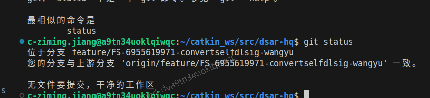
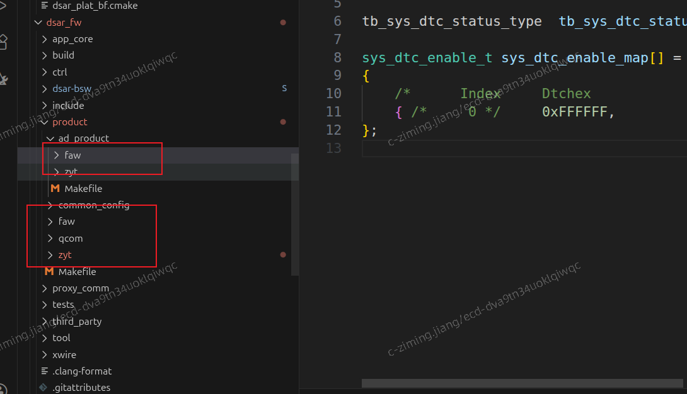

## 0413 学习记录
1) c801 代码 ota 协议适配 
2) git 操作学习使用（cherry pick, git status ,git branch） ： 注意在从云端拉代码时直接用自己分支的名字，这样会在云端前直接加上origin
3) aep 编译，cicd工具学习使用
4) dkit工具学习使用上板测试
5) wireshark someip 协议抓包 (lua,host) 参考链接：https://zhuanlan.zhihu.com/p/22170327605?share_code=1m6uFH8qyZ7XB&utm_psn=2027076650790130147
6) git pr 操作： 注意选择人（需求者，预集成，通信负责人，诊断负责人）

## 0414 学习记录

## 0416 学习记录
御哥分支

1）关注diag uds上传机制
理解各个模块
2）

3）git push -u/--up-stream