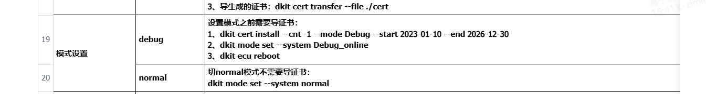
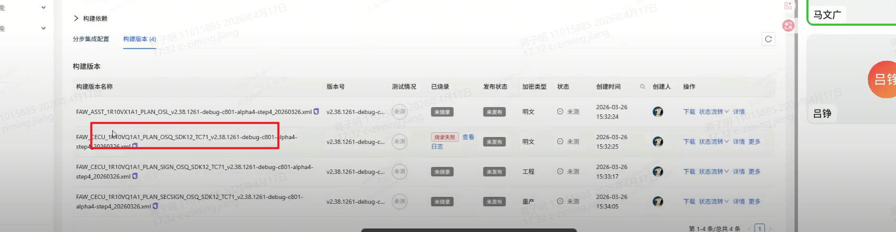
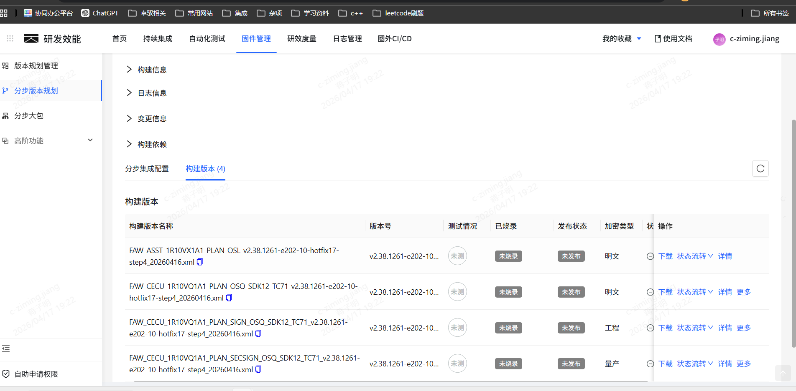
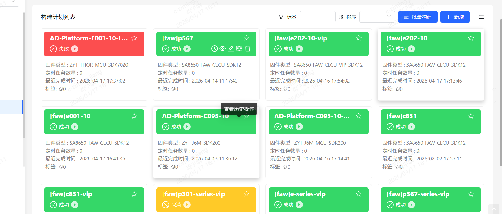

## 0413 学习记录
1) c801 代码 ota 协议适配 
2) git 操作学习使用（cherry pick, git status ,git branch） ： 注意在从云端拉代码时直接用自己分支的名字，这样会在云端前直接加上origin
3) aep 编译，cicd工具学习使用
4) dkit工具学习使用上板测试
5) wireshark someip 协议抓包 (lua,host) 参考链接：https://zhuanlan.zhihu.com/p/22170327605?share_code=1m6uFH8qyZ7XB&utm_psn=2027076650790130147
6) git pr 操作： 注意选择人（需求者，预集成，通信负责人，诊断负责人）

## 0414 学习记录
1) 独立下载功能理解
2）两套通信（comif dcms模块理解）

## 0416 学习记录
御哥分支

1）关注diag uds上传机制
理解各个模块
2）

3）git push -u/--up-stream 参数含义，追踪远程仓库

## 0417 学习记录
1）cicd 编译（加 --Production指令）
2）dkit 下载小包 直接加--file 会从云上下载小包
3）量产模式切换(正常模式与debug模式)

4）烧录大包，需要切换（carmode 传感器mode syu）
5) 救急板，还需要导入证书，和切换模式
6）板子log日志地址 /mnt/home/root#cd /mnt/dj/partitions/user/dlog/data0/txtlog-192.168.1.101/data0/
7) had地址（172.20.0.68 用于和其他对手件通信， 192.168.1.101 调试地址root用户）
8）黑匣子地址 192.168.1.111 用户dji
9) 实车wifi密码： Br1609dji
10）git commit 和commit(amend)使用区别、git fetch\git pull区别、当冲突时如何使用本地模型
11）注意commit 注释格式
12）烧录打包注意 使用的包和板子一样，普通开发最好使用明文包osq

## 疑问点
1）独立下载校验过程，是否是一口气校验
2）cicd 编译选项应该选择哪些 如何应该根据分支编译,应该选择哪个

3）板子冒烟测试

## 0418 学习记录
1）windows下wsl工具安装 （注意配置网络 mirror网络，开启复杂网络选项，安装docker 配置systemmd）
2）vn5620工具学习使用(host casc口扩展口)
3) someip协议详细研究

### 0420 学习记录
1）学习git add 和git commit ，理解git 工作区、暂存区和提交区、理解changes和stage changes