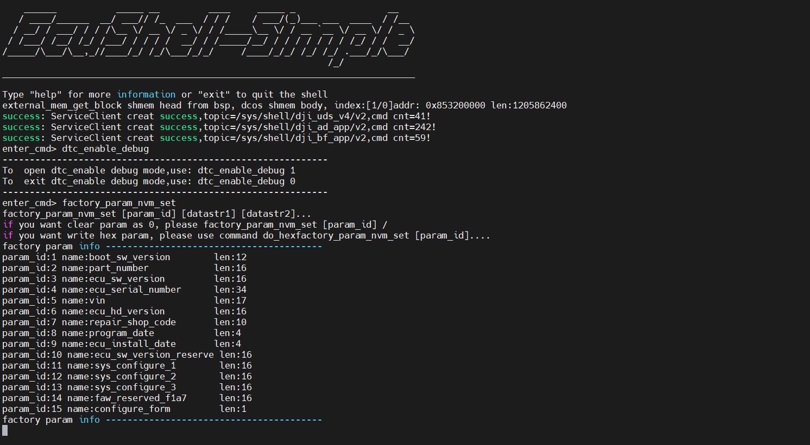

## 0413 学习记录
1) c801 代码 ota 协议适配 
2) git 操作学习使用（cherry pick, git status ,git branch） ： 注意在从云端拉代码时直接用自己分支的名字，这样会在云端前直接加上origin
3) aep 编译，cicd工具学习使用
4) dkit工具学习使用上板测试
5) wireshark someip 协议抓包 (lua,host) 参考链接：https://zhuanlan.zhihu.com/p/22170327605?share_code=1m6uFH8qyZ7XB&utm_psn=2027076650790130147
6) git pr 操作： 注意选择人（需求者，预集成，通信负责人，诊断负责人）

## 0414 学习记录
1) 独立下载功能理解
2）两套通信（comif dcms模块理解）

## 0416 学习记录
御哥分支

1）关注diag uds上传机制
理解各个模块
2）

3）git push -u/--up-stream 参数含义，追踪远程仓库

## 0417 学习记录
1）cicd 编译（加 --Production指令）
2）dkit 下载小包 直接加--file 会从云上下载小包
3）量产模式切换(正常模式与debug模式)

4）烧录大包，需要切换（carmode 传感器mode syu）
5) 救急板，还需要导入证书，和切换模式
6）板子log日志地址 /mnt/home/root#cd /mnt/dj/partitions/user/dlog/data0/txtlog-192.168.1.101/data0/
7) had地址（172.20.0.68 用于和其他对手件通信， 192.168.1.101 调试地址root用户）
8）黑匣子地址 192.168.1.111 用户dji
9) 实车wifi密码： Br1609dji
10）git commit 和commit(amend)使用区别、git fetch\git pull区别、当冲突时如何使用本地模型
11）注意commit 注释格式
12）烧录打包注意 使用的包和板子一样，普通开发最好使用明文包osq

## 疑问点
1）独立下载校验过程，是否是一口气校验
2）cicd 编译选项应该选择哪些 如何应该根据分支编译,应该选择哪个

3）板子冒烟测试

## 0418 学习记录
1）windows下wsl工具安装 （注意配置网络 mirror网络，开启复杂网络选项，安装docker 配置systemmd）
2）vn5620工具学习使用(host casc口扩展口)
3) someip协议详细研究

### 0420 学习记录
1）学习git add 和git commit ，理解git 工作区、暂存区和提交区、理解changes和stage changes， git pr流程、restore和reset、还有cherrypick，git rebase和git merge
2) 101 root had板子、111 dji 黑匣子、wifi密码 BR1609dji
3) 诊断日志地址：txt-bsp.log 和txt.log 通信日志地址：bin-mcu.log
黑匣子目录  
/tmp/where_is_dlog
/blackbox/car_data/car_2026-04-20_15-32-34/dlog/data0/txtlog-bsp-192.168.1.101/data0$ cat log |grep 
had目录
/mnt/dji/partutions/user/dlog/datao/txtlog-bsp
4) uds 1902 1906服务，通过dkit发送诊断指令
   发送 doip诊断指令：dkit diag send --ip 172.20.0.68 --proj faw --msg 1003
5) 导证书、切换debug模式，正常使用都是debug online模式
   导证书dkit cert install --cnt -1 --mode debug --start 2020-01-10 --end 2024-12-30 --proj faw --ip 172.20.0.68
   切模式dkit mode set --system debug_online --proj faw --ip 172.20.0.68
   
### 0421 学习记录
1）学习uds 1902 1906指令、理解uds前置条件表
dkit diag send --ip 172.20.0.68 --proj faw --msg 1902ff
dkit diag send --ip 172.20.0.68 --proj faw --msg 190696a002ff
dkit diag send --ip 172.20.0.68 --proj faw --msg 1906d47c8aff

2）理解cpu trap指令，特权态和非特权态
3）autosar各个模块间的通信机制，不理解（pdur can dcm）

4）systemdiag调用路径rte10ms DiagApp_MainFunction->

5）配合log文件SYS_SetDTC查看是否又faultid

6)ecushell 打桩

疑问点：
1）e202-10属于哪个系列（p567还是e系列） --production=fawhq_e202_10 --debug-version应该怎么写
使用e202构建计划来编译，请教通信同事，另外可以查询其他人编译指令

2）板端phm测试，冒烟测试
172.200.68：19999 

3）pr commit该如何提交

5）acu_write和acu_read是什么东西