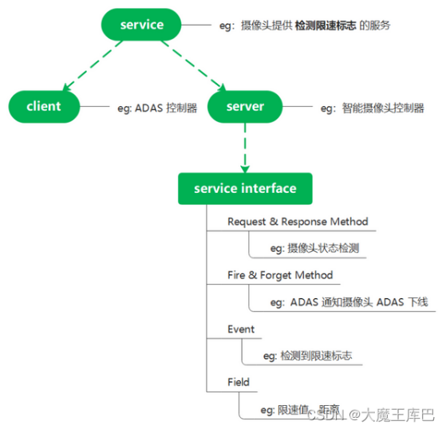

## someip协议基础理解

概念 → 报文结构 → 通信模式 → SD服务发现 → 代码实战 → 抓包排查

### 01 整体理解
someip为autosar定义的，面向汽车/嵌入式场景的ip通信协议。支持远程调用RPC、事件通知、序列化\wire format。同时规定了someip本体和someip-sd服务发现

### 02 概念理解

**基本概念**
**通信双方角色**:server\client，server提供service,client使用service
**服务定义层**:service\service interface
**服务提供接口**：
1)method(request\response调用后返回、fire\forget调用后不返回)
2)event
3)field(setter,getter,notifier)

**运行时角色**
├─ server：服务提供者
└─ client：服务使用者

**服务定义**
└─ service / service interface
    ├─ method
    │   ├─ request/response
    │   └─ fire&forget
    ├─ event
    └─ field

 -----------------
 **通信方向**

**field使用双方**：field中setter,getter的方向都是client想server请求，notifier是server给client传输
**method使用双方**:client发送rpc请求到server端，server端回结果给client

**method**:
  RR / FF
  client -> server

**event**:
  notification
  server -> client

**field**:
  getter     client -> server
  setter     client -> server
  notifier   server -> client
  
-----------------------
**订阅方式**
一般event和notifier都是通过someipsd 服务发现来订阅的，而且一般订阅的是eventgroup事件组。

**method**：不需要订阅
client -> server 调用
**event / field notifier**：需要订阅，通过事件组来管理
client 先订阅
server 后续主动推送

**SOME/IP-SD**：服务发现+服务订阅。负责服务发现、服务订阅、服务上线宣告、服务查找、时间组订阅、订阅确认

**简单时序图**
client                         server
  |                              |
  |---- FindService -----------> |
  |<--- OfferService ----------- |
  |                              |
  |---- SubscribeEventgroup ---> |
  |<--- SubscribeAck ----------- |
  |                              |
  |<--- event / field notifier - |
  |<--- event / field notifier - |

---------------------------

**service id和 instance id区别**
1)service是提供的一类服务（比如车门状态）
2)instance是提供服务的实例（比如左前门）
3)service id有在someip报文中明确定义，4)instance id未在报文中定义，与endpoint有关,endpoint 通常就是这个 service instance 对外提供通信所使用的网络端点，也就是 IP + 传输层协议（TCP/UDP）+ port

**服务类别  ->  服务实例  ->  具体方法**
**Service   ->  Instance   ->  Method**

**编程使用**
request->set_service(0x1234);
request->set_instance(0x5678);
request->set_method(0x0421);