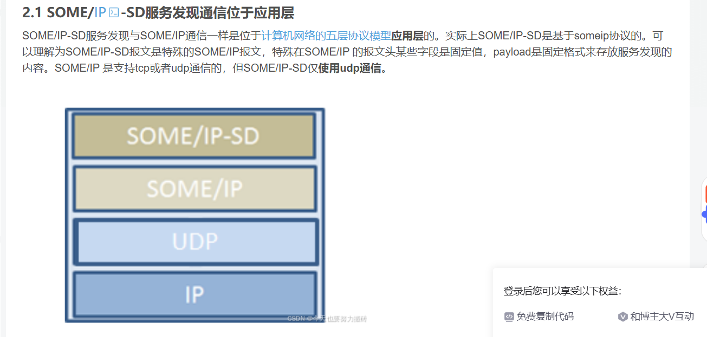
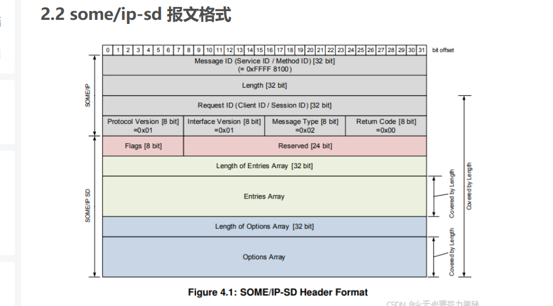

## someip 报文格式

### 1 各个协议间层次
someip sd基于someip协议

------

### 2 协议报文头

**1) 报文协议格式**

------

**2) 标准字节头**
**message id = service id + method id**
**request id = client id + sesdion id**
0               4               8              12             16
+---------------+---------------+---------------+---------------+
|         Message ID            |             Length            |
+---------------+---------------+---------------+---------------+
|         Request ID            | ProtVer | IfVer | MsgT | RetC |
+---------------+---------------+---------------+---------------+
|                        Payload (variable)                      |
+---------------------------------------------------------------+

--------
**3) 各字段含义**
**Message ID**：你要调用谁的哪个接口：
Message ID = Service ID(16 bit) + Method ID(16 bit)
Method ID 空间粗分成两半：0x0000–0x7FFF 常用于方法（method），带最高位 1 的范围常用于事件/通知(event)

**Length**：从 Request ID 开始，到整包结束，一共有多少字节
Length 表示的是 从 Request ID / Client ID 开始,它不包含最前面的8个字节（MessageID 4字节 + Length4字节）
Length = 8 + Payload长度

**Request ID**：这次调用是谁发的、第几次发的
Request ID = Client ID(16 bit) + Session ID(16 bit)
服务端生成响应时，要把请求里的 Request ID 原样拷贝到响应里
Client ID 是调用方客户端在 ECU 内的唯一标识
Session ID 用来区分同一个客户端连续发出的不同请求

**Protocol Version**：SOME/IP 头格式版本
Protocol Version 说的是 SOME/IP 头格式本身的版本,通常为1

**Interface Version**：这个服务接口的大版本
服务接口的 major version

**Message Type**：这是请求、响应、通知还是错误
0x00 REQUEST
普通请求，期待一个响应。

0x01 REQUEST_NO_RETURN
fire-and-forget，请求但不期待响应。

0x02 NOTIFICATION
通知/事件回调，不期待响应。

0x80 RESPONSE
正常响应。

0x81 ERROR
错误响应。

还定义了带 TP 分段标志的类型，比如 0x20、0x21、0x22、0xA0、0xA1。其中 0x20 这个位被叫做 TP-Flag，用于表示该 SOME/IP 消息是一个分段

**Return Code**：处理结果如何
虽然每个 SOME/IP 消息头里都有 Return Code 字段，但规范明确说：

只有 RESPONSE (0x80) 和 ERROR (0x81) 真正用它来携带返回码
其他消息类型都应设为 0x00

0x00 E_OK
0x01 E_NOT_OK
0x02 E_UNKNOWN_SERVICE
0x03 E_UNKNOWN_METHOD
0x04 E_NOT_READY
0x07 E_WRONG_PROTOCOL_VERSION
0x08 E_WRONG_INTERFACE_VERSION
0x09 E_MALFORMED_MESSAGE
0x0A E_WRONG_MESSAGE_TYPE

---------------

### 3 注意问题
错点 1：Length 不是整个报文长度
它是“从 Request ID 开始到末尾”的长度。
所以：
总报文长度 = 8 + Length

错点 2：Return Code 不是每种消息都真有意义
只有 0x80 RESPONSE 和 0x81 ERROR 真正用它表达处理结果；其他类型通常都写 0x00。

错点 3：Request ID 不是服务端生成的
它是请求侧生成的，服务端只是原样带回去。