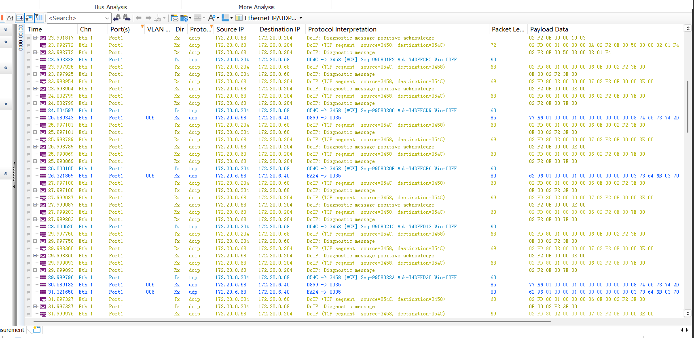

这组报文是正常的，链路完整打通了。你的测试机看起来是 `172.20.0.204`，ECU 是 `172.20.0.68`，DoIP TCP 目标端口 `0x3458 = 13400`。

**1. Vehicle Identification**

请求：

```text
02 FD 00 01 00 00 00 00
```

含义：

```text
02      DoIP protocol version
FD      反码，0xFF ^ 0x02
00 01   Payload type = Vehicle identification request
00 00 00 00   Payload length = 0
```

ECU 返回 Vehicle Identification Response：

```text
02 FD 00 04 00 00 00 20 ...
```

`0x0004` 是识别响应，长度 `0x20 = 32`。解析结果和脚本输出一致：

```text
VIN      = W0L000043MB541326
LA       = 0x02F2
EID      = AA BB CC DD EE 44
GID      = 02 47 57 4D 00 99
FurtherAction = 0x00
```

这里已经证明 UDP 发现和 ECU 逻辑地址都没问题。

**2. TCP 建链**

抓包里有：

```text
172.20.0.204:0x29C2 -> 172.20.0.68:0x3458 [SYN]
172.20.0.68:0x3458 -> 172.20.0.204:0x29C2 [SYN, ACK]
172.20.0.204:0x29C2 -> 172.20.0.68:0x3458 [ACK]
```

`0x3458` 就是十进制 `13400`。TCP 三次握手正常。

**3. Routing Activation**

请求：

```text
02 FD 00 05 00 00 00 07 0E 00 00 00 00 00 00
```

解析：

```text
00 05        Routing activation request
长度          7
0E 00        Tester/source logical address = 0x0E00
00           Activation type = Default
00 00 00 00  Reserved
```

响应：

```text
02 FD 00 06 00 00 00 09 0E 00 02 F2 10 00 00 00 00
```

解析：

```text
00 06        Routing activation response
长度          9
0E 00        Client logical address = 0x0E00
02 F2        ECU logical address = 0x02F2
10           Response code = Success
00 00 00 00  Reserved
```

所以路由激活成功，`Activation response : 16` 里的 `16` 是十进制，等于十六进制 `0x10`，表示成功。

**4. Entity Status**

请求：

```text
02 FD 40 01 00 00 00 00
```

响应：

```text
02 FD 40 02 00 00 00 03 01 01 01
```

解析：

```text
40 02   Entity status response
长度     3
01      Node type = DoIP node
01      Max concurrent sockets = 1
01      Currently open sockets = 1
```

所以脚本输出：

```text
Node type     : 1
Max sockets   : 1
Open sockets  : 1
Max data size : None
```

是合理的。因为响应长度只有 3 字节，没有带 `MDS / max data size` 字段。

**5. Alive Check 超时**

请求：

```text
02 FD 00 07 00 00 00 00
```

这是 Alive check request。ECU 没有回 `0x0008 Alive check response`，所以脚本打印：

```text
Alive check failed or unsupported: TimeoutError
```

这个不影响诊断通信。很多 ECU 不会响应 tester 主动发起的 alive check；更常见的是 ECU 主动发 alive check 给 tester，tester 再回 alive check response。

**6. UDS TesterPresent**

请求：

```text
02 FD 80 01 00 00 00 06 0E 00 02 F2 3E 00
```

解析：

```text
80 01        Diagnostic message
长度          6
0E 00        Source address = tester 0x0E00
02 F2        Target address = ECU 0x02F2
3E 00        UDS TesterPresent
```

ECU 先回 DoIP 层 ACK：

```text
02 FD 80 02 00 00 00 07 02 F2 0E 00 00 3E 00
```

解析：

```text
80 02        Diagnostic positive acknowledgement
02 F2        Source = ECU
0E 00        Target = tester
00           ACK code = OK
3E 00        Previous diagnostic message data
```

注意这个只是 DoIP 层确认，表示 ECU 接收/转发了诊断消息，不是 UDS 服务响应。

随后 ECU 回真正的 UDS 响应：

```text
02 FD 80 01 00 00 00 06 02 F2 0E 00 7E 00
```

解析：

```text
80 01        Diagnostic message
02 F2        Source = ECU
0E 00        Target = tester
7E 00        UDS positive response to 3E 00
```

`0x7E = 0x3E + 0x40`，这是 UDS 正响应规则。所以最后这句：

```text
Recv UDS : 7E 00
```

说明 DoIP + UDS 整条链路都成功了。

结论：你的 ECU 地址、端口、ECU 逻辑地址 `0x02F2`、本机逻辑地址 `0x0E00` 都是对的。唯一异常是 AliveCheck 没响应，但从后续 `3E 00 -> 7E 00` 看，它不是通信故障。

---

## 问题1 你做的很棒，我不理解的是3e可以维持1003会话，那doip这个tcp session该如何保持，是靠发tcp心跳包来位置的吗

对，你理解的方向对，但要分清两层：

**UDS 会话保持**

`10 03` 切的是 UDS 扩展会话。这个会话通常靠 `TesterPresent` 保持，也就是你现在每 2s 发：

```text
3E 00
```

ECU 回：

```text
7E 00
```

这保持的是 UDS 层的 `extendedDiagnosticSession`，防止 ECU 的 S3 timeout 到期后退回默认会话。

**DoIP TCP 会话保持**

DoIP 的 TCP_DATA socket 是另一层。它不是靠你手动发“TCP 心跳包”来保持的，通常只要这个 TCP 连接上持续有 DoIP 应用层报文交互，就算活跃。

你现在每 2s 发的 `3E 00` 实际在线上不是裸 UDS，而是包在 DoIP Diagnostic Message 里面：

```text
02 FD 80 01 00 00 00 06 0E 00 02 F2 3E 00
```

这就是一帧 DoIP over TCP 报文。所以它同时做了两件事：

```text
UDS 层：3E 00 保持 10 03 扩展会话
DoIP/TCP 层：周期性有 DoIP Diagnostic Message，TCP_DATA socket 不空闲
```

所以一般不需要额外 TCP keepalive。

你抓包里这些蓝色的 TCP ACK：

```text
0x054C -> 0x3458 [ACK]
```

只是 TCP 协议栈自动确认收到对方 TCP segment，不是应用层心跳。真正有业务含义的是这些 DoIP 报文：

```text
02 FD 80 01 ... 3E 00   Tester -> ECU，诊断请求
02 FD 80 02 ... 3E 00   ECU -> Tester，DoIP positive ACK
02 FD 80 01 ... 7E 00   ECU -> Tester，UDS 正响应
```

DoIP 里也有 `AliveCheck`：

```text
0x0007 AliveCheckRequest
0x0008 AliveCheckResponse
```

但它不是常规“每隔几秒必须发一次”的 TCP 保活机制。很多 ECU 不响应 tester 主动发的 AliveCheck，你前面也看到了超时。更常见的是 ECU 在需要确认连接是否还活着时主动发 AliveCheck，tester 回 AliveCheckResponse。

结论：你现在“每 2s 发 `3E 00`”已经足够同时保持 UDS 会话和 DoIP TCP 活跃。不要再额外做 TCP heartbeat，除非你的 ECU/网关有特殊厂家要求。