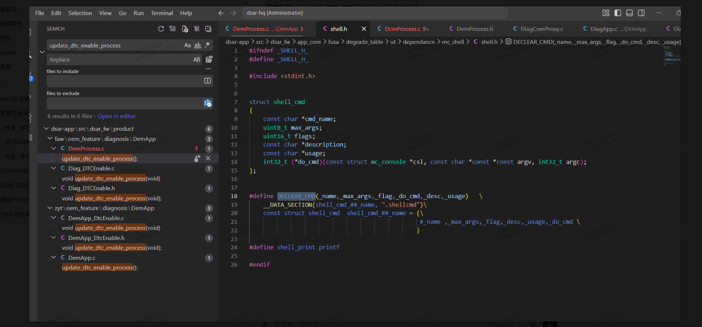

可以，这个宏已经把“**命令注册**”的套路暴露得很明显了。
你这段代码：

```c
#define DECLEAR_CMD(_name, _max_args, _flag, _do_cmd, _desc, _usage) \
    __DATA_SECTION(shell_cmd_##_name, ".shellcmd") \
    const struct shell_cmd shell_cmd_##_name = { \
        #_name, _max_args, _flag, _desc, _usage, _do_cmd \
    }
```

本质是在做两件事：

1. **定义一个 `struct shell_cmd` 类型的全局对象**
2. **把这个对象放到特定链接段 `.shellcmd` 里**

这样系统启动后，只要去遍历 `.shellcmd` 这个段，就能找到所有命令。

所以这是一个很典型的：

**“宏注册 + linker section 自动收集命令”**

不是普通函数调用注册，而是**静态注册**。

---

# 一、先把这个结构体看懂

你图里 `shell_cmd` 是：

```c
struct shell_cmd
{
    const char *cmd_name;
    uint8_t max_args;
    uint16_t flags;
    const char *description;
    const char *usage;
    int32_t (*do_cmd)(const struct mc_console *csl,
                      const char *const *const argv,
                      int32_t argc);
};
```

这表示每条命令都包含：

* `cmd_name`：命令名
* `max_args`：最大参数个数
* `flags`：命令属性
* `description`：描述
* `usage`：用法
* `do_cmd`：真正执行函数

也就是说，命令行框架最终要做的事就是：

```c
输入字符串 --> 找到对应 shell_cmd --> 调 do_cmd(...)
```

---

# 二、这个宏展开后到底生成了什么

你这个宏：

```c
#define DECLEAR_CMD(_name, _max_args, _flag, _do_cmd, _desc, _usage) \
    __DATA_SECTION(shell_cmd_##_name, ".shellcmd") \
    const struct shell_cmd shell_cmd_##_name = { \
        #_name, _max_args, _flag, _desc, _usage, _do_cmd \
    }
```

假设你这样写：

```c
static int32_t update_dtc_enable_process_cmd(
    const struct mc_console *csl,
    const char *const *const argv,
    int32_t argc)
{
    update_dtc_enable_process();
    return 0;
}

DECLEAR_CMD(update_dtc_enable_process,
            0,
            0,
            update_dtc_enable_process_cmd,
            "update dtc enable process",
            "update_dtc_enable_process");
```

那预处理展开后，大概等价于：

```c
__DATA_SECTION(shell_cmd_update_dtc_enable_process, ".shellcmd")
const struct shell_cmd shell_cmd_update_dtc_enable_process = {
    "update_dtc_enable_process",
    0,
    0,
    "update dtc enable process",
    "update_dtc_enable_process",
    update_dtc_enable_process_cmd
};
```

注意这里几个关键点。

---

## 1）`shell_cmd_##_name`

这是 **token pasting**，也就是拼接标识符。

```c
shell_cmd_##_name
```

如果 `_name = update_dtc_enable_process`

就会变成：

```c
shell_cmd_update_dtc_enable_process
```

所以它是在生成一个唯一变量名。

---

## 2）`#_name`

这是 **字符串化**。

```c
#_name
```

如果 `_name = update_dtc_enable_process`

就变成：

```c
"update_dtc_enable_process"
```

也就是说：

* 变量名叫 `shell_cmd_update_dtc_enable_process`
* 命令名字符串叫 `"update_dtc_enable_process"`

---

## 3）`__DATA_SECTION(..., ".shellcmd")`

这个最关键。
虽然你图里没展开 `__DATA_SECTION`，但大概率它本质类似：

```c
#define __DATA_SECTION(sym, sec) \
    __attribute__((section(sec), used))
```

或者编译器私有写法，比如 IAR/ARMCC/GCC 不同风格。

它的作用是：

**把后面的全局变量放进 `.shellcmd` 这个 section**

所以：

```c
const struct shell_cmd shell_cmd_update_dtc_enable_process = {...};
```

不会放到普通 `.data` / `.rodata` 的常规位置，而会被单独放进 `.shellcmd` 段。

---

# 三、为什么放进 `.shellcmd` 就能“自动注册”

因为链接器最后会把所有目标文件里属于 `.shellcmd` 的对象都拼到一起。

比如你有三个 c 文件：

### a.c

```c
DECLEAR_CMD(cmd_a, ...);
```

### b.c

```c
DECLEAR_CMD(cmd_b, ...);
```

### c.c

```c
DECLEAR_CMD(cmd_c, ...);
```

编译后，每个 `.o` 文件里都会有一个放在 `.shellcmd` 段里的 `shell_cmd_xxx` 对象。

链接完成后，最终映像里会形成这样一块连续区域：

```c
.shellcmd:
    shell_cmd_cmd_a
    shell_cmd_cmd_b
    shell_cmd_cmd_c
```

于是主程序只要拿到这段区域的起始和结束地址：

```c
extern const struct shell_cmd __start_shellcmd[];
extern const struct shell_cmd __stop_shellcmd[];
```

或者某些工程里是：

```c
extern const struct shell_cmd __shellcmd_start__;
extern const struct shell_cmd __shellcmd_end__;
```

就可以遍历：

```c
const struct shell_cmd *cmd = __start_shellcmd;
while (cmd < __stop_shellcmd) {
    // 把 cmd 加到命令表，或者直接用
    cmd++;
}
```

这就是所谓的“自动注册”。

---

# 四、所以这个宏怎么用

一般用法就是两步：

---

## 第一步：写命令处理函数

函数签名要匹配：

```c
int32_t (*do_cmd)(const struct mc_console *csl,
                  const char *const *const argv,
                  int32_t argc);
```

例如：

```c
static int32_t do_update_dtc_enable_process(
    const struct mc_console *csl,
    const char *const *const argv,
    int32_t argc)
{
    (void)csl;
    (void)argv;
    (void)argc;

    update_dtc_enable_process();
    return 0;
}
```

---

## 第二步：用宏声明命令

```c
DECLEAR_CMD(update_dtc_enable_process,
            0,
            0,
            do_update_dtc_enable_process,
            "update dtc enable process",
            "update_dtc_enable_process");
```

这样这条命令就注册进去了。

启动 shell 后，输入：

```sh
update_dtc_enable_process
```

框架就会查到：

```c
cmd_name = "update_dtc_enable_process"
```

然后调用：

```c
do_update_dtc_enable_process(...)
```

---

# 五、参数分别是什么意思

结合你的宏定义：

```c
DECLEAR_CMD(_name, _max_args, _flag, _do_cmd, _desc, _usage)
```

我给你逐个解释。

---

## 1）`_name`

命令名，同时也参与生成变量名。

比如：

```c
DECLEAR_CMD(reset_demo, ...)
```

会生成：

* 变量名：`shell_cmd_reset_demo`
* 命令字符串：`"reset_demo"`

---

## 2）`_max_args`

最大允许参数数目。

比如输入：

```sh
reset_demo 1 2
```

如果框架规定 argc 超过 `_max_args` 就报错，那这里就是做参数数量限制。

但要注意，有的框架里这个值是：

* 不包含命令名
* 或包含命令名

这得看解析代码怎么写。
你最好再搜一下谁在用 `max_args`。

---

## 3）`_flag`

命令属性位。

可能用于表示：

* 是否隐藏命令
* 是否管理员权限
* 是否异步执行
* 是否可在中断上下文调用
* 是否只读/调试命令

这要看工程里 `flags` 的定义。

你可以搜：

```c
flags &
SHELL_CMD_
CMD_FLAG_
```

之类的宏。

---

## 4）`_do_cmd`

真正执行的回调函数。

框架在匹配到命令后最终调用这个。

---

## 5）`_desc`

帮助描述。

比如 `help` 命令时打印：

```sh
update_dtc_enable_process    update dtc enable process
```

---

## 6）`_usage`

用法说明。

比如输错参数时打印：

```sh
usage: update_dtc_enable_process
```

或者：

```sh
usage: set_speed <value>
```

---

# 六、你这个机制是不是“打桩”

就你现在这张图里看到的这个宏本身：

**不是打桩，是命令注册机制。**

它做的只是：

* 生成命令描述对象
* 放进 `.shellcmd` 段
* 供 shell 框架发现和调用

---

但如果你注册进去的函数干的是这些事情：

* 模拟故障
* 改内部状态
* 强制某个流程通过/失败
* 替换真实硬件返回值
* 注入 DTC
* 关闭某个检查逻辑

那这些**命令的用途**就可能属于“打桩/调试桩/故障注入”。

也就是说：

* **宏本身**：不是打桩
* **宏注册的某些命令**：可能是打桩入口

---

# 七、你这段代码最可能的运行流程

大概率是这样：

### 1）各个模块写命令

```c
DECLEAR_CMD(xxx, ...);
DECLEAR_CMD(yyy, ...);
DECLEAR_CMD(zzz, ...);
```

---

### 2）链接后全放进 `.shellcmd`

变成一整块连续命令表。

---

### 3）shell 初始化时遍历 `.shellcmd`

伪代码：

```c
extern const struct shell_cmd __shellcmd_start[];
extern const struct shell_cmd __shellcmd_end[];

void shell_init(void)
{
    const struct shell_cmd *cmd = __shellcmd_start;
    while (cmd < __shellcmd_end) {
        shell_add_cmd(cmd);
        cmd++;
    }
}
```

---

### 4）用户输入命令

比如：

```sh
update_dtc_enable_process
```

---

### 5）shell 查找命令表

```c
if (strcmp(input_cmd, cmd->cmd_name) == 0) {
    cmd->do_cmd(csl, argv, argc);
}
```

---

### 6）最终调用你业务函数

```c
update_dtc_enable_process();
```

---

# 八、你可以去哪里继续验证

你现在已经看到注册宏了，接下来建议你搜这几个点，就能把整个链条补全。

---

## 1）搜 `.shellcmd`

看链接脚本或者启动代码里谁处理这个 section。

搜：

```c
.shellcmd
```

或者：

```c
__start
__stop
shell_cmd
```

尤其是：

* ld 链接脚本
* scatter 文件
* map 文件
* shell 初始化代码

---

## 2）搜 `cmd_name` / `do_cmd`

看谁在遍历命令表并调用 `do_cmd`。

比如搜：

```c
do_cmd(
strcmp(cmd_name
description
usage
```

---

## 3）搜 `help` 命令实现

`help` 命令一般最容易暴露命令表遍历逻辑。

因为它通常会做：

```c
for each cmd in all_cmds:
    print cmd->cmd_name, cmd->description
```

---

## 4）搜 `__DATA_SECTION`

确认它具体展开成什么。

不同编译器实现不同，可能是：

* GCC `__attribute__((section))`
* IAR `@ "section"`
* ARMCC `__attribute__((section))`
* 某层封装宏

---

# 九、给你一个最贴近你这段代码的完整示例

你可以把它理解成这样：

```c
struct shell_cmd
{
    const char *cmd_name;
    uint8_t max_args;
    uint16_t flags;
    const char *description;
    const char *usage;
    int32_t (*do_cmd)(const struct mc_console *csl,
                      const char *const *const argv,
                      int32_t argc);
};
```

命令函数：

```c
static int32_t do_reset(
    const struct mc_console *csl,
    const char *const *const argv,
    int32_t argc)
{
    (void)csl;
    (void)argv;
    (void)argc;

    printf("system reset\n");
    return 0;
}
```

注册：

```c
DECLEAR_CMD(reset,
            0,
            0,
            do_reset,
            "reset system",
            "reset");
```

展开后类似：

```c
__DATA_SECTION(shell_cmd_reset, ".shellcmd")
const struct shell_cmd shell_cmd_reset = {
    "reset",
    0,
    0,
    "reset system",
    "reset",
    do_reset
};
```

shell 框架遍历命令表后，输入：

```sh
reset
```

最终执行：

```c
do_reset(...)
```

---

# 十、一句话帮你彻底记住

你这个宏不是“调用注册函数”那种动态注册，而是：

**在编译/链接阶段，把命令描述对象放进特定 section，启动时统一扫描 section，实现自动注册。**

所以它的本质可以概括成：

**“用宏定义命令对象 + 用 linker section 收集 + 用 shell 框架分发调用”**

---

如果你愿意，我下一条可以继续帮你做两件事里的任意一个：

1. 按你这张图，直接给你写一个“从 `DECLEAR_CMD` 到最终 shell 调用”的完整伪代码链路
2. 结合你这个 `update_dtc_enable_process`，推一遍真实调用流程，告诉你这个命令大概率在工程里哪里被遍历和执行


## 具体例子
可以。你前面看到的是**命令注册机制**，现在你问的“打桩机制”更偏向于：

**把原本真实会发生的行为，换成一个可控的假行为，方便测试、调试、故障注入。**

最核心一句话：

**打桩 = 在某个调用点，不走真实实现，改走你预先准备好的替代实现。**

---

# 一、先建立最直观理解

比如系统里原本有这样一个函数：

```c
int ReadBatteryVoltage(void)
{
    return Adc_ReadChannel(BATTERY_CH);
}
```

这是真实逻辑，会上硬件 ADC 读取电压。

但你现在想测试“欠压故障”流程，又不想真的把电池电压拉低。
这时就会想办法让它暂时返回一个假值，比如 `9V`。

那么测试时就变成：

```c
int ReadBatteryVoltage(void)
{
    return 9;
}
```

这个“临时替代真实行为的东西”，就叫**桩**。

---

# 二、打桩到底在替代什么

通常替代的是这几类东西：

1. **硬件访问**

   * ADC
   * CAN 收发
   * GPIO
   * NVM

2. **外部依赖**

   * 网络发送
   * 文件系统
   * 其他进程/服务
   * BSW 模块接口

3. **难以稳定复现的场景**

   * 超时
   * 丢包
   * 传感器异常
   * 返回错误码
   * 内存申请失败

所以打桩的目标不是“多加一个命令”，而是：

**让你能控制程序看到的世界。**

---

# 三、最常见的几种打桩方式

我先给你一个整体图，再展开。

### 1）直接改实现

测试版直接把函数写成假的。

### 2）函数指针切换

运行时把“真实函数指针”切换成“桩函数指针”。

### 3）宏替换

编译测试版本时，用宏把真实函数名换成假函数名。

### 4）链接替换

同名函数在测试工程里覆盖正式函数。

### 5）命令行触发桩状态

通过 shell 命令打开 mock 开关，业务代码读取这个开关决定是否走假逻辑。

你前面看到的命令注册机制，经常就是第 5 种的入口。

---

# 四、先看一个最简单的打桩例子

---

## 场景：测试欠压 DTC

系统里有个周期任务：

```c
void BatteryMonitor_MainFunction(void)
{
    int voltage = ReadBatteryVoltage();

    if (voltage < 10) {
        Dem_ReportErrorStatus(DTC_UNDERVOLTAGE, DEM_EVENT_STATUS_FAILED);
    }
}
```

真实情况下：

```c
int ReadBatteryVoltage(void)
{
    return Adc_ReadChannel(BATTERY_CH);
}
```

如果你想测试欠压，但不想真的改硬件电压，就可以打桩。

---

## 方式 1：最粗暴的“直接打桩”

测试版本里改成：

```c
int ReadBatteryVoltage(void)
{
    return 9;
}
```

这样 `BatteryMonitor_MainFunction()` 每次读到的都是 9，必然触发欠压。

这就是最基本的桩。

但它太死了，只能固定返回 9，不够灵活。

---

# 五、更像工程实际的例子：可开关的桩

我们一般会写成这样：

```c
static int g_voltage_stub_enable = 0;
static int g_voltage_stub_value = 12;

int ReadBatteryVoltage(void)
{
    if (g_voltage_stub_enable) {
        return g_voltage_stub_value;
    }

    return Adc_ReadChannel(BATTERY_CH);
}
```

这样就形成了一个“可切换”的桩机制。

* `g_voltage_stub_enable = 0`：走真实 ADC
* `g_voltage_stub_enable = 1`：走假值

然后提供控制接口：

```c
void VoltageStub_Enable(int value)
{
    g_voltage_stub_enable = 1;
    g_voltage_stub_value = value;
}

void VoltageStub_Disable(void)
{
    g_voltage_stub_enable = 0;
}
```

这就已经是一个完整的打桩机制了。

---

# 六、再把它和命令行结合起来

这就和你前面看到的 shell 注册机制连上了。

比如注册两个 shell 命令：

```c
static int32_t do_stub_voltage(const struct mc_console *csl,
                               const char *const *const argv,
                               int32_t argc)
{
    if (argc < 2) {
        shell_print("usage: stub_voltage <value>\n");
        return -1;
    }

    int value = atoi(argv[1]);
    VoltageStub_Enable(value);
    shell_print("stub voltage = %d\n", value);
    return 0;
}

static int32_t do_unstub_voltage(const struct mc_console *csl,
                                 const char *const *const argv,
                                 int32_t argc)
{
    VoltageStub_Disable();
    shell_print("stub voltage disabled\n");
    return 0;
}
```

注册：

```c
DECLEAR_CMD(stub_voltage, 1, 0, do_stub_voltage,
            "stub battery voltage", "stub_voltage <value>");

DECLEAR_CMD(unstub_voltage, 0, 0, do_unstub_voltage,
            "disable battery voltage stub", "unstub_voltage");
```

这时候你在命令行里输入：

```sh
stub_voltage 9
```

后面业务线程再执行：

```c
BatteryMonitor_MainFunction();
```

内部看到的电压就是 9，不是真实 ADC 值。

这就是一个很典型的：

**shell 命令只是入口，真正的打桩是通过全局开关替换了读取逻辑。**

---

# 七、把整个链路完整串起来

你可以把这个过程理解成：

```text
shell输入 "stub_voltage 9"
        ↓
shell框架找到 do_stub_voltage()
        ↓
do_stub_voltage() 把 g_voltage_stub_enable=1, g_voltage_stub_value=9
        ↓
BatteryMonitor_MainFunction() 周期运行
        ↓
调用 ReadBatteryVoltage()
        ↓
ReadBatteryVoltage() 发现 stub_enable=1
        ↓
不读ADC，直接返回 9
        ↓
监控逻辑认为出现欠压
        ↓
上报DTC
```

这个就是“打桩机制”的完整例子。

---

# 八、为什么这叫“桩”，而不是普通业务代码

因为它不是系统正式功能的一部分。
正式用户不会需要“把电压强制改成 9V”。

它的用途是：

* 测试某个分支
* 调试问题
* 人工注入场景
* 验证故障处理

也就是说，它是一个**人为插入的替身**。

---

# 九、再举一个更像通信模块的例子

---

## 场景：测试 CAN 发送失败

真实代码：

```c
Std_ReturnType Diag_SendResponse(const uint8_t *data, uint16_t len)
{
    return CanIf_Transmit(TX_PDU_DIAG, data, len);
}
```

你想测试“发送失败后系统怎么处理”，但现场很难稳定制造这种故障。
所以可以打桩：

```c
static int g_can_tx_fail_stub = 0;

Std_ReturnType Diag_SendResponse(const uint8_t *data, uint16_t len)
{
    if (g_can_tx_fail_stub) {
        return E_NOT_OK;
    }

    return CanIf_Transmit(TX_PDU_DIAG, data, len);
}
```

控制接口：

```c
void Stub_CanTxFail_Enable(void)
{
    g_can_tx_fail_stub = 1;
}

void Stub_CanTxFail_Disable(void)
{
    g_can_tx_fail_stub = 0;
}
```

shell 命令：

```c
enable_can_tx_fail
disable_can_tx_fail
```

然后你就可以验证：

* DCM 是否重试
* PduR 是否丢弃
* 日志是否打印
* DEM 是否上报通信故障

这也是打桩。

---

# 十、函数指针版的打桩，更正规一些

前面的写法是在函数里加 `if (stub_enable)`。
再正规一点，会把“真实行为”和“桩行为”做成可替换函数指针。

---

## 例子：发送接口抽象

```c
typedef Std_ReturnType (*tx_func_t)(const uint8_t *data, uint16_t len);

static Std_ReturnType real_tx(const uint8_t *data, uint16_t len)
{
    return CanIf_Transmit(TX_PDU_DIAG, data, len);
}

static Std_ReturnType stub_tx_fail(const uint8_t *data, uint16_t len)
{
    (void)data;
    (void)len;
    return E_NOT_OK;
}

static tx_func_t g_tx_func = real_tx;

Std_ReturnType Diag_SendResponse(const uint8_t *data, uint16_t len)
{
    return g_tx_func(data, len);
}
```

切换桩：

```c
void UseRealTx(void)
{
    g_tx_func = real_tx;
}

void UseStubTxFail(void)
{
    g_tx_func = stub_tx_fail;
}
```

这时候打桩更清晰：

* 正式模式：`g_tx_func = real_tx`
* 测试模式：`g_tx_func = stub_tx_fail`

这种方式比到处写 `if (g_stub_enable)` 更干净。

---

# 十一、单元测试里常见的打桩

在单元测试里，打桩经常用于隔离依赖。

比如你要测：

```c
int CalcVehicleState(void)
{
    int speed = VehicleIf_GetSpeed();
    int gear  = VehicleIf_GetGear();

    if (speed > 0 && gear == D) {
        return VEHICLE_RUNNING;
    }
    return VEHICLE_STOPPED;
}
```

但 `VehicleIf_GetSpeed()` 和 `VehicleIf_GetGear()` 依赖真实系统。
测试时你不想接整车环境，那就打桩：

```c
int VehicleIf_GetSpeed(void)
{
    return 30;
}

int VehicleIf_GetGear(void)
{
    return D;
}
```

这样就能只测 `CalcVehicleState()` 的逻辑。

这类桩主要用于：

* 单元测试
* 模块测试
* 持续集成

---

# 十二、打桩、Mock、Hook 的区别可以这样粗分

工程里这几个词经常混着说，我给你一个实用理解。

### Stub（桩）

给一个简单替代实现，返回预期结果。

比如：

```c
int NvM_Read(...) { return E_OK; }
```

### Mock

不但替代，还会检查“有没有按预期被调用”。

比如：

* 调了几次
* 参数对不对
* 调用顺序对不对

### Hook

在原逻辑前后挂钩子，拦截或附加行为。

比如：

* 先记录日志
* 再调用原函数
* 或者直接拦截不让原函数执行

但在很多嵌入式项目里，大家口头上常把这些都叫“打桩”。

---

# 十三、打桩机制最关键的设计点

一个好用的打桩机制，通常要回答这几个问题。

### 1）替换点在哪里

也就是“哪个函数或接口可以被替换”。

### 2）怎么切换

* 编译期开关
* 函数指针
* 全局变量
* shell 命令
* 配置文件

### 3）作用范围

* 全局生效
* 仅某次调用生效
* 仅某模块生效

### 4）是否线程安全

如果 shell 线程改桩状态，业务线程同时读，就要考虑同步。

### 5）怎么恢复

测试完要能回到真实模式。

---

# 十四、一个更贴近你现在理解方式的总结例子

你可以把“打桩机制”抽象成下面这个模板。

---

## 1）真实接口

```c
int Sensor_Read(void);
```

---

## 2）打桩控制状态

```c
static int g_stub_enable;
static int g_stub_value;
```

---

## 3）接口内部判断是否走桩

```c
int Sensor_Read(void)
{
    if (g_stub_enable) {
        return g_stub_value;
    }
    return RealSensor_Read();
}
```

---

## 4）提供控制函数

```c
void Stub_SetValue(int value)
{
    g_stub_enable = 1;
    g_stub_value = value;
}

void Stub_Clear(void)
{
    g_stub_enable = 0;
}
```

---

## 5）再用 shell 命令调用控制函数

```c
stub_sensor 123
unstub_sensor
```

这样就完成了一套“在线打桩机制”。

---

# 十五、和你前面那个注册宏怎么联系起来

你前面看到的 `DECLEAR_CMD(...)` 宏，本身只是：

**把命令注册到 shell**

而打桩机制一般是：

**这些被注册的命令，去修改某个 mock/stub 状态，进而改变真实业务函数行为。**

所以你现在可以这样理解：

* `DECLEAR_CMD`：负责让 shell 能找到这个命令
* `do_cmd(...)`：负责打开/关闭桩、设置桩值
* 业务函数：根据桩状态决定走真逻辑还是假逻辑

---

# 十六、一句话记忆版

**打桩机制不是“注册命令”，而是“在调用链上预留一个可替代点，并能切换到假实现”；命令注册只是常见的控制入口。**

---

如果你愿意，我下一条可以继续直接给你画一个更贴近 AUTOSAR/诊断场景的例子，比如：

**“通过 shell 命令打桩，让 Dcm/Dem 流程里模拟电压故障、CAN 发送失败、NVM 读取失败”**
这样你会更容易和现在手头工程对应起来。
