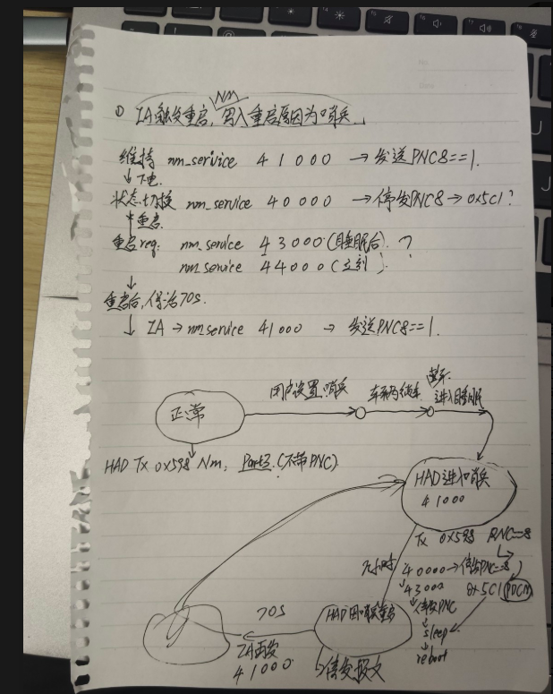

4)需要理解哨兵模式
4.1正常模式下pdc发5c1网管报文，为主节点，唤醒had,had收到5c1后被动唤醒，发送应用报文和网管598报文
4.2哨兵模式下：had为主控节点，发送598pnc8，pdc收到后外发5c1和pnc8，此时had为主节点，不受到5c1网管影响
4.3哨兵模式需要每隔几小时需要重启数据落盘，因此需要主动重启，重启过程是先正常发送应用报文，ia控制停发598pnc8,之后pdc收到停发的598pnc8后，也会停发5c1pnc8,但会有正常的5c1网管,当收到最后一帧5c1后1s中，所有控制器停发应用报文，5s后休眠。但此时had不应该休眠，ia控制had重启，重启后不发送应用报文和网管报文，等待ia上电启动，当ia启动后再有ia决定是否外发应用报文和网管报文。




下面我把你这张图和文字整理成一个**“哨兵模式下，HAD 域控重启时网管怎么配合”**的完整流程。

核心目标是：

**HAD 域控需要自重启，但不能把整车一直唤醒，也不能在重启后提前乱发网管报文。等哨兵服务起来后，再由 IA/哨兵逻辑决定是否重新拉起整车。**

---

## 1. 正常状态：HAD 正常发 NM，PNC8 = 1

正常情况下，HAD 作为主控节点，会周期发送 NM 报文，例如图里写的：

```text
HAD Tx 0x598 Nm
PNC8 = 1
```

含义是：

```text
HAD 当前需要整车保持唤醒
```

网管报文里带有 PNC 位，其中 **PNC8** 表示哨兵相关的网络保持请求。

正常时链路大概是：

```text
HAD / IA / 哨兵服务
        ↓
网管模块发送 0x598 NM
        ↓
PNC8 = 1
        ↓
其他 ECU / PDC-Master 认为 HAD 还需要网络
        ↓
整车保持唤醒
```

---

## 2. 重启前：IA 通知网管准备重启

你文字里的第 1 点是：

> 接收并提取 NM 报文的 PNC 位，网管提供接口发送给 IA，IA 做逻辑判断是否重启。

也就是说，网管需要把接收到的 NM / PNC 状态上报给 IA。

类似接口可以理解为：

```c
Nm_GetPncStatus(uint8_t pnc_id);
```

或者事件上报：

```c
IA_OnPncChanged(PNC8, value);
```

IA 根据 PNC8、哨兵状态、车辆状态等判断：

```text
当前是否允许 HAD 自重启
```

---

## 3. IA 调用网管接口，停发 HAD 自己的 NM / APP / ALL 报文

你文字里的第 2 点是：

> 网管提供接口，IA 调用于停发 NM / APP / ALL 报文，HAD 作为主控节点，停发 PNC8，保证其他 ECU 休眠。

图里也写了类似：

```text
mm_service 40000 -> 停发 PNC8 -> 0x5C1?
```

这一段的关键是：

**重启前，HAD 不能继续对外声明“我还需要网络”。**

所以 IA 调用网管接口，让 HAD 停止发送相关报文，尤其是：

```text
0x598 NM 报文
PNC8 = 1
```

停发之后，PDC-Master 收不到 HAD 的 NM 请求，就会认为 HAD 不再请求网络保持，于是外发：

```text
0x5C1 NM
PNC8 = 0
```

这个 `PNC8 = 0` 的含义是：

```text
哨兵相关网络请求释放
其他 ECU 可以进入休眠
```

所以重启前的链路是：

```text
IA 判断需要重启
        ↓
IA 调用网管接口：停发 HAD 的 NM / APP / ALL 报文
        ↓
HAD 停发 0x598 NM，或者不再携带 PNC8 = 1
        ↓
PDC-Master 检测不到 HAD 的网络请求
        ↓
PDC-Master 外发 0x5C1，PNC8 = 0
        ↓
其他 ECU 进入休眠
```

这里图里的 `40000` 我理解就是你们已有或计划中的一个接口，用于：

```text
停发 PNC8 / 停发网络管理请求
```

---

## 4. 等待其他 ECU 休眠，大概 70s

图里有一段：

```text
重启后，保持 70s
```

或者：

```text
70s
IA -> 网管 41000
```

结合文字看，应该是：

**HAD 不应该一停发 NM 就马上 reset，而是要给其他 ECU 足够时间进入休眠。**

所以流程应该是：

```text
HAD 停发 PNC8
        ↓
PDC-Master 发 PNC8 = 0
        ↓
其他 ECU 开始休眠流程
        ↓
等待约 70s
        ↓
确认整车基本休眠
        ↓
HAD 再自重启
```

这里的 70s 是为了保证：

```text
其他 ECU 已经不再被 HAD 保活
整车进入较低功耗状态
HAD 自己重启不会继续把整车吊醒
```

---

## 5. IA 调用 reboot 接口，网管保证数据落盘，然后重启 HAD

你文字里的第 3 点是：

> 网管提供接口，IA 调用用于 reboot，网管保证数据落盘，其他 ECU 休眠后，自重启，调 44 接口可以实现。

图里也写了：

```text
mm_service 44000（立刻）
```

还有：

```text
43xxx 软发 PNC
sleep
reboot
```

从你们讨论里看，最终倾向是：

```text
还是走此前的哨兵重启 44 接口即可
```

也就是说，已有的 `44` 类接口大概率就是：

```text
IA 通知网管：我要重启
网管完成必要处理
网管控制域控 reset
```

这里网管要做的事情不是简单 reset，而是：

```text
1. 停止对外发网管请求
2. 等其他 ECU 休眠
3. 保存必要日志 / 状态 / 数据落盘
4. 控制 HAD reset
```

伪代码可以理解为：

```c
void IA_RequestSentryReboot(void)
{
    Nm_StopTxPnc8();          // 停发 PNC8
    wait(70s);                // 等其他 ECU 休眠
    Nm_FlushDataToStorage();  // 数据落盘
    Mcu_ResetSocOrDomain();   // 控制重启
}
```

---

## 6. 重启后：MCU 先起来，但不能马上外发 NM

这是第 3 点和第 4 点里最关键的部分。

文字里写：

> 重启后，MCU 起来后不发网络报文，直到 SOC 起来哨兵进程起来后，让网管 PNC8 置为 1 后，再发送网管报文。

这句话非常重要。

HAD 重启后通常是：

```text
MCU 先起来
SOC 后起来
哨兵服务 / IA 进程更晚起来
```

如果 MCU 一起来就立刻开始发 NM，可能会出现问题：

```text
SOC / IA / 哨兵服务还没起来
但是 HAD 已经开始对外发 PNC8 = 1
其他 ECU 又被提前唤醒
整车又被拉起来
```

所以设计要求是：

```text
重启后，MCU 可以先自保活，但不要对外发 NM / PNC8
等 SOC 上哨兵服务起来后，再由 IA 明确调用接口，让网管发送 PNC8 = 1
```

也就是：

```text
HAD reboot
    ↓
MCU 启动
    ↓
网管内部保活
但是不外发 NM
    ↓
SOC 启动
    ↓
IA / 哨兵服务启动
    ↓
IA 调用网管接口：发送哨兵模式 PNC8 = 1
    ↓
网管开始发送 NM，PNC8 = 1
    ↓
唤醒整车
```

---

## 7. 重启后等待 IA 的时间：按 10s

你最后贴的讨论里有一句：

> 第三点中，建议给一个具体的时间值，在这个时间值之后，SOC 的哨兵进程一定能起来。
> 按照 10s 即可，服务在 8s 左右起。

这说明现在方案是：

```text
重启后，网管保持一个“启动保护窗口”
```

例如：

```text
MCU起来后，10s 内不主动外发 NM
等待 IA / 哨兵服务起来调用接口
```

因为服务大约 8s 启动，所以给 10s 比较合理。

但是这个 10s 要注意两层含义：

### 情况一：IA 在 10s 内起来并调用接口

```text
MCU起来
    ↓
网管不外发 NM
    ↓
第 8s 左右 IA / 哨兵服务起来
    ↓
IA 调用网管接口：PNC8 = 1
    ↓
网管开始发 NM
    ↓
整车被哨兵模式唤醒
```

这是期望流程。

### 情况二：10s 到了 IA 还没起来

这里要看你们最终策略。

从文字看，目前建议是：

```text
给一个具体时间值，超过这个时间后 SOC 哨兵进程一定能起来
```

也就是说，他们是把 10s 当成一个保证值，而不是一个复杂超时恢复逻辑。

但是工程上最好还是明确：

```text
如果 10s 后 IA 没有调用，网管到底继续静默？还是生成日志？还是按默认策略发 NM？
```

建议你们需求里补一句，否则实现时容易分歧。

---

## 8. 第 4 点：IA 调用接口发送哨兵模式 PNC8，用于唤醒整车

你文字里的第 4 点是：

> reboot 唤醒后网管提供接口，IA 调用发送哨兵模式 PNC8，用于唤醒整车。网管需自保活到 IA 调用，期间不外发报文，保活时间超出日志生成时间。

这个就是重启后恢复阶段。

也就是 IA 起了之后调用类似接口：

```c
Nm_StartSentryPnc8();
```

或者：

```c
Nm_SetPncRequest(PNC8, TRUE);
```

然后网管开始外发：

```text
0x598 NM
PNC8 = 1
```

或者通过 PDC-Master 影响：

```text
0x5C1 NM
PNC8 = 1
```

最终含义是：

```text
HAD 哨兵模式恢复，需要重新唤醒整车相关网络
```

---

## 9. 整体时序可以这样理解

整理成一条完整链路：

```text
正常状态
  HAD 发 0x598 NM，PNC8 = 1
  整车保持唤醒

        ↓

IA 判断需要哨兵重启
  IA 从网管拿 PNC 状态
  IA 判断当前允许重启

        ↓

IA 调用网管停发接口
  HAD 停发 NM / APP / ALL
  重点是释放 PNC8

        ↓

PDC-Master 检测 HAD 不再请求网络
  外发 0x5C1
  PNC8 = 0

        ↓

其他 ECU 进入休眠
  等待约 70s

        ↓

IA 调用 44 重启接口
  网管保证数据落盘
  网管控制 HAD reset

        ↓

HAD 重启
  MCU 先起来
  网管内部自保活
  但不对外发 NM

        ↓

SOC 启动
  IA / 哨兵服务约 8s 起来
  需求建议按 10s 保障

        ↓

IA 调用网管接口
  设置 PNC8 = 1
  网管开始发送哨兵模式 NM

        ↓

整车被重新唤醒
  HAD 进入哨兵模式
```

---

## 10. 你这几个接口可以按职责这样拆

根据你图片和文字，我建议你这样理解这几个需求接口：

| 接口职责              | 谁调用     | 网管做什么                    | 目的         |
| ----------------- | ------- | ------------------------ | ---------- |
| 获取 / 上报 PNC 位     | 网管 → IA | 提取 NM 报文里的 PNC8 状态并通知 IA | IA 判断是否要重启 |
| 停发 NM / APP / ALL | IA → 网管 | 停止 HAD 对外发 NM，释放 PNC8    | 让其他 ECU 休眠 |
| reboot 接口，类似 44   | IA → 网管 | 落盘、等待策略、控制 reset         | HAD 自重启    |
| 重启后发送 PNC8 = 1    | IA → 网管 | 开始外发哨兵模式 NM              | 唤醒整车       |
| 重启后静默保活           | 网管内部    | MCU 起来后先不外发报文，等待 IA      | 防止提前唤醒整车   |

---

## 11. 最核心的一句话

这个方案本质上是：

**重启前，HAD 先释放 PNC8，让其他 ECU 休眠；重启过程中，网管控制 HAD reset 并保证数据落盘；重启后，MCU 先静默自保活，不主动发 NM，等 SOC 上 IA/哨兵服务起来后，再由 IA 明确通知网管发送 PNC8 = 1，把整车重新唤醒。**

你现在要重点确认的需求边界是：

```text
1. 重启前停发 PNC8 后，是否固定等待 70s？
2. 44 reboot 接口是否已经包含落盘、reset、等待逻辑？
3. 重启后 MCU 静默等待 IA 的最大时间是否就是 10s？
4. 如果 10s 内 IA 没起来，网管默认怎么处理？
5. 重启后发送 PNC8 = 1 的接口，是复用已有 41000，还是新增接口？
```

这 5 个点确认清楚，哨兵重启网管方案就比较完整了。
