## 1 docs api使用与调用时序分析
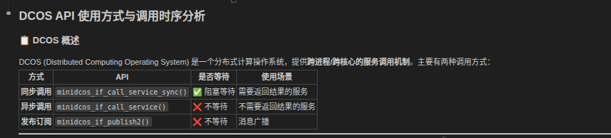
> 核心api
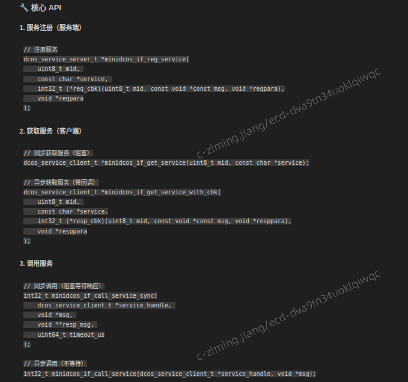
> 1）调用时序分析 同步等待（轮询状态机）
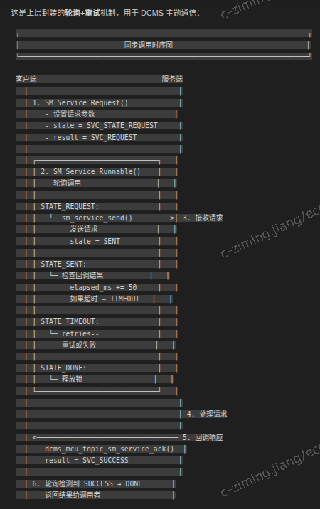
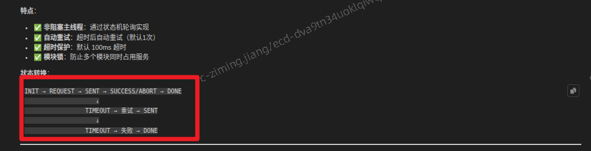
> 2）同步阻塞 直接调用
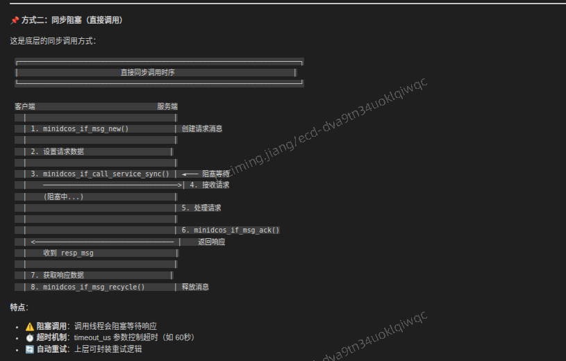
> 3）异步调用
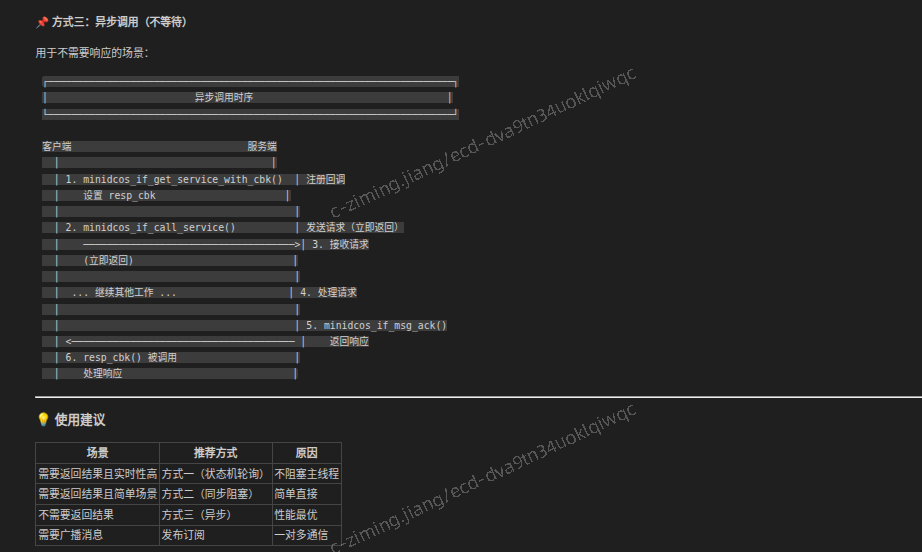

## 2 dcms api使用方式与调用时序分析
> dcms 统一的通信抽象层，屏蔽底层dcos/minidcos差异，提供topic和service通信能力
> 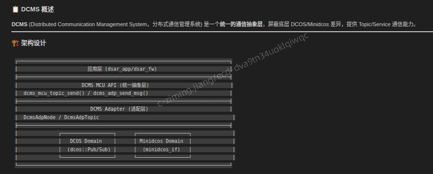
> 核心api
> 01 主题注册 dcms_adp_topic_register
> 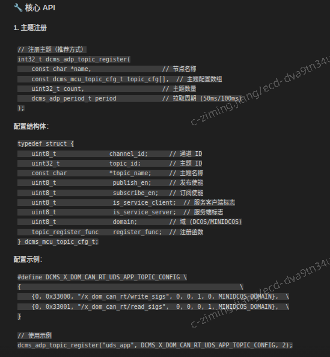
> 02 注册回调
> 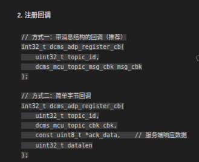
> 03 发送消息
> 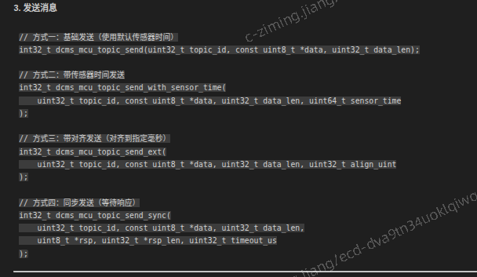
> 调用时序
> 01 topic
> 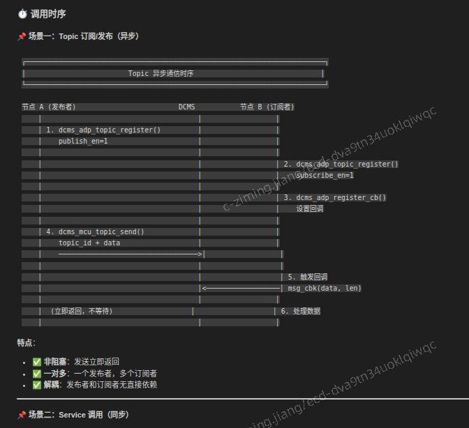
> 02 service (同步/非阻塞同步)
> 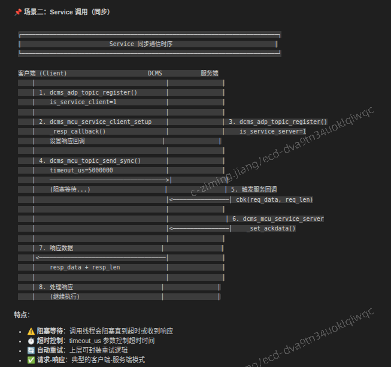
> 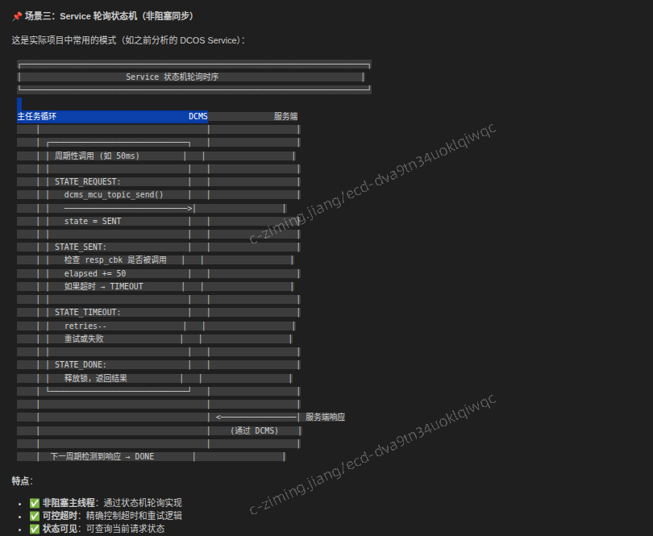
> topic分段
> 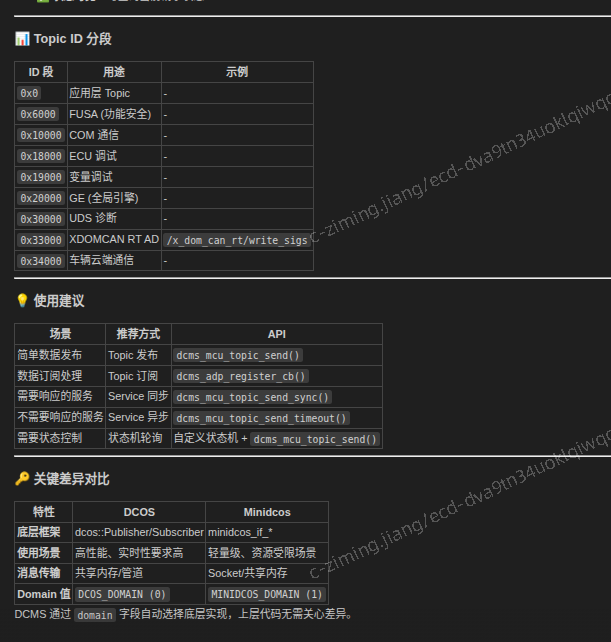
>

## 3 dcms 代码理解

topic 发布者
```cpp
// ============================================================
// temp_sensor.c - 温度传感器 (发布者)
// ============================================================
#include "dsar_plat_bf/cdd/dcms_mcu_api.h"
#include <stdio.h>
#include <unistd.h>

// 1. 定义 Topic ID
typedef enum {
    TEMP_SENSOR_TOPIC = 0x01000,  // 温度传感器 Topic
} topic_id_t;

// 2. 定义温度数据结构
typedef struct {
    float temperature;      // 温度值
    uint32_t timestamp;     // 时间戳
} __attribute__((packed)) temp_data_t;

// 3. 配置 Topic
#define TEMP_SENSOR_TOPIC_CONFIG \
{                                                                 \
    {0, TEMP_SENSOR_TOPIC, "/sensor/temperature", 1, 0, 0, 0, MINIDCOS_DOMAIN} \
}

int main(void) {
    // 4. 注册 Topic (发布者)
    dcms_mcu_topic_cfg_t topic_cfg[] = TEMP_SENSOR_TOPIC_CONFIG;
    int ret = dcms_adp_topic_register("temp_sensor", topic_cfg, 1, DCMS_PULL_PERIOD_50MS);
    if (ret != 0) {
        printf("Topic register failed!\n");
        return -1;
    }
    printf("Temp sensor: Topic registered\n");

    // 5. 周期性发送数据
    temp_data_t temp;
    int count = 0;

    while (1) {
        temp.temperature = 25.0f + (count % 10);  // 模拟温度变化
        temp.timestamp = count;

        // 发送数据到 Topic
        ret = dcms_mcu_topic_send(TEMP_SENSOR_TOPIC, 
                                  (uint8_t*)&temp, 
                                  sizeof(temp));

        if (ret == 0) {
            printf("[%d] Published: %.1f°C\n", count, temp.temperature);
        }

        usleep(1000000);  // 1秒发送一次
        count++;
    }

    return 0;
}
```

topic 订阅者
```cpp
// ============================================================
// temp_monitor.c - 温度监控器 (订阅者)
// ============================================================
#include "dsar_plat_bf/cdd/dcms_mcu_api.h"
#include <stdio.h>
#include <unistd.h>

// 1. 定义相同的 Topic ID
typedef enum {
    TEMP_SENSOR_TOPIC = 0x01000,
} topic_id_t;

// 2. 定义相同的数据结构
typedef struct {
    float temperature;
    uint32_t timestamp;
} __attribute__((packed)) temp_data_t;

// 3. 配置 Topic (订阅者)
#define TEMP_MONITOR_TOPIC_CONFIG \
{                                                                 \
    {0, TEMP_SENSOR_TOPIC, "/sensor/temperature", 0, 1, 0, 0, MINIDCOS_DOMAIN} \
}

// 4. 定义接收回调函数
static int32_t temp_receive_callback(const uint8_t *data, uint32_t len) {
    if (data == NULL || len != sizeof(temp_data_t)) {
        printf("Invalid data received!\n");
        return -1;
    }

    temp_data_t *temp = (temp_data_t*)data;
    printf("🌡️  Received: %.1f°C (ts=%u)\n", temp->temperature, temp->timestamp);

    // 可以添加告警逻辑
    if (temp->temperature > 30.0f) {
        printf("⚠️  WARNING: High temperature!\n");
    }

    return 0;
}

int main(void) {
    // 5. 注册 Topic (订阅者)
    dcms_mcu_topic_cfg_t topic_cfg[] = TEMP_MONITOR_TOPIC_CONFIG;
    int ret = dcms_adp_topic_register("temp_monitor", topic_cfg, 1, DCMS_PULL_PERIOD_50MS);
    if (ret != 0) {
        printf("Topic register failed!\n");
        return -1;
    }
    printf("Temp monitor: Topic registered\n");

    // 6. 注册接收回调
    ret = dcms_adp_register_cb(TEMP_SENSOR_TOPIC, temp_receive_callback);
    if (ret != 0) {
        printf("Callback register failed!\n");
        return -1;
    }
    printf("Temp monitor: Callback registered, waiting for data...\n");

    // 7. 主循环 (等待回调被触发)
    while (1) {
        usleep(1000000);  // 保持运行
    }

    return 0;
}
```
service端
```cpp
// ============================================================
// sys_info_server.c - 系统信息服务端
// ============================================================
#include "dsar_plat_bf/cdd/dcms_mcu_api.h"
#include <stdio.h>
#include <string.h>
#include <unistd.h>

// 1. 定义 Service Topic ID
typedef enum {
    SYS_INFO_SERVICE = 0x02000,
} service_id_t;

// 2. 定义请求和响应结构
typedef struct {
    uint32_t request_type;  // 0=版本, 1=状态, 2=内存
} __attribute__((packed)) sys_info_req_t;

typedef struct {
    uint32_t request_type;
    char info[64];          // 响应信息
    uint32_t result_code;   // 0=成功
} __attribute__((packed)) sys_info_resp_t;

// 3. 配置 Service (服务端)
#define SYS_INFO_SERVER_CONFIG \
{                                                                 \
    {0, SYS_INFO_SERVICE, "/service/sys_info", 0, 0, 0, 1, MINIDCOS_DOMAIN} \
}

// 4. 定义服务请求处理回调
static int32_t sys_info_service_callback(const uint8_t *req_data, uint32_t req_len) {
    if (req_data == NULL || req_len != sizeof(sys_info_req_t)) {
        printf("Invalid request!\n");
        return -1;
    }

    sys_info_req_t *req = (sys_info_req_t*)req_data;
    sys_info_resp_t resp = {0};

    // 根据请求类型处理
    resp.request_type = req->request_type;

    switch (req->request_type) {
        case 0:  // 获取版本
            snprintf(resp.info, sizeof(resp.info), "Version: DSAR-v2.38.1240");
            printf("📨 Service: Version request received\n");
            break;

        case 1:  // 获取状态
            snprintf(resp.info, sizeof(resp.info), "Status: Running, CPU: 45%%");
            printf("📨 Service: Status request received\n");
            break;

        case 2:  // 获取内存
            snprintf(resp.info, sizeof(resp.info), "Memory: 512MB/2GB used");
            printf("📨 Service: Memory request received\n");
            break;

        default:
            snprintf(resp.info, sizeof(resp.info), "Unknown request");
            resp.result_code = 1;
            break;
    }

    // 5. 设置响应数据
    int ret = dcms_mcu_service_server_set_ackdata(
        SYS_INFO_SERVICE,
        (uint8_t*)&resp,
        sizeof(resp)
    );

    if (ret != 0) {
        printf("Failed to set ack data!\n");
        return -1;
    }

    printf("✅ Service: Response sent (len=%u)\n", sizeof(resp));
    return 0;
}

int main(void) {
    // 6. 注册 Service (服务端)
    dcms_mcu_topic_cfg_t topic_cfg[] = SYS_INFO_SERVER_CONFIG;
    int ret = dcms_adp_topic_register("sys_info_server", topic_cfg, 1, DCMS_PULL_PERIOD_50MS);
    if (ret != 0) {
        printf("Service register failed!\n");
        return -1;
    }
    printf("SysInfo Server: Service registered\n");

    // 7. 注册服务回调
    ret = dcms_adp_register_cb(SYS_INFO_SERVICE, sys_info_service_callback, NULL, 0);
    if (ret != 0) {
        printf("Callback register failed!\n");
        return -1;
    }
    printf("SysInfo Server: Callback registered, waiting for requests...\n");

    // 8. 主循环
    while (1) {
        usleep(1000000);
    }

    return 0;
}
```
service客户端
```cpp
// ============================================================
// sys_info_client.c - 系统信息客户端
// ============================================================
#include "dsar_plat_bf/cdd/dcms_mcu_api.h"
#include <stdio.h>
#include <string.h>
#include <unistd.h>

// 1. 定义相同的 Service Topic ID
typedef enum {
    SYS_INFO_SERVICE = 0x02000,
} service_id_t;

// 2. 定义相同的数据结构
typedef struct {
    uint32_t request_type;
} __attribute__((packed)) sys_info_req_t;

typedef struct {
    uint32_t request_type;
    char info[64];
    uint32_t result_code;
} __attribute__((packed)) sys_info_resp_t;

// 3. 配置 Service (客户端)
#define SYS_INFO_CLIENT_CONFIG \
{                                                                 \
    {0, SYS_INFO_SERVICE, "/service/sys_info", 0, 0, 1, 0, MINIDCOS_DOMAIN} \
}

// 4. 定义响应回调 (异步调用时使用)
static int32_t sys_info_response_callback(const uint8_t *resp_data, uint32_t resp_len) {
    if (resp_data == NULL || resp_len != sizeof(sys_info_resp_t)) {
        printf("Invalid response!\n");
        return -1;
    }

    sys_info_resp_t *resp = (sys_info_resp_t*)resp_data;

    if (resp->result_code == 0) {
        printf("📥 Response: %s\n", resp->info);
    } else {
        printf("❌ Request failed: %s\n", resp->info);
    }

    return 0;
}

int main(void) {
    // 5. 注册 Service (客户端)
    dcms_mcu_topic_cfg_t topic_cfg[] = SYS_INFO_CLIENT_CONFIG;
    int ret = dcms_adp_topic_register("sys_info_client", topic_cfg, 1, DCMS_PULL_PERIOD_50MS);
    if (ret != 0) {
        printf("Service register failed!\n");
        return -1;
    }
    printf("SysInfo Client: Service registered\n");

    // 6. 注册响应回调 (用于异步调用)
    ret = dcms_mcu_service_client_setup_resp_callback(SYS_INFO_SERVICE, sys_info_response_callback);
    if (ret != 0) {
        printf("Response callback register failed!\n");
        return -1;
    }
    printf("SysInfo Client: Response callback registered\n");

    // 等待服务就绪
    sleep(2);

    // ============================================================
    // 方式一：同步调用 (阻塞等待响应)
    // ============================================================
    printf("\n--- 方式一：同步调用 ---\n");

    sys_info_req_t req = {.request_type = 0};  // 请求版本信息
    sys_info_resp_t resp = {0};
    uint32_t resp_len = sizeof(resp);

    ret = dcms_mcu_topic_send_sync(
        SYS_INFO_SERVICE,
        (uint8_t*)&req,
        sizeof(req),
        (uint8_t*)&resp,
        &resp_len,
        5000000  // 5秒超时
    );

    if (ret == 0 && resp.result_code == 0) {
        printf("✅ Sync Response: %s\n", resp.info);
    } else {
        printf("❌ Sync request failed!\n");
    }

    // ============================================================
    // 方式二：异步调用 (不等待，通过回调接收响应)
    // ============================================================
    printf("\n--- 方式二：异步调用 ---\n");

    req.request_type = 1;  // 请求状态信息

    ret = dcms_mcu_topic_send_timeout(
        SYS_INFO_SERVICE,
        (uint8_t*)&req,
        sizeof(req),
        5000000
    );

    if (ret == 0) {
        printf("✅ Async request sent, waiting for callback...\n");
    } else {
        printf("❌ Async request failed!\n");
    }

    // 保持运行，等待异步响应
    sleep(2);

    // ============================================================
    // 方式三：状态机轮询 (推荐用于实际项目)
    // ============================================================
    printf("\n--- 方式三：状态机轮询 ---\n");

    typedef enum {
        STATE_IDLE,
        STATE_REQUEST_SENT,
        STATE_RESPONSE_RECEIVED,
        STATE_TIMEOUT,
        STATE_ERROR
    } state_t;

    state_t state = STATE_IDLE;
    uint32_t retry_count = 0;
    const uint32_t max_retries = 3;
    uint32_t timeout_ms = 0;
    const uint32_t timeout_limit = 500;  // 500ms
    sys_info_resp_t poll_resp = {0};

    // 注册轮询用的响应回调
    static volatile bool response_received = false;
    auto poll_resp_callback = [](const uint8_t *data, uint32_t len) -> int32_t {
        if (len == sizeof(sys_info_resp_t)) {
            memcpy(&poll_resp, data, len);
            response_received = true;
        }
        return 0;
    };

    dcms_mcu_service_client_setup_resp_callback(SYS_INFO_SERVICE, poll_resp_callback);

    // 发送请求
    req.request_type = 2;  // 请求内存信息
    dcms_mcu_topic_send(SYS_INFO_SERVICE, (uint8_t*)&req, sizeof(req));
    state = STATE_REQUEST_SENT;
    printf("📤 Request sent, polling...\n");

    // 轮询状态机
    while (state != STATE_RESPONSE_RECEIVED && 
           state != STATE_ERROR &&
           retry_count < max_retries) {

        usleep(50000);  // 50ms 轮询周期

        switch (state) {
            case STATE_REQUEST_SENT:
                if (response_received) {
                    state = STATE_RESPONSE_RECEIVED;
                    printf("✅ Poll Response: %s\n", poll_resp.info);
                } else {
                    timeout_ms += 50;
                    if (timeout_ms >= timeout_limit) {
                        state = STATE_TIMEOUT;
                    }
                }
                break;

            case STATE_TIMEOUT:
                retry_count++;
                if (retry_count < max_retries) {
                    printf("⏱️  Timeout, retrying... (%u/%u)\n", 
                           retry_count, max_retries);
                    timeout_ms = 0;
                    response_received = false;
                    dcms_mcu_topic_send(SYS_INFO_SERVICE, 
                                      (uint8_t*)&req, 
                                      sizeof(req));
                    state = STATE_REQUEST_SENT;
                } else {
                    printf("❌ All retries failed!\n");
                    state = STATE_ERROR;
                }
                break;

            default:
                break;
        }
    }

    printf("\nClient demo completed.\n");
    return 0;
}
```

调用结果
```bash
// Terminal 1 - 温度传感器
$ ./temp_sensor
Temp sensor: Topic registered
[0] Published: 25.0°C
[1] Published: 26.0°C
[2] Published: 27.0°C
...

// Terminal 2 - 温度监控器
$ ./temp_monitor
Temp monitor: Topic registered
Temp monitor: Callback registered, waiting for data...
🌡️  Received: 25.0°C (ts=0)
🌡️  Received: 26.0°C (ts=1)
🌡️  Received: 27.0°C (ts=2)
⚠️  WARNING: High temperature!
...

// Terminal 3 - 系统信息服务端
$ ./sys_info_server
SysInfo Server: Service registered
SysInfo Server: Callback registered, waiting for requests...
📨 Service: Version request received
✅ Service: Response sent (len=72)
📨 Service: Status request received
✅ Service: Response sent (len=72)
...

// Terminal 4 - 系统信息客户端
$ ./sys_info_client
SysInfo Client: Service registered
SysInfo Client: Response callback registered

--- 方式一：同步调用 ---
✅ Sync Response: Version: DSAR-v2.38.1240

--- 方式二：异步调用 ---
✅ Async request sent, waiting for callback...
📥 Response: Status: Running, CPU: 45%

--- 方式三：状态机轮询 ---
📤 Request sent, polling...
✅ Poll Response: Memory: 512MB/2GB used

Client demo completed.
```

关键点总结
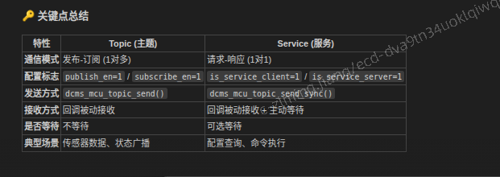

## 4 service同步与异步调用区别
总体理解
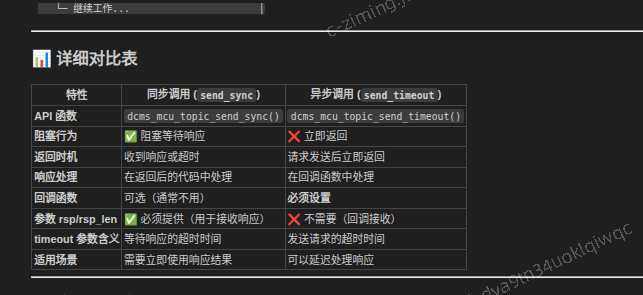
同步调用
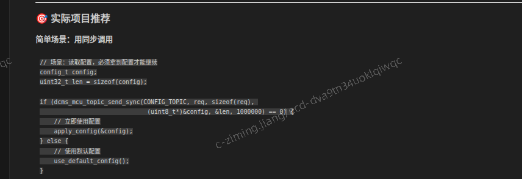
异步调用
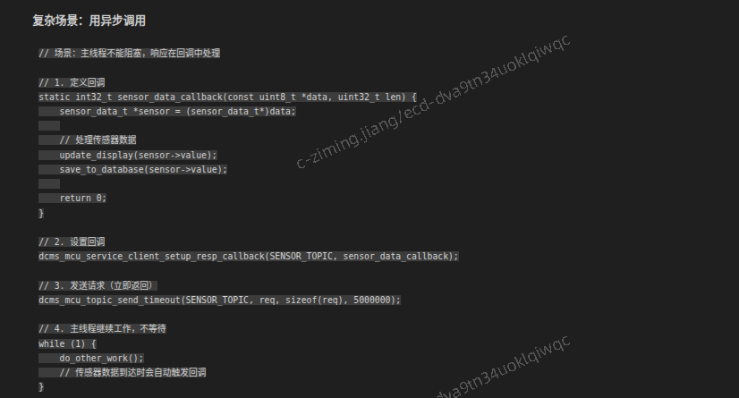