## **数学模型推导**
> **01 目录**
> 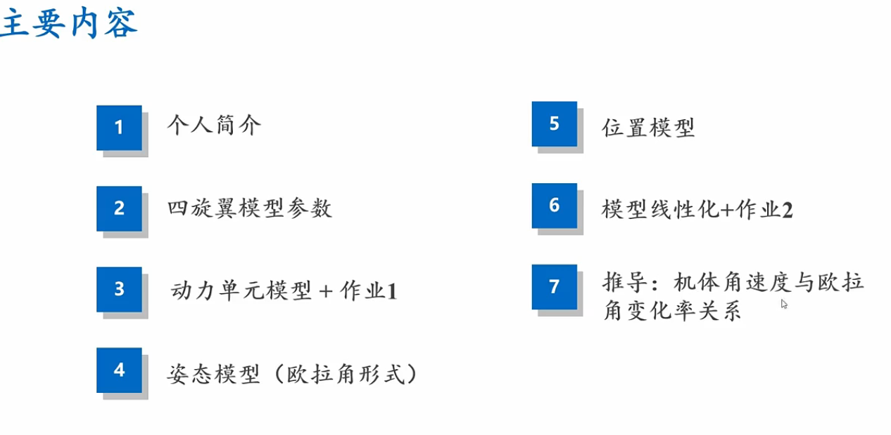
> **2 模型参数**
> 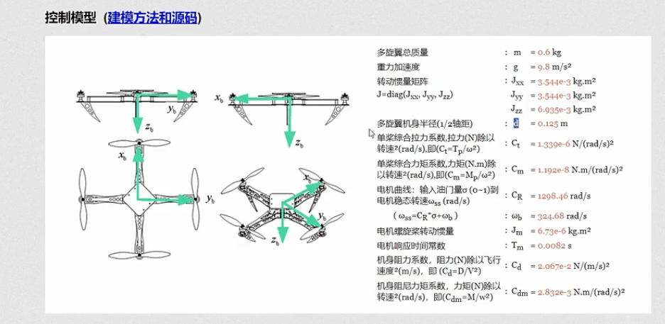
> **3 动力单元模型 总览**
> 输入是四个电机的油门 sigma1-4 输出四个电机转速 w1-4 
> 不同的转速会有不同的升力，会对三轴产生对应的力矩
> 输出是机体升力和力矩
> 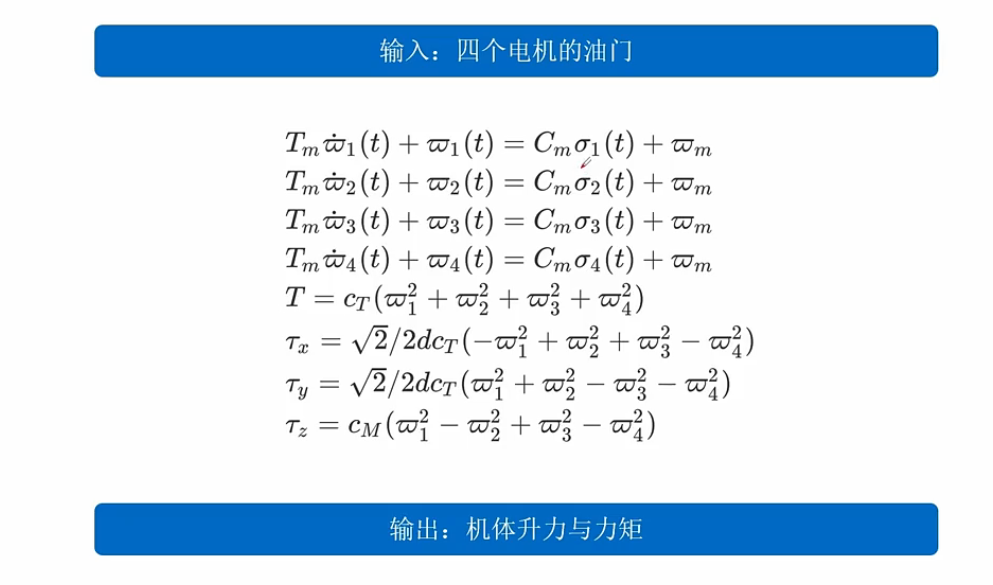
> **4 具体解读-电机模型**
> 电机模型
> tm是电机时间常数，实际希望tm越小越好，容易很快达到稳态
> 决定的是斜率
> 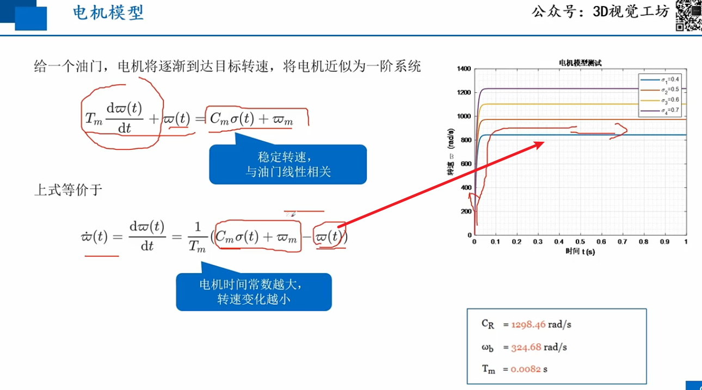
> **5 具体解读-升力模型**
> 单个螺旋桨产生的升力与转速成正比
> 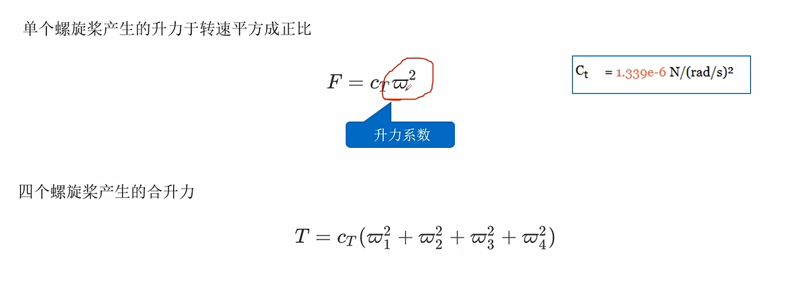
> **5 具体解读-力矩模型**
> 采用的是前右下的机体坐标系
> 全局坐标系是北东地坐标系
> xy轴合力矩
> 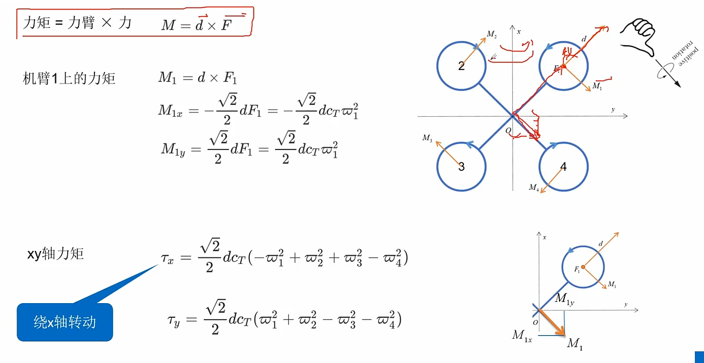
> z轴力矩理解（阻力矩产生的绕z轴转动的力矩）
> 阻力矩是平行于z轴的，纯力偶可以随意平移
> 因此对于单旋翼的力矩可以平移到四旋翼的中心上
> 绕z轴旋转可以采用降低m2 m4转速 提高m1 m3转速
> 总升力不变，但有z轴力矩
> 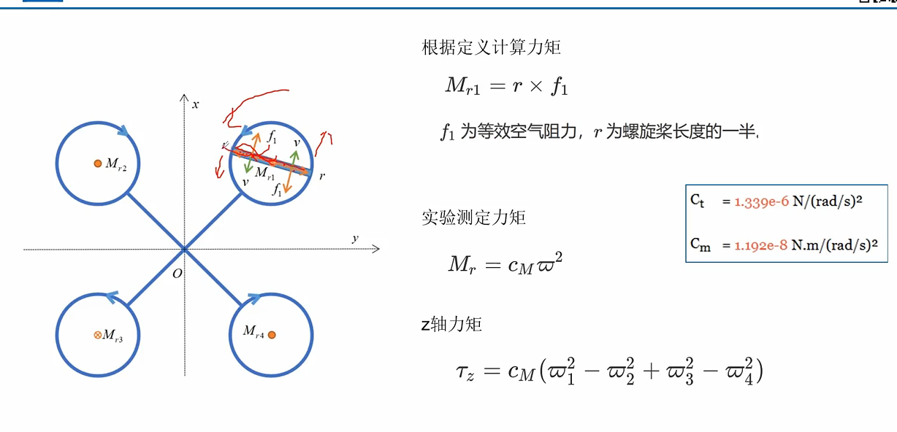
> 实验测 cm 参数，要比x，y轴的参数小1-2个数量级
> 绕z轴较难转动
> **6 计算例子**
> 1 计算无人机的最大升力
> 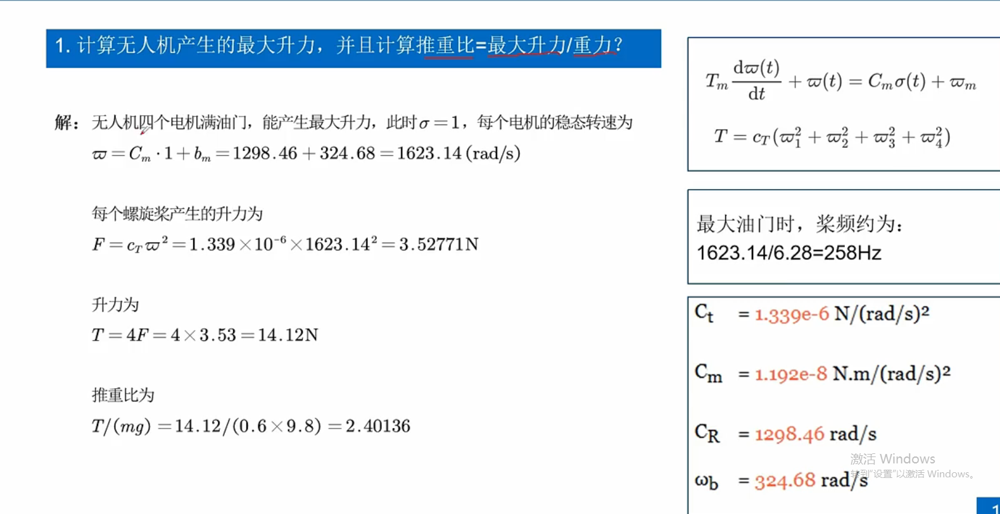
> 2 计算力矩
> z轴力矩会比较小
> 
> **7 代码实战**
> 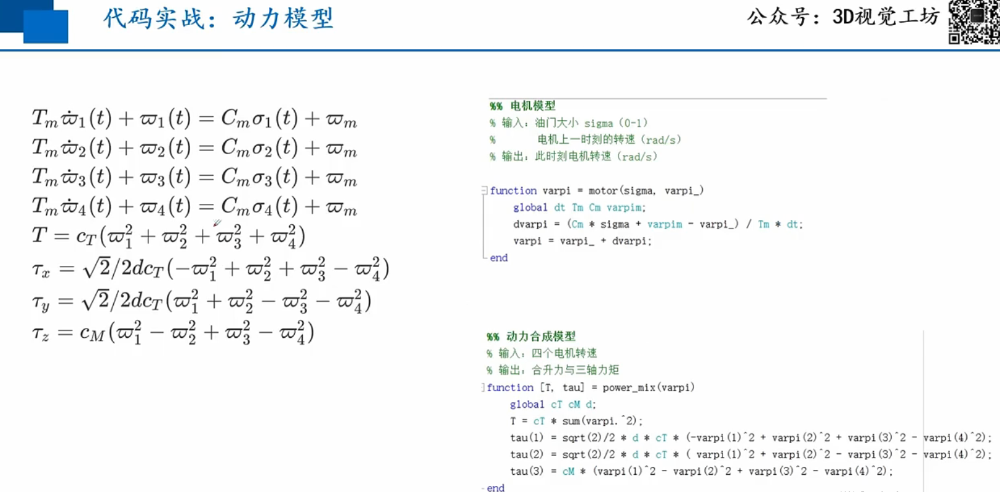
> 模型测试
> 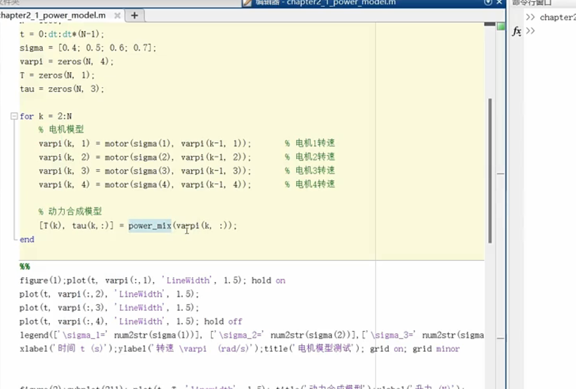
> 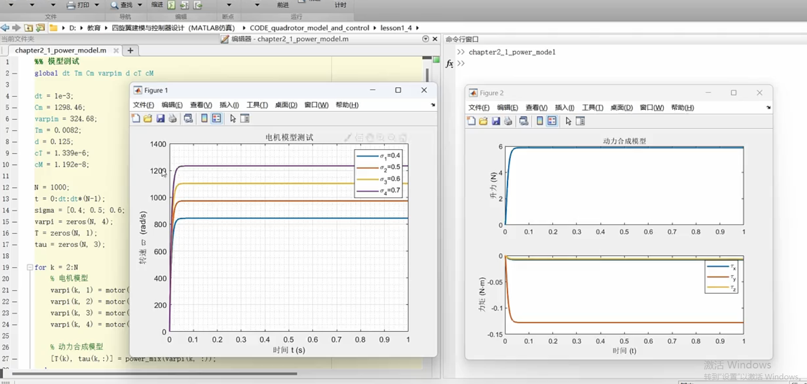
> 电机模型（离散模型）
> 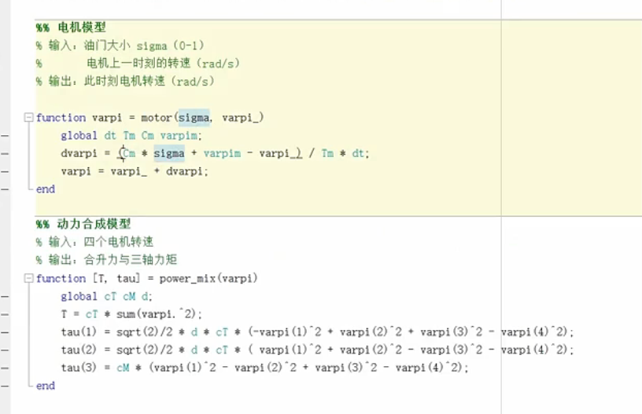
> 动力合成
> 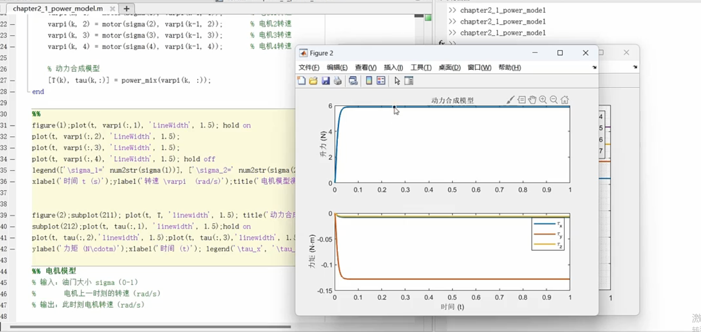
>
> ---
## **补充01 不同坐标系下的力矩计算**

我们一步步来。

### 目标

推导：关于新参考点 O 的总力矩 $\vec{\tau}_O$ 和关于旧参考点 C 的总力矩 $\vec{\tau}_C$ 之间的关系。

### 1\. 设定场景和基本定义

首先，我们建立一个通用的场景。想象一个刚体，上面作用着许多个力 $\vec{F}_1, \vec{F}_2, \dots, \vec{F}_n$。每个力 $\vec{F}_i$ 的作用点是 $P_i$。

我们有两个参考点：O 和 C。

根据矢量加法的三角形法则，我们可以写出三个关键位置矢量之间的关系：

  * $\vec{r}_{iO}$：从 O 点到力作用点 $P_i$ 的矢量。
  * $\vec{r}_{iC}$：从 C 点到力作用点 $P_i$ 的矢量。
  * $\vec{R}_{CO}$：从 O 点到 C 点的矢量。

从图中可以清晰地看出：
$$\vec{r}_{iO} = \vec{R}_{CO} + \vec{r}_{iC}$$
这个简单的几何关系是整个推导的基石。

-----

### 2\. 从力矩的定义出发

我们的目标是求 $\vec{\tau}_O$。根据力矩的定义，一个力系关于 O 点的总力矩是所有单个力矩的矢量和：
$$\vec{\tau}_O = \sum_{i=1}^{n} (\vec{r}_{iO} \times \vec{F}_i)$$

-----

### 3\. 进行代换

现在，我们将第一步得到的几何关系 $\vec{r}_{iO} = \vec{R}_{CO} + \vec{r}_{iC}$ 代入上面的力矩定义式中：
$$\vec{\tau}_O = \sum_{i=1}^{n} [(\vec{R}_{CO} + \vec{r}_{iC}) \times \vec{F}_i]$$

-----

### 4\. 利用叉乘的分配律展开

叉乘对矢量加法满足分配律，即 $(\vec{A} + \vec{B}) \times \vec{C} = (\vec{A} \times \vec{C}) + (\vec{B} \times \vec{C})$。我们用它来展开方括号里的内容：
$$\vec{\tau}_O = \sum_{i=1}^{n} [(\vec{R}_{CO} \times \vec{F}_i) + (\vec{r}_{iC} \times \vec{F}_i)]$$
然后，我们可以将求和符号分配到两项中：
$$\vec{\tau}_O = \sum_{i=1}^{n} (\vec{R}_{CO} \times \vec{F}_i) + \sum_{i=1}^{n} (\vec{r}_{iC} \times \vec{F}_i)$$

-----

### 5\. 分别分析等式右边的两项

现在我们来仔细看看这两项分别是什么。

  * **第二项：$\sum (\vec{r}_{iC} \times \vec{F}_i)$**

      * $\vec{r}_{iC}$ 是从 C 点出发的力臂，$\vec{F}_i$ 是对应的力。
      * 这一项的求和，根据定义，就是整个力系**关于 C 点的总力矩**。
      * 所以：$\sum_{i=1}^{n} (\vec{r}_{iC} \times \vec{F}_i) = \vec{\tau}_C$

  * **第一项：$\sum (\vec{R}_{CO} \times \vec{F}_i)$**

      * 在这个求和中，矢量 $\vec{R}_{CO}$ 是一个**常量**。因为它描述的是 O 和 C 两个固定参考点之间的关系，与具体是哪个力 $\vec{F}_i$ 无关。
      * 因为 $\vec{R}_{CO}$ 是常量，我们可以利用叉乘的分配律把它提到求和符号的外面：
        $$\sum_{i=1}^{n} (\vec{R}_{CO} \times \vec{F}_i) = \vec{R}_{CO} \times \left( \sum_{i=1}^{n} \vec{F}_i \right)$$
      * 括号里的 $\sum \vec{F}_i$ 是什么？它正是作用在刚体上所有力的矢量和，也就是我们所说的**合力 (Net Force)**, $\vec{F}_{\text{net}}$。
      * 所以：$\sum_{i=1}^{n} (\vec{R}_{CO} \times \vec{F}_i) = \vec{R}_{CO} \times \vec{F}_{\text{net}}$

-----

### 6\. 组合结果

现在，我们将分析得到的两项代回到第4步的方程中：
$$\vec{\tau}_O = (\vec{R}_{CO} \times \vec{F}_{\text{net}}) + \vec{\tau}_C$$
整理一下顺序，就得到了最终的公式：
$$\vec{\tau}_O = \vec{\tau}_C + \vec{R}_{CO} \times \vec{F}_{\text{net}}$$

推导完成！

这个公式的物理意义可以这样理解：**一个力系关于新参考点O的力矩，等于它原来关于旧参考点C的力矩，再加上把整个力系的合力$\vec{F}_{\text{net}}$平移到旧参考点C处所产生的附加力矩。**