## **3 姿态模型**
> **1 姿态模型概览**
> 输入3轴力矩，输出三轴角速度和姿态
> 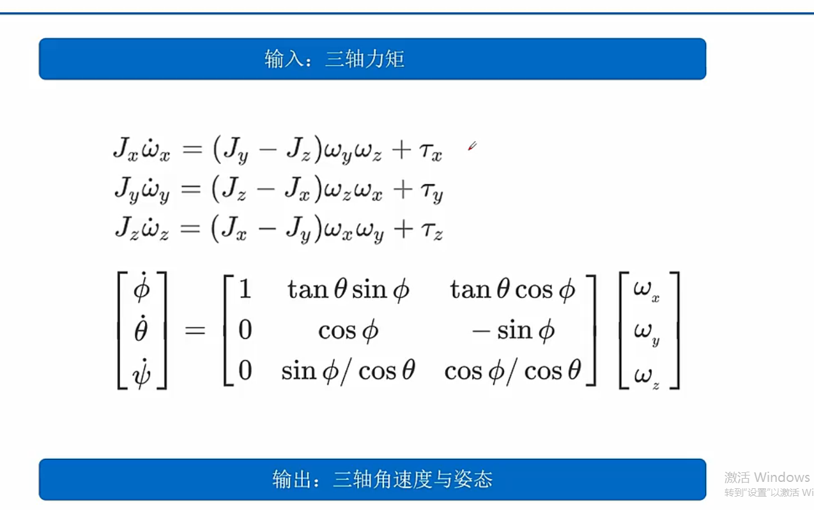
> **2 一些基础概念**
> 转动惯量定义 I=mr2 本质的定义，类比于物体的质量
> 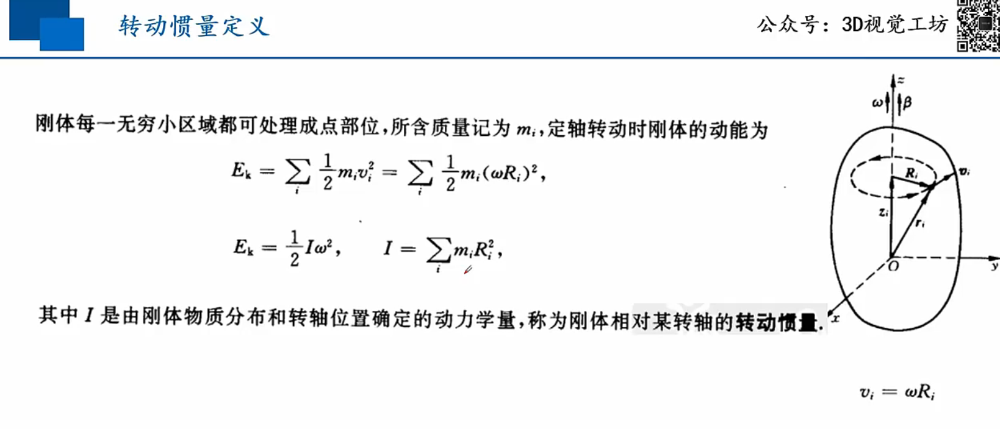
> 力矩参考点平移
> 
> 力矩衡量的是角速度的变化率 （力矩为角动量的导数）
> 类比力衡量的是速度的变化率 （力为动量的导数）
> 
> 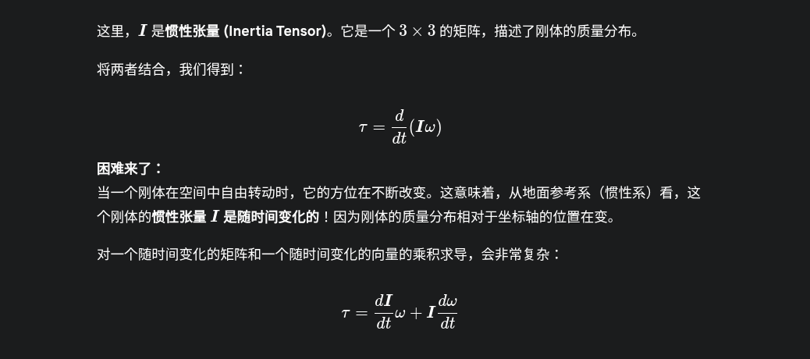
> 定轴转动定理
> 角动量
> 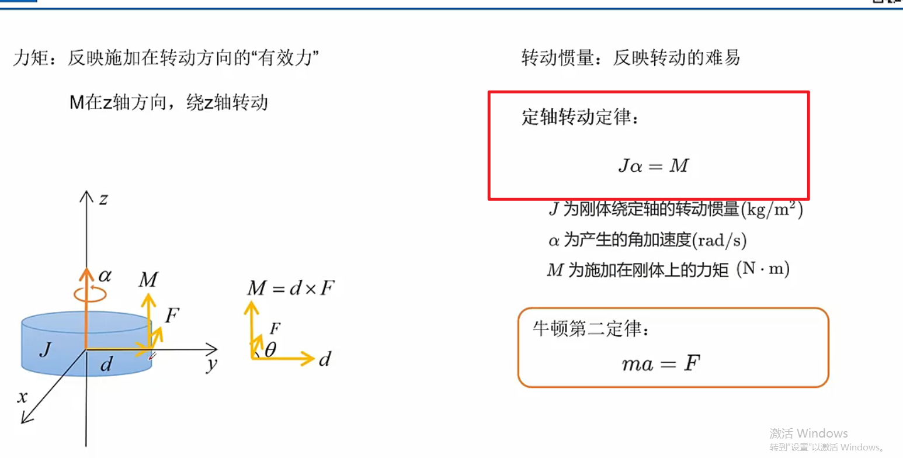
> 定点转动定理（欧拉动力学方程）
> 定点转动对于x轴来说除了taox以外还与wywz的转动有关
> 一般来说都是一个轴在快速转动，jxx项可以被忽略
> jxx和jyy一般相同
> 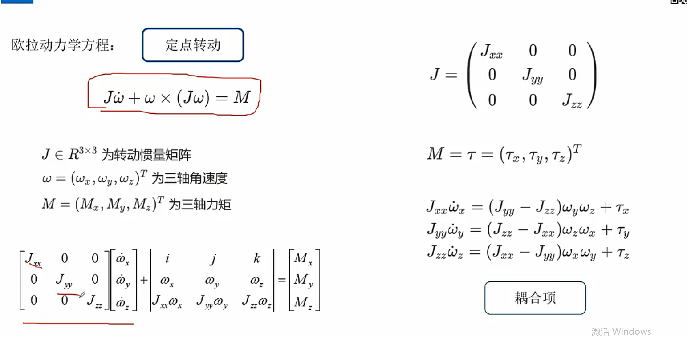
> 举例计算 估算角加速度
> 一般来说jzz = jxx + jyy
> 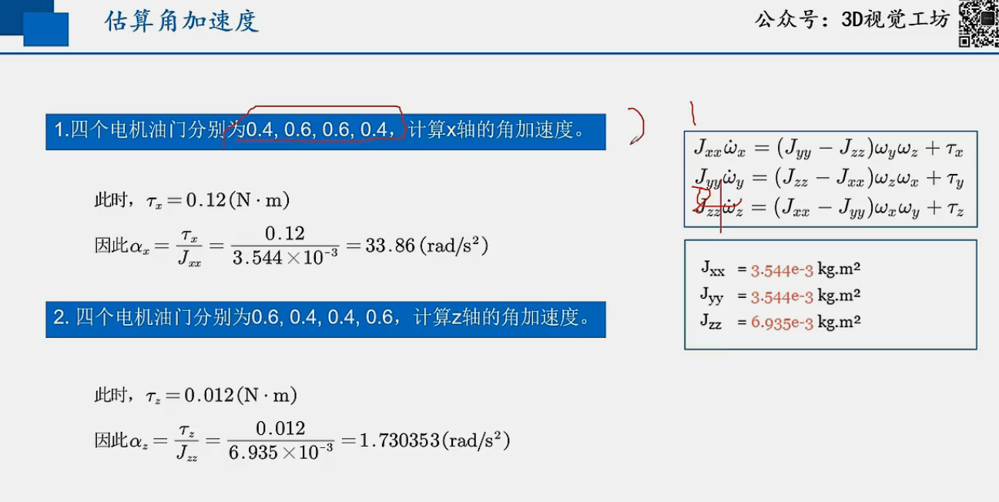
> **3 欧拉角定义**
> zyx欧拉角 航偏角->俯仰角->翻滚角 
> 通过连续三次旋转，可以朝向任意方向
> 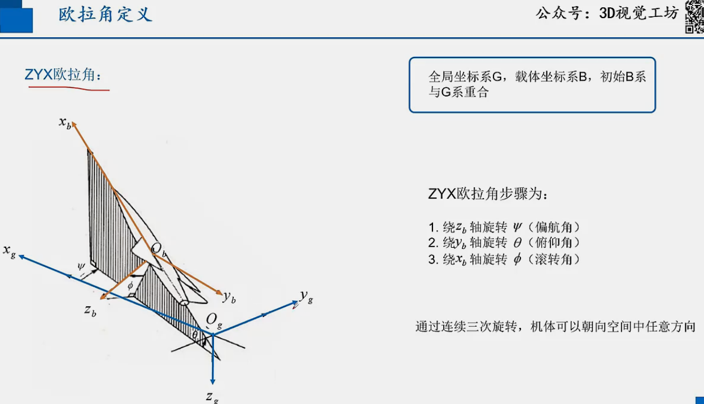
> 姿态变化率与角速度关系
> 根本原因是欧拉角是三个坐标系，角速度是一个固定坐标系
> 
> **4 姿态代码详解**
> 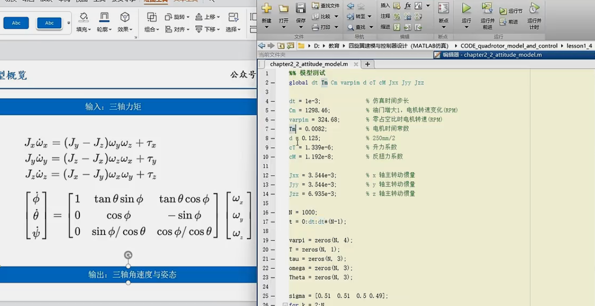
> 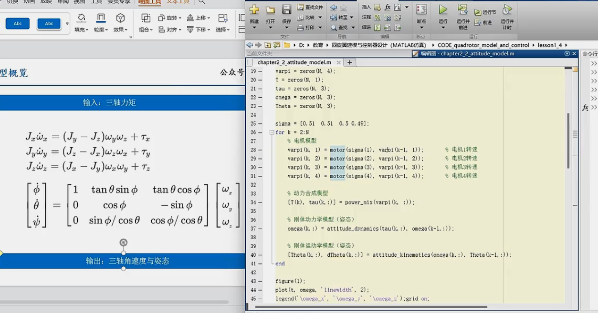
> 动力学模型和运动学模型
> 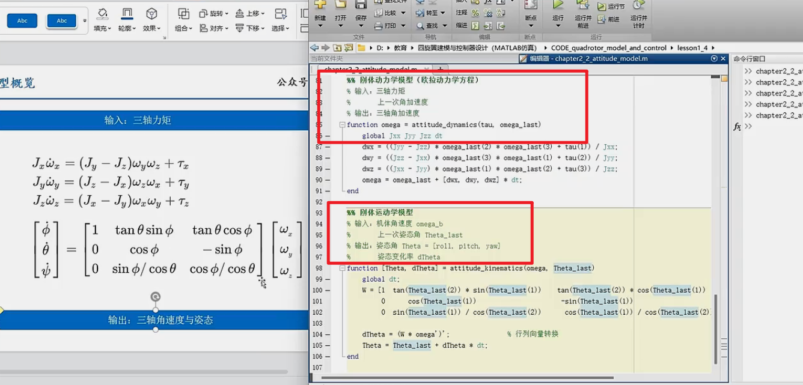
> 结果如下
> 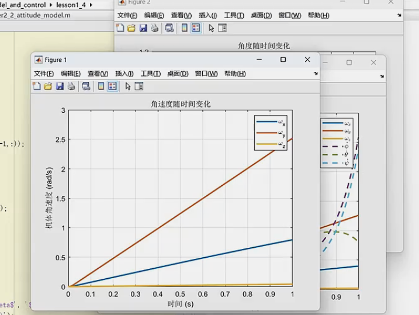
> 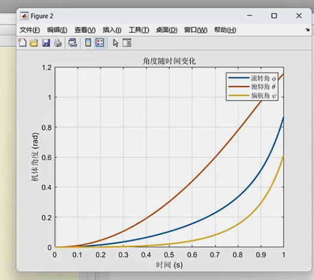
> 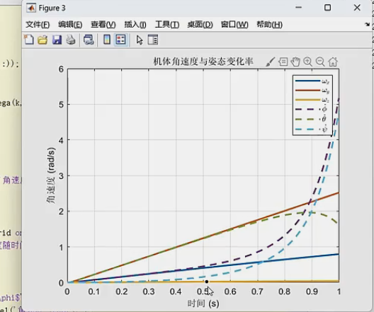

---
## **补充 00 角动量与动力矩**
这是一个非常棒的基础问题！

**角动量 (Angular Momentum)** 和 **动力矩 (Torque)** **不是**同一个东西，但它们之间存在着牛顿第二定律在转动问题中那样的深刻关系。

为了让你彻底明白，我们可以借助一个简单的类比：**平动和转动的对比**。

| 平动 (Linear Motion)                      | 转动 (Rotational Motion)                                 |
| :---------------------------------------- | :------------------------------------------------------- |
| **力 (Force, $\vec{F}$)**                 | **力矩 (Torque, $\vec{\tau}$)** (动力矩是力矩的别称)     |
| **动量 (Momentum, $\vec{p} = m\vec{v}$)** | **角动量 (Angular Momentum, $\vec{L} = I\vec{\omega}$)** |

现在，我们来详细解释一下。

---

### 核心区别：一个描述状态，一个描述改变

#### 1. 角动量 (Angular Momentum, $\vec{L}$)

* **是什么？** 角动量是物体**转动状态的量度**。它描述了一个物体“拥有”多少转动。一个物体只要在转动，它就具有角动量。
* **类比**：它就像平动中的**动量 ($\vec{p}$)**。动量是物体“拥有”多少平动运动的量度。
* **作用**：它是一个**状态量**。角动量越大，意味着这个物体的转动惯性越大，越难让它停下来。
* **公式**：
    * 对于质点: $\vec{L} = \vec{r} \times \vec{p}$ （位置矢量叉乘动量）
    * 对于刚体: $\vec{L} = I \vec{\omega}$ （转动惯量乘以角速度）
* **单位**：$kg \cdot m^2/s$

**例子**：一个正在旋转的陀螺、绕地球公转的月球、花样滑冰运动员在旋转时，都具有角动量。

#### 2. 动力矩 (Torque, $\vec{\tau}$)

* **是什么？** “动力矩”就是**力矩**的另一个说法。它是**改变物体转动状态的原因**。它是一种外部作用。
* **类比**：它就像平动中的**力 ($\vec{F}$)**。力是改变物体平动状态（即改变动量）的原因。
* **作用**：它是一个**作用量**。有力矩作用在物体上，物体的转动就会发生改变（转得更快、更慢、或者转动方向改变）。**没有力矩，物体的转动状态就不会变**。
* **公式**：
    * $\vec{\tau} = \vec{r} \times \vec{F}$ （力臂叉乘力）
* **单位**：$N \cdot m$ (牛顿·米)

**例子**：用扳手拧螺丝、用手转动门把手、风吹动风车，这些都是施加力矩的例子。

---

### 核心关系：力矩是角动量的变化率

它们之间最重要的关系，正是牛顿第二定律的转动版本：

**施加在物体上的净外力矩，等于其角动量随时间的变化率。**

$$\vec{\tau}_{\text{net}} = \frac{d\vec{L}}{dt}$$

这和我们熟悉的平动定律 $\vec{F}_{\text{net}} = \frac{d\vec{p}}{dt}$ 是完全对应的！

**这个公式告诉我们：**
1.  **力矩是因，角动量改变是果**：如果你对一个物体施加了力矩（比如用手去加速一个静止的轮子），那么这个物体的角动量就会从零开始增加。你施加力矩的时间越长，角动量就变得越大。
2.  **角动量守恒**：如果一个系统不受外力矩，或者所受外力矩之和为零（$\vec{\tau}_{\text{net}} = 0$），那么 $\frac{d\vec{L}}{dt} = 0$，这意味着角动量 $\vec{L}$ 将保持不变。这就是**角动量守恒定律**。
    * **经典例子**：一个旋转的花样滑冰运动员，当她把张开的手臂收回时，她的转动惯量 $I$ 减小了。由于没有外界力矩，她的角动量 $L = I\omega$ 必须保持守恒。因此，她的角速度 $\omega$ 就会急剧增大，转得飞快。在这个过程中，她“拥有”的角动量始终没变，但她的转动状态（角速度）改变了。

### 总结

| 特性      | 角动量 (Angular Momentum)    | 动力矩 (Torque)                      |
| :-------- | :--------------------------- | :----------------------------------- |
| **本质**  | 物体**转动状态**的量度       | **改变**物体转动状态的原因           |
| **是...** | 一种**属性 (Property)**      | 一种**作用 (Action)**                |
| **类比**  | 动量 (Momentum)              | 力 (Force)                           |
| **关系**  | **力矩**是**角动量**的变化率 | **角动量**是**力矩**对时间累积的结果 |

所以，它们是两个截然不同但又密不可分的概念，就像力和动量一样。

---
## **补充 01 定点转动下的欧拉角动量方程**
当然！很乐意帮助你学习刚体定点转动下的欧拉动力学方程。这是经典力学中一个非常核心且优美的部分，它描述了刚体在受到外力矩作用时，其角速度如何随时间变化。

为了彻底理解，我们将分步进行：

1.  **出发点：为什么需要欧拉方程？**
2.  **关键思想：引入一个“与刚体一起转动”的参考系。**
3.  **方程的推导。**
4.  **最终形式与物理意义。**
5.  **一个重要应用：自由转动。**

---

### 1. 出发点：为什么需要欧拉方程？

我们知道，对于质点，牛顿第二定律的转动形式是：力矩等于角动量的变化率。
$$\vec{\tau} = \frac{d\vec{L}}{dt}$$
这个公式对于刚体同样成立。其中：
* $\vec{\tau}$ 是作用在刚体上的总外力矩 (Torque)。
* $\vec{L}$ 是刚体的总角动量 (Angular Momentum)。
* 这个导数必须在**惯性参考系**（例如，地面参考系）中计算。

对于一个刚体，角动量 $\vec{L}$ 和角速度 $\vec{\omega}$ 的关系是：
$$\vec{L} = \boldsymbol{I} \vec{\omega}$$
这里，$\boldsymbol{I}$ 是**惯性张量 (Inertia Tensor)**。它是一个 $3 \times 3$ 的矩阵，描述了刚体的质量分布。

将两者结合，我们得到：
$$\vec{\tau} = \frac{d}{dt}(\boldsymbol{I} \vec{\omega})$$

**困难来了：**
当一个刚体在空间中自由转动时，它的方位在不断改变。这意味着，从地面参考系（惯性系）看，这个刚体的**惯性张量 $\boldsymbol{I}$ 是随时间变化的**！因为刚体的质量分布相对于坐标轴的位置在变。

对一个随时间变化的矩阵和一个随时间变化的向量的乘积求导，会非常复杂：
$$\vec{\tau} = \frac{d\boldsymbol{I}}{dt}\vec{\omega} + \boldsymbol{I}\frac{d\vec{\omega}}{dt}$$
这个方程很难求解。

---

### 2. 关键思想：切换参考系

为了解决 $\boldsymbol{I}$ 随时间变化的问题，物理学家想出了一个绝妙的办法：**不站在地面上看，而是“骑”在刚体上和它一起转动。**

我们建立一个**固连参考系 (Body-fixed frame)**，它的坐标轴固定在刚体上，并随刚体一起转动。

* **优点**：在这个固连参考系中，刚体的质量分布是固定的，因此它的**惯性张量 $\boldsymbol{I}_{body}$ 是一个常数矩阵**！
* **代价**：这个固连参考系是一个**非惯性系**。我们需要处理从惯性系到非惯性系的变换。

---

### 3. 方程的推导

我们有一个普适的矢量关系，用于计算一个矢量 $\vec{A}$ 在惯性系（Lab Frame）中的时间导数和在转动参考系（Body Frame，角速度为 $\vec{\omega}$）中的时间导数的关系：

$$\left(\frac{d\vec{A}}{dt}\right)_{Lab} = \left(\frac{d\vec{A}}{dt}\right)_{Body} + \vec{\omega} \times \vec{A}$$

这个公式的直观理解是：从地面看，矢量 $\vec{A}$ 的总变化，等于它在刚体坐标系中的自身变化，再加上由于整个刚体坐标系转动带来的“牵连”变化 ($\vec{\omega} \times \vec{A}$)。

现在，我们将这个普适关系应用到角动量 $\vec{L}$ 上：

$$\left(\frac{d\vec{L}}{dt}\right)_{Lab} = \left(\frac{d\vec{L}}{dt}\right)_{Body} + \vec{\omega} \times \vec{L}$$

我们知道，在惯性系中 $\vec{\tau} = \left(\frac{d\vec{L}}{dt}\right)_{Lab}$，所以：

$$\vec{\tau} = \left(\frac{d\vec{L}}{dt}\right)_{Body} + \vec{\omega} \times \vec{L}$$

现在，我们把所有的矢量都放到**固连参考系**中来表示。在这个参考系里：
* 角动量 $\vec{L} = \boldsymbol{I}_{body} \vec{\omega}$。
* 因为 $\boldsymbol{I}_{body}$ 是常数，所以 $\left(\frac{d\vec{L}}{dt}\right)_{Body} = \boldsymbol{I}_{body} \left(\frac{d\vec{\omega}}{dt}\right)_{Body}$。

将这两点代入上面的方程，我们得到了**欧拉动力学方程的矢量形式**：

$$\vec{\tau} = \boldsymbol{I}_{body} \frac{d\vec{\omega}}{dt} + \vec{\omega} \times (\boldsymbol{I}_{body} \vec{\omega})$$

这个方程中的所有量（$\vec{\tau}, \vec{\omega}, \boldsymbol{I}_{body}$）都是在固连参考系中测量的分量。

---

### 4. 最终形式与物理意义

为了让方程更实用，我们通常会选择一个特殊的固连参考系：**主轴坐标系 (Principal Axes Frame)**。

在这个坐标系中，惯性张量 $\boldsymbol{I}_{body}$ 是一个对角矩阵：
$$
\boldsymbol{I}_{body} =
\begin{pmatrix}
I_1 & 0 & 0 \\
0 & I_2 & 0 \\
0 & 0 & I_3
\end{pmatrix}
$$
其中 $I_1, I_2, I_3$ 是刚体绕三个主轴的转动惯量，称为**主转动惯量**。

我们将矢量写成分量形式：
* $\vec{\omega} = (\omega_1, \omega_2, \omega_3)$
* $\vec{\tau} = (\tau_1, \tau_2, \tau_3)$

代入到矢量形式的欧拉方程中，并展开计算叉乘项 $\vec{\omega} \times (\boldsymbol{I}_{body} \vec{\omega})$，最终得到三个分量方程：

$$
\begin{cases}
\tau_1 = I_1 \dot{\omega}_1 + (I_3 - I_2) \omega_2 \omega_3 \\
\tau_2 = I_2 \dot{\omega}_2 + (I_1 - I_3) \omega_3 \omega_1 \\
\tau_3 = I_3 \dot{\omega}_3 + (I_2 - I_1) \omega_1 \omega_2
\end{cases}
$$

这就是**欧拉动力学方程**最常见的形式。

**物理意义解读：**
以第一个方程为例： $\tau_1 = I_1 \dot{\omega}_1 + (I_3 - I_2) \omega_2 \omega_3$
* $\tau_1$：绕主轴1的力矩。
* $I_1 \dot{\omega}_1$：这一项我们很熟悉，就是力矩用来改变绕该轴的角加速度（$\dot{\omega_1} = d\omega_1/dt$）。如果刚体只绕一个固定的主轴转动（例如 $\omega_2 = \omega_3 = 0$），方程就简化为 $\tau_1 = I_1 \alpha_1$，回到了定轴转动的情况。
* $(I_3 - I_2) \omega_2 \omega_3$：这是核心部分，称为**陀螺效应项 (Gyroscopic term)**。它表明，即使绕轴1的角速度 $\omega_1$ 不变（$\dot{\omega}_1=0$），只要刚体同时还绕着另外两个轴转动（$\omega_2, \omega_3 \neq 0$），也可能需要一个绕轴1的力矩 $\tau_1$ 来维持这个运动。这个力矩不是用来改变角速度的大小，而是用来改变角动量矢量的**方向**。

---

### 5. 重要应用：无力矩的自由转动 (Torque-Free Motion)

一个非常重要的特例是当刚体不受外力矩作用时，即 $\vec{\tau} = 0$。此时欧拉方程变为：

$$
\begin{cases}
I_1 \dot{\omega}_1 = (I_2 - I_3) \omega_2 \omega_3 \\
I_2 \dot{\omega}_2 = (I_3 - I_1) \omega_3 \omega_1 \\
I_3 \dot{\omega}_3 = (I_1 - I_2) \omega_1 \omega_2
\end{cases}
$$

这组非线性微分方程描述了诸如抛在空中的书本、地球的自转（会发生微小的摆动，即钱德勒摆动）以及空间站的姿态等行为。解这组方程可以得到角速度 $\vec{\omega}(t)$ 的演化，从而理解刚体的**进动 (Precession)** 和**章动 (Nutation)** 现象。

### 总结

| 关键点       | 描述                                                                                                                     |
| :----------- | :----------------------------------------------------------------------------------------------------------------------- |
| **目标**     | 描述刚体角速度 $\vec{\omega}$ 如何随时间变化。                                                                           |
| **核心困难** | 在地面参考系（惯性系）中，惯性张量 $\boldsymbol{I}$ 是时变的，导致 $\frac{d}{dt}(\boldsymbol{I}\vec{\omega})$ 难以计算。 |
| **解决方法** | 切换到与刚体固连的**主轴坐标系**。                                                                                       |
| **优势**     | 在此坐标系中，惯性张量 $\boldsymbol{I}$ 是一个**常数对角矩阵**。                                                         |
| **代价**     | 这是一个非惯性系，必须在基本运动方程中加入一项 $\vec{\omega} \times \vec{L}$ 来修正。                                    |
| **最终方程** | 一组关于角速度三个分量 $(\omega_1, \omega_2, \omega_3)$ 的一阶非线性常微分方程组。                                       |
| **物理内涵** | 力矩不仅改变角速度的大小（$I\dot{\omega}$ 项），也改变角动量的方向（陀螺效应项）。                                       |

希望这个循序渐进的解释能帮助你理解欧拉动力学方程的精髓！如果对某一步推导或某个概念有疑问，随时可以提出来。

---
## **补充 02欧拉动力学方程理解**
### 方法一：直观理解 (蚂蚁在旋转的唱片上爬行)

想象一个正在以角速度 $\vec{\omega}$ 旋转的黑胶唱片，你站在地面上（惯性系，Lab Frame）观察。

唱片上有一个点 P，我们想知道 P 点相对于地面的**总速度** $\vec{v}_{Lab}$ 是多少。

这个 P 点可以看作是一个从唱片圆心 O 指向 P 点的矢量 $\vec{A}$ 的末端。那么它的速度就是 $\left(\frac{d\vec{A}}{dt}\right)_{Lab}$。

现在，P 点的运动可以分解为两种：

1.  **唱片自身的转动**：即使 P 点在唱片上“静止不动”，它也会因为唱片的旋转而具有一个速度。这个速度的方向是切向的，大小是 $\omega r$（其中 r 是 P 到圆心的距离）。用矢量的语言来描述，这个速度正是 $\vec{\omega} \times \vec{A}$。这部分就是你提到的**“牵连”**变化。

2.  **P 点在唱片上的相对运动**：如果 P 点本身（比如一只蚂蚁）还在唱片上爬行，那么它还有一个相对于唱片的速度，我们称之为 $\vec{v}_{Body}$。这就是矢量 $\vec{A}$ 在唱片参考系（Body Frame）中的变化率，即 $\left(\frac{d\vec{A}}{dt}\right)_{Body}$。

P 点相对于地面的**总速度**，就是这两种运动速度的矢量和：

$$\vec{v}_{Lab} = \vec{v}_{Body} + \vec{v}_{牵连}$$

将它写成我们正在讨论的数学形式，就是：

$$\left(\frac{d\vec{A}}{dt}\right)_{Lab} = \left(\frac{d\vec{A}}{dt}\right)_{Body} + \vec{\omega} \times \vec{A}$$

这个类比非常直观地展示了为什么总变化等于“相对变化”加上“牵连变化”。

---

### 方法二：严谨的数学推导 (基于基矢量的变化)

这是更根本的推导方法。

1.  **定义两个坐标系**：
    * **惯性系 (Lab Frame)**：我们用 $S$ 表示，它的基矢量（单位矢量）是 $(\hat{i}, \hat{j}, \hat{k})$。这些基矢量是**恒定不变**的。
    * **转动系 (Body Frame)**：我们用 $S'$ 表示，它的基矢量是 $(\hat{e}_1, \hat{e}_2, \hat{e}_3)$。这些基矢量被**固定在刚体上**，所以它们会随刚体一起以角速度 $\vec{\omega}$ 转动。

2.  **在转动系中表示矢量 $\vec{A}$**：
    任何一个矢量 $\vec{A}$ 都可以用转动系的基矢量来表示：
    $$\vec{A} = A_1 \hat{e}_1 + A_2 \hat{e}_2 + A_3 \hat{e}_3$$
    其中 $A_1, A_2, A_3$ 是矢量 $\vec{A}$ 在转动系中的分量。

3.  **在惯性系中求时间导数**：
    我们想计算的是 $\left(\frac{d\vec{A}}{dt}\right)_{Lab}$。我们对上式在惯性系中求导。注意，这里的分量 $A_i$ 和基矢量 $\hat{e}_i$ **都可能随时间变化**（从惯性系看），所以我们要使用乘法求导法则：
    $$
    \begin{aligned}
    \left(\frac{d\vec{A}}{dt}\right)_{Lab} &= \frac{d}{dt}(A_1 \hat{e}_1 + A_2 \hat{e}_2 + A_3 \hat{e}_3) \\
    &= \left( \frac{dA_1}{dt}\hat{e}_1 + \frac{dA_2}{dt}\hat{e}_2 + \frac{dA_3}{dt}\hat{e}_3 \right) + \left( A_1 \frac{d\hat{e}_1}{dt} + A_2 \frac{d\hat{e}_2}{dt} + A_3 \frac{d\hat{e}_3}{dt} \right)
    \end{aligned}
    $$

4.  **分析等式右边的两部分**：

    * **第一部分**: $\left( \frac{dA_1}{dt}\hat{e}_1 + \frac{dA_2}{dt}\hat{e}_2 + \frac{dA_3}{dt}\hat{e}_3 \right)$
        这部分描述的是矢量 $\vec{A}$ 在转动系中的**分量**随时间的变化率。因为基矢量 $\hat{e}_i$ 在转动系中是不变的，所以这正是 $\vec{A}$ 在转动系自身看来随时间的变化率。即：
        $$\left( \frac{d\vec{A}}{dt} \right)_{Body}$$

    * **第二部分**: $\left( A_1 \frac{d\hat{e}_1}{dt} + A_2 \frac{d\hat{e}_2}{dt} + A_3 \frac{d\hat{e}_3}{dt} \right)$
        这部分描述的是由于**基矢量本身在转动**而引起的变化。对于任何一个以角速度 $\vec{\omega}$ 转动的矢量 $\vec{v}$，它的时间导数是 $\frac{d\vec{v}}{dt} = \vec{\omega} \times \vec{v}$。这个结论对我们的单位基矢量 $\hat{e}_i$ 同样适用。所以：
        $$\frac{d\hat{e}_1}{dt} = \vec{\omega} \times \hat{e}_1$$
        $$\frac{d\hat{e}_2}{dt} = \vec{\omega} \times \hat{e}_2$$
        $$\frac{d\hat{e}_3}{dt} = \vec{\omega} \times \hat{e}_3$$
        将它们代入第二部分，得到：
        $$A_1(\vec{\omega} \times \hat{e}_1) + A_2(\vec{\omega} \times \hat{e}_2) + A_3(\vec{\omega} \times \hat{e}_3)$$
        利用叉乘的分配律，我们可以把 $\vec{\omega}$ 提出来：
        $$\vec{\omega} \times (A_1 \hat{e}_1 + A_2 \hat{e}_2 + A_3 \hat{e}_3)$$
        括号里的正是矢量 $\vec{A}$ 本身！所以第二部分等于：
        $$\vec{\omega} \times \vec{A}$$

5.  **合并结果**：
    将分析好的两部分合并起来，我们就得到了最终的公式：
    $$\left(\frac{d\vec{A}}{dt}\right)_{Lab} = \left(\frac{d\vec{A}}{dt}\right)_{Body} + \vec{\omega} \times \vec{A}$$

这个推导过程清晰地显示了，从惯性系看来，一个矢量的总变化率，由它相对于转动系的变化率（分量的变化）和转动系本身带来的变化率（基矢量的变化）两部分构成。

将这个普适的关系应用到角动量 $\vec{L}$，就自然得到了你在上一个问题中提到的那一步。

---
## **补充03 欧拉动力学方程推导**
> *当然！非常乐意再次为你解释这个至关重要的公式。把它彻底理解是掌握整个刚体动力学的基石。

这个公式是**牛顿第二定律转动形式**在一个**非惯性系（旋转的机体坐标系）**下的“变形”。

我们分三步来理解它：**出发点** -> **遇到的困难** -> **解决方案**。

---

### 1. 出发点：物理世界的“绝对真理”

在物理学中，最根本的转动定律是在**惯性参考系（比如地面）**下定义的。这个定律非常简洁：
$$\vec{\tau} = \left(\frac{d\vec{L}}{dt}\right)_{\text{惯性系}}$$
**翻译**：作用在一个物体上的**净外力矩** `τ`，等于这个物体的**角动量** `L` 在惯性系中的**变化率**。
* `τ` 是 **因** (改变转动的原因)。
* `dL/dt` 是 **果** (转动状态的变化)。

这个公式是绝对正确的，是我们所有推导的基石。

---

### 2. 遇到的困难：在惯性系中计算太复杂

我们知道角动量 `L = Jω` (转动惯量张量 `J` 乘以角速度 `ω`)。
代入上面的“绝对真理”公式：
$$\vec{\tau} = \left(\frac{d(J\vec{\omega})}{dt}\right)_{\text{惯性系}}$$
**困难来了**：当一个物体（比如一个翻滚的手机）在空间中转动时，从地面上看，它的姿态在不断改变。这意味着它的质量分布相对于地面坐标轴的位置在变。因此，它的**转动惯量张量 `J` 在惯性系中是一个随时间变化的矩阵**！

对一个时变的矩阵和一个时变的矢量求导，非常困难：
$$\vec{\tau} = \frac{dJ}{dt}\vec{\omega} + J\frac{d\vec{\omega}}{dt}$$
这个方程几乎没法求解。

---

### 3. 解决方案：切换到“简单”的坐标系

为了解决 `J` 时变的问题，我们想到了一个绝妙的办法：**不站在地面上看，而是“骑”在刚体上，和它一起转动**。我们建立一个**机体坐标系 (Body Frame)**。

* **好处**：在这个坐标系里，物体的质量分布是固定的，所以它的**转动惯量张量 `J_body` 是一个常数矩阵**！
* **代价**：这个机体坐标系是一个**非惯性系**，它自身就在旋转。我们不能直接使用 `τ = dL/dt` 这个简单的形式了。

所以，我们的任务变成了：如何把“绝对真理” `τ = (dL/dt)_惯性系` 转换到机体坐标系下来表达？

这就需要用到我们之前讨论过的**“转动参考系下的时间导数关系”**，也就是“蚂蚁在唱片上爬行”的那个普适公式：
$$\left(\frac{d\vec{A}}{dt}\right)_{\text{惯性系}} = \left(\frac{d\vec{A}}{dt}\right)_{\text{机体系}} + \vec{\omega} \times \vec{A}$$
这个公式告诉我们，任何一个矢量 `A` 在惯性系中的总变化，等于它在机体系中的“相对变化”，加上由于机体系自身旋转带来的“牵连变化”。

现在，我们把这个普适公式应用到我们关心的**角动量矢量 `L`** 上：
$$\left(\frac{d\vec{L}}{dt}\right)_{\text{惯性系}} = \left(\frac{d\vec{L}}{dt}\right)_{\text{机体系}} + \vec{\omega} \times \vec{L}$$我们知道“绝对真理”是 `τ = (dL/dt)_惯性系`。把这个代入上式的左边，就得到了我们最终的公式：$$\vec{\tau} = \left(\frac{d\vec{L}}{dt}\right)_{\text{body}} + \vec{\omega} \times \vec{L}$$

### 公式各项的直观解释

现在我们来重新审视这个最终公式的每一项：

$$\vec{\tau} = \left(\frac{d\vec{L}}{dt}\right)_{\text{body}} + \vec{\omega} \times \vec{L}$$

* **`τ` (力矩)**：这是**原因**。你施加的外部作用，它想要改变物体的转动。

* **` (dL/dt)_body ` (相对变化)**：这是**后果一**。力矩的一部分被用来改变角动量 `L` 在机体坐标系下的分量。因为在机体系中 `J_body` 是常数，所以这一项就等于 `J_body * (dω/dt)_body`。它描述的是**物体相对于自身的转速变化**，比如陀螺转得更快或更慢了。

* **` ω × L ` (牵连变化)**：这是**后果二**。力矩的另一部分被用来“对抗”陀螺效应。即使角动量 `L` 相对于机身的大小和方向都不变（即 `(dL/dt)_body = 0`），但只要机身在转（`ω ≠ 0`），角动量矢量 `L` 就会像一根固定在转盘上的棍子一样，被“牵着”在空间中转动。**从地面上看，这个 `L` 矢量的方向就在改变**，所以它也有一个 `dL/dt`。这一项就描述了这种由机体旋转本身带来的角动量变化。

**总结**：
这个公式完美地告诉我们，一个外部力矩 `τ` 施加后，会产生两种效果：一部分用来让物体**相对于自己**转得更快或更慢 ( `(dL/dt)_body` )，另一部分用来改变整个物体**在空间中的转动轴指向** ( `ω × L` )。它就是牛顿定律在旋转世界里的真实样貌。**

--- 
## **补充05 坐标系的思考**
您这个问题非常棒，可以说抓到了一半的重点，但另一半是关键的区别所在。我们需要把它精确化一下。

您说的“w不就是相当于机体系吗”可以理解，因为 `ω` 的所有分量 `(ω_x, ω_y, ω_z)` 都是在机体系的坐标轴上定义的。但这就像说“我的身高就相当于米尺”，这并不准确。

让我们用一个精准的比喻来彻底厘清这个关系：**汽车的速度**

---

### 一个精准的比喻：汽车的速度

想象一下你正在驾驶一辆汽车，同时在转弯和加速。

1.  **物理事实是什么？**
    * 汽车的**速度矢量 `v`** 描述的是**汽车相对于地面的运动**。这是一个客观的物理事实，与你如何测量它无关。

2.  **现在，我们如何用“数字”来描述这个速度 `v`？**

    * **选择一：使用“惯性系”（地面坐标系）**
        * 地面上有固定的“东南西北”四个方向。
        * 你的汽车速度 `v` 可以被分解为“向东的速度分量”和“向北的速度分量”。
        * **问题是**：因为你在转弯，这两个分量会一直以复杂的方式变化，非常不直观。

    * **选择二：使用“机体系”（汽车自己的坐标系）**
        * 你的汽车有“前进方向”和“侧向”。
        * 你可以用这两个方向来描述你的速度 `v`。在绝大多数情况下，你的速度矢量 `v` 几乎完全指向你的“前进方向”。侧向的速度（漂移）非常小。
        * 所以，在汽车坐标系下，你的速度分量可能非常简单，比如 `(100 公里/小时, 1 公里/小时)`。这个 `100` 就是你**仪表盘上显示的速度**！

**现在，回到你的问题：**

速度矢量 `v` **描述的是**汽车相对于地面的运动，但我们**选择在**汽车自己的坐标系里去读取和记录它，因为这样最简单、最直观。

---

### 将比喻应用到角速度 `ω`

现在，我们把上面的词替换一下：
* 汽车 -> **刚体（无人机、陀螺）**
* 地面 -> **惯性系**
* 汽车自己的坐标系 -> **机体系**
* 速度 `v` -> **角速度 `ω`**
* 汽车仪表盘 -> **陀螺仪传感器**

**结论就非常清晰了：**

1.  **`ω` 的物理事实**：角速度矢量 `ω` 描述的是**“机体系相对于惯性系的转动状态”**。这是一个客观的物理事实。

2.  **`ω` 的数学描述**：在求解欧拉方程时，我们选择将这个 `ω` 矢量投影到**机体系**自己的坐标轴上，得到分量 `(ω_x, ω_y, ω_z)`。

**所以，`ω` 不是机体系本身，而是机体系的运动状态。**

更精确的说法是：

* **机体系**是一个**参考框架（一把尺子）**。
* **角速度 `ω`** 是一个**物理量（一个待测量的东西）**。
* 我们只不过是**用“机体系”这把尺子，去测量 `ω` 这个东西**，因为用这把尺子量出来的读数 `(ω_x, ω_y, ω_z)` 最简单、最有意义。

---
您提出的这一点**完全正确**！而且这正是我们区分不同速度，理解整个坐标系变换思想的**核心关键**。

你的思考过程是这样的：
> **前提**：我坐在车里，以车为参考系。
> **观察**：我看到自己没有动。
> **结论**：我的速度是0。

这个逻辑是完美的。但我们需要精确定义这里的“速度”究竟是哪个速度。

物理学中，为了不混淆，我们把速度分为两种：

### 1. 相对速度 (Relative Velocity)

这就是你刚才描述的速度。它是**物体相对于其所在参考系**的速度。

* **对于你**：你坐在车里，相对于**车（机体系）**，你的位置没有变化，所以你的**相对速度是 0**。
* **对于一个在车厢里走动的乘务员**：他相对于**车（机体系）**，他的**相对速度是 1 m/s**。

### 2. 牵连速度 (Transport Velocity)

这是**参考系自身相对于另一个参考系**的速度。

* **对于你坐的这辆车**：车（机体系）相对于**地面（惯性系）**正在以 100 km/h 的速度飞驰。所以，**车的牵连速度是 100 km/h**。这个速度是车上**所有物体**（包括你、乘务员、行李）都被“牵着”一起运动的速度。

---

### 绝对速度 = 相对速度 + 牵连速度

一个物体相对于地面（惯性系）的**绝对速度**，等于它相对于车（机体系）的**相对速度**，加上车（机体系）自身的**牵连速度**。

现在我们用这个公式来分析：

* **对于你**：
    * 你的相对速度 = 0 (你说的对)
    * 车的牵连速度 = 100 km/h
    * **你的绝对速度（相对于地面）** = 0 + 100 km/h = **100 km/h**。
    （所以，路边的警察测速，测到的你的速度是 100 km/h，而不是0）

* **对于乘务员**（假设他和你同向行走）：
    * 他的相对速度 = 1 m/s
    * 车的牵连速度 = 100 km/h
    * **他的绝对速度（相对于地面）** = 1 m/s + 100 km/h。

---

### 回到我们最初的 `ω` 问题

这个逻辑可以完美地平移到转动问题上：

* 你问：“机体系的速度不就是0吗？”
* 你准确地指出了：在机体系中，**机体系自身的相对线速度和相对角速度都是0**。一个固定在无人机上的螺丝钉，相对于无人机，它既没有平动也没有转动。

* 但是，我们在欧拉方程中使用的 `ω`，对应的是上面例子里的**“牵连速度”**。它描述的是**机体系本身（汽车、无人机）相对于惯性系（地面）的转动快慢**。

**总结一下：**

* **你在机体系中的速度是0**，这描述的是**“你”**这个物体。
* **机体系本身的速度不是0**，这描述的是**“机体系”**这个参考框架。

`ω` 描述的正是后者。它是整个机体系（无人机）在惯性系（天空）中的翻转、俯仰、滚转的角速度。

----

你的这个问题提得太好了，直击要害！

对于你提出的情况，答案是：**是的，你说得完全正确！** 让我们来分析这背后更深层的含义。

### 首先，肯定你的判断

我们必须明确，在你的这个场景里，我们分析的矢量 `A` 是什么。

在这里，矢量 `A` 是**你相对于无人机座舱中心的位置矢量**，我们称之为 `r_你`。

  * **前提**：你在座舱中**保持静止**。
  * **含义**：这意味着，无论无人机如何翻滚，你和座舱中心点的相对位置关系永远不变。从机体系“自己”看来，你这个点从未移动过。
  * **结论**：因此，你的位置矢量 `r_你` 在机体系中的变化率是零。
    $$\left(\frac{d\vec{r}_{\text{你}}}{dt}\right)_{\text{机体系}} = 0$$
    所以，对于**你的个人运动**这个具体问题，**“相对项”确实是0**。

（顺便说一句，这并不意味着你没有速度。根据完整公式，你相对于地面的绝对速度将是 `v_绝对 = 0 + ω × r_你`。你依然有速度，这个速度完全由无人机翻滚的“牵连”效应产生。）

-----

### 其次，也是最关键的区别点

在我们推导**欧拉动力学方程**（即描述无人机如何翻滚的方程）时，我们代入那个普适公式的矢量 `A` **不是你的位置矢量**，而是整个无人机的**角动量矢量 `L`**。

现在我们来分析这个**完全不同**的场景：

  * **我们关心的矢量 `A`**：是无人机整体的**角动量 `L`**。
  * **前提**：无人机正在“翻滚”。
  * **含义**：“翻滚”意味着无人机的**角速度 `ω` 正在发生改变**。可能是飞行员在打杆，或者一阵风吹来，导致无人机的滚转、俯仰、偏航速率在变化。
  * **结论**：在机体系中，角动量 `L = Jω`。因为 `J` 是一个常数矩阵，而 `ω` 正在改变，所以**角动量 `L` 必然也在改变**。
    因此，角动量 `L` 在机体系中的变化率**不是0**！
    $$\left(\frac{d\vec{L}}{dt}\right)_{\text{机体系}} = J \frac{d\vec{\omega}}{dt} \neq 0$$

这个不为零的 `(dL/dt)_机体系` 描述的正是无人机**相对于自身**转速的改变，比如它从不滚转变为开始滚转，或者从慢速俯仰变为快速俯仰。

-----

### 总结：同一个公式，不同的应用

这个普适公式的强大之处就在于，你可以把**任何矢量** `A` 代入其中。但你必须清楚，你每次代入的 `A` 是什么，这样才能正确地理解“相对项”的含义。

| 应用场景                      | 你在座舱中的运动                       | 无人机的整体转动 (欧拉方程)                                                  |
| :---------------------------- | :------------------------------------- | :--------------------------------------------------------------------------- |
| **我们关心的矢量 `A` 是？**   | 你的**位置矢量 `r`**                   | 无人机的**角动量 `L`**                                                       |
| **“相对项” `(dA/dt)_机体系`** | **是 0**。 因为你相对于座舱“静止”。 | **不是 0**。 因为无人机在“翻滚”，它的角速度`ω`在变，所以角动量`L`也在变。 |
| **这个“相对项”的物理意义**    | 你相对于座舱的**相对线速度**           | 无人机角动量的**相对变化率**（由角加速度引起）                               |

所以，你的判断完全正确。你静止在座舱里，你位置的“相对项”就是0。但与此同时，无人机本身的角动量 `L` 的“相对项”却不是0，正是无人机电机的力矩在驱动着这个变化，让无人机翻滚起来。

----

你问了一个顶尖水平的问题！这绝对是整个欧拉动力学方程中最微妙、最关键的一个点。你说对了一半，但另一半的区别恰恰是理解陀螺效应的精髓。

你的问题可以分解为两个层次：
1.  `ω` 的改变（导致 `(dL/dt)_body ≠ 0`）是不是因为从静止到运动？
2.  如果是在“匀速转动”过程中，这一项 `(dL/dt)_body` 应该是0还是不为0？

我们来逐一剖析。

---

### 1. 从静止到运动（角加速度）

> “w正在改变的原因是从静止到运动所以不为0吗”

**是的，这绝对是 `(dL/dt)_body` 不为零的一种最常见情况。**

当无人机从悬停（`ω = (0,0,0)`）开始做一个滚转动作时，它的角速度 `ω` 的分量（比如 `ω_x`）从0开始增加。这个**变化过程**就意味着在机体系中 `dω/dt` 不为零。

* **物理意义**：这一项 `(dL/dt)_body = J(dω/dt)` 直接对应于**角加速度**。它描述的是无人机**相对于自己**转得“越来越快”或“越来越慢”的过程。飞行员推杆，电机输出力矩，产生角加速度，这就是这一项的来源。

---

### 2. “匀速转动”过程（这是问题的核心）

> “如果是在匀速转动过程中，这一项是不为0啊” (这里你可能想问的是“是不是为0”)

**答案是：这取决于你如何定义“匀速转动”。这正是最关键的区别！**

#### 情况A：最简单的“匀速转动”（稳定自转）

* **场景**：想象一个**完美平衡的轮子**（或无人机），在太空中绕着它的一个**惯性主轴**（比如穿过中心的对称轴）以**恒定的速率**旋转。
* **在机体系中观察**：角速度矢量 `ω` 是一个**恒定不变的矢量**。比如，它始终是 `ω = (0, 0, 10 rad/s)`。
* **结论**：在这种情况下，因为 `ω` 是一个常数，所以它对时间求导 `dω/dt` **等于零**。因此，**`(dL/dt)_body` 这一项确实是零！**
    * （同时，因为 `ω` 和 `L` 都沿着主轴，方向相同，所以 `ω × L` 也为零。根据欧拉方程 `τ = 0 + 0`，这说明维持这种稳定旋转**不需要任何外力矩**。）

#### 情况B：复杂的“匀速转动”（匀速进动）

* **场景**：想象一个倾斜的**陀螺**，它在绕自身轴高速**自转**的同时，整个轴又在绕着竖直方向以**恒定的速率进动**（画圈）。从地面上看，这两种转动都是“匀速”的。
* **在机体系中观察（关键！）**：现在，你“骑”在陀螺上。
    * 总角速度 `ω_总 = ω_自转 + ω_进动`。
    * `ω_自转` 矢量在你看来是固定的（比如始终沿着你的z轴）。
    * 但 `ω_进动` 矢量呢？它在地面系中是竖直向上的，是一个**恒定的矢量**。但由于你和陀螺本身在不停地翻转和改变方向，这个**竖直向上的矢量**在你看来，**方向是在不停地画圈改变的！**
* **结论**：因为 `ω_进动` 在你的机体系看来在变化，所以**总角速度矢量 `ω_总` 在你的机体系中的分量就不是一个常数！** 它在不停地变化。
    因此，`dω_总/dt` **不等于零**！这意味着，在这种看似“匀速”的进动过程中，**`(dL/dt)_body` 这一项是绝对不为零的！**

---

### 总结与回答

所以，我们回到你的问题：

1.  **从静止到运动**，`ω` 在变，`(dL/dt)_body` **不为零**。这代表**角加速度**。

2.  **在“匀速转动”中**：
    * 如果是指**绕着一个惯性主轴的稳定旋转**（比如平衡的轮子），那么 `ω` 在机体系中是常数，`(dL/dt)_body` **为零**。
    * 如果是指**陀螺式的匀速进动**，那么 `ω` 在机体系中**不是常数**，`(dL/dt)_body` **不为零**！

这个不为零的 `(dL/dt)_body` 加上陀螺项 `ω × L`，共同平衡了重力产生的力矩，才使得陀螺能够稳定进动而不倒下。

**一句话概括：**
`(dL/dt)_body` 衡量的是角速度矢量 `ω` **在机体系坐标下的变化率**。只有最简单的稳定自转才能让它为零。任何更复杂的运动，即便在外界看来是“匀速”的，通常都会导致 `ω` 在机体系下的分量发生变化，从而使这一项不为零。

---

## **附录5 万向节与死锁**
根据您之前报告中探讨的概念，万向节死锁（Gimbal Lock）这一现象主要与**内旋（Intrinsic Rotations）**，也即“动态欧拉角”相关联 [1, 2]。

具体解释如下：

1.  **内旋（Intrinsic/动态旋转）与死锁**：
    *   内旋是指旋转操作是依次围绕**物体自身的、正在移动的坐标系**（Body Frame）的轴来进行的 [1, 2]。
    *   万向节死锁正是在这种情况下发生的。当第二次旋转的角度达到临界值（通常是±90度）时，它会将第一次旋转的轴和第三次旋转的轴对齐到同一个方向上。
    *   由于这两个旋转轴变得共线，系统便失去了一个旋转自由度。此时，无论你是想执行第一次旋转（例如“偏航”）还是第三次旋转（例如“翻滚”），它们产生的效果是等价的，导致系统无法向某个特定方向转动 [1, 2]。这就是万向节死锁的本质。

2.  **外旋（Extrinsic/静态旋转）**：
    *   外旋是指三次旋转**始终**围绕固定的、静止的**世界坐标系**（World Frame）的轴来进行的 [1, 2]。
    *   因为参考的旋转轴始终是固定的，不会因为前一次旋转而改变方向，所以不会出现两个旋转轴意外对齐并“锁定”在一起的情况。因此，静态的、围绕世界坐标系的外旋通常被认为**不会**产生万向节死锁问题 [1]。

**总结来说，万向节死锁是内旋（动态欧拉角）表示法的一个固有缺陷。** 当旋转是相对于物体自身移动的坐标轴定义时，在特定姿态下（第二次旋转为±90度），会导致旋转轴重合，从而丢失一个自由度。而外旋（静态欧拉角）由于其旋转轴始终固定，则没有这个问题。

---

## **附录6 欧拉角与坐标一致性**

# 三维旋转表示法的严谨论述：从欧拉角到万向节死锁奇点及其超越

## 引言

在三维空间中，明确无误地表示一个刚体的朝向，是机器人学、航空航天工程、计算机图形学及物理学等众多领域的基石性挑战 [1, 2]。这是一个非平凡的问题，其解决方案直接影响着从航天器导航到虚拟角色动画等各种系统的精确性与稳定性。瑞士数学家莱昂哈德·欧拉（Leonhard Euler）为此提供了一个直观的解决方案：通过围绕特定坐标轴的一系列三次基本旋转来描述任何空间朝向，这便是著名的欧拉角 [1, 2]。欧拉角因其与人类对“偏航（yaw）”、“俯仰（pitch）”和“翻滚（roll）”等概念的直观对应而广受欢迎 [3, 4]。

然而，在这种直观性的背后，潜藏着一个微妙但可能导致灾难性后果的缺陷，即“万向节死锁”（Gimbal Lock）[5, 6]。这一现象不仅是一个理论上的数学奇点，更是在现实世界中产生过严重影响的技术难题，其在阿波罗登月计划中的关键作用便是一个深刻的历史例证 [7, 8, 9]。同时，它至今仍是现代机器人控制和三维动画领域必须解决的实际问题 [10, 11, 12]。

本报告旨在响应用户的核心疑问，不仅将对万向节死锁现象的成因、机理及其影响进行一次决定性的、深入的剖析，还将严谨地辨析如ZYX这样的旋转序列与XYZ地面坐标系之间的精确关系。本报告的结构将从坐标系的基础原理出发，系统性地分析欧拉角的各种约定，通过数学推导和历史案例研究来解构万向节死锁的本质，并最终介绍和比较用于构建稳健三维系统的现代替代方案——旋转矩阵与四元数。

---

## 第1节 三维朝向的基础

### 1.1 定义参考框架：世界坐标系与物体坐标系

要精确描述旋转，首先必须建立清晰的参考框架。在三维空间中，我们通常使用两个关键的坐标系：

1.  **世界坐标系（World Frame）**：这是一个固定的、静止的参考系，通常被视为“全局”或“实验室”坐标系。在本文中，我们用小写的`xyz`来表示其坐标轴 [1, 2, 3]。它为空间中所有物体的位置和朝向提供了一个统一的基准。
2.  **物体坐标系（Body Frame）**：这是一个附着在刚体上，并随其一同运动的坐标系。我们用大写的`XYZ`来表示其坐标轴 [1, 2, 3]。例如，对于一架飞机，X轴可能指向机头，Y轴指向右翼，Z轴垂直向下。

任何旋转表示法的核心目标，都是为了描述物体坐标系`XYZ`相对于世界坐标系`xyz`的朝向。对这两个坐标系的区分至关重要，是理解后续所有概念的前提。一个简单的类比可以帮助理解：想象一个放在桌面上的指南针，整个房间可以看作是世界坐标系`xyz`，而指南针本身则是物体坐标系`XYZ`。指针指示的方向（例如，北偏东30度）就是物体坐标系在世界坐标系中的一个朝向表达 [13]。

### 1.2 解构旋转：欧拉角方法

欧拉角被形式化地定义为一组三个独立的角度参数，它们通过组合三次基本旋转来指定一个物体的最终朝向 [1, 2, 14]。其核心思想在于，三维空间中的任何复杂朝向都可以通过这样一系列有序的、简单的旋转累加而成。

每一次基本旋转都对应一个**基本旋转矩阵**。例如，绕X、Y、Z轴分别旋转角度$\alpha$、$\beta$、$\gamma$的右手系旋转矩阵通常表示为：

*   绕X轴旋转$\alpha$：
    $$ R_x(\alpha) = \begin{pmatrix} 1 & 0 & 0 \\ 0 & \cos\alpha & -\sin\alpha \\ 0 & \sin\alpha & \cos\alpha \end{pmatrix} $$
*   绕Y轴旋转$\beta$：
    $$ R_y(\beta) = \begin{pmatrix} \cos\beta & 0 & \sin\beta \\ 0 & 1 & 0 \\ -\sin\beta & 0 & \cos\beta \end{pmatrix} $$
*   绕Z轴旋转$\gamma$：
    $$ R_z(\gamma) = \begin{pmatrix} \cos\gamma & -\sin\gamma & 0 \\ \sin\gamma & \cos\gamma & 0 \\ 0 & 0 & 1 \end{pmatrix} $$

物体的最终朝向由这三个基本旋转矩阵的乘积决定 [1, 2, 3]。然而，旋转的执行方式——即是围绕固定的世界坐标轴还是移动的物体坐标轴——引出了一个至关重要的区别。

### 1.3 一个关键的二分法：内在旋转与外在旋转

欧拉角的应用中存在两种截然不同的旋转哲学，即内在旋转（Intrinsic Rotations）和外在旋转（Extrinsic Rotations）。

*   **外在旋转**：也被称为静态旋转，指的是三次旋转**始终**围绕固定的世界坐标系`xyz`的坐标轴进行 [5, 15, 16]。在整个旋转过程中，作为参考的坐标轴本身保持静止不动。
*   **内在旋转**：也被称为动态旋转，指的是旋转是围绕移动的物体坐标系`XYZ`的坐标轴进行 [5, 15, 16]。每完成一次旋转，物体坐标系都会更新其朝向，下一次旋转将围绕这个**新的、已经旋转过**的坐标轴进行。这种方式对于飞行器或车辆的控制更为直观，例如，飞行员执行“翻滚”操作时，是围绕飞机自身的机头-机尾轴线（物体X轴）旋转，而不是世界坐标系的X轴 [3, 15]。

举一个ZYX序列的例子来说明其差异：
*   **外在ZYX旋转**：首先绕世界Z轴旋转，然后绕世界Y轴旋转，最后绕世界X轴旋转。
*   **内在ZYX旋转**：首先绕物体Z轴旋转，然后绕**新的**物体Y轴（Y'）旋转，最后绕**最新的**物体X轴（X''）旋转 [17, 15, 16]。

这两种定义方式会产生不同的旋转结果，除非其旋转顺序经过特殊安排，我们将在第3节详细探讨这一点。

### 1.4 十二种约定：经典欧拉角与泰特-布莱恩角序列分类

旋转轴的选择和顺序并非任意，这导致了12种可能的有效欧拉角序列 [1, 2]。唯一的限制是，任意两次连续的旋转不能围绕同一个轴进行 [1, 2]。这12种序列可被分为两大类：

*   **经典欧拉角（Proper/Classic Euler Angles）**：这类序列的特点是第一次和第三次旋转围绕同一个轴进行，例如Z-X-Z、Z-Y-Z、X-Y-X等 [15, 18, 19]。它们在经典力学、量子力学和物理学领域中被广泛使用，常用于描述进动、章动和自旋等物理现象 [2, 15]。
*   **泰特-布莱恩角（Tait-Bryan Angles）**：这类序列的特点是三次旋转分别围绕三个不同的轴进行，例如Z-Y-X、X-Y-Z等 [15, 18, 19]。尽管在广义上它们也常被称为欧拉角，但严格来说应加以区分 [20]。泰特-布莱恩角在航空航天和机器人学中尤为常见，因为它们能直观地映射到偏航、俯仰和翻滚角 [2, 15, 21]。

特定领域倾向于使用特定的旋转约定，这并非偶然，而是一种基于物理现实的工程优化选择。工程师和物理学家会选择一种能够将主要旋转轴与系统最重要或最直观的自由度对齐的约定。例如，飞行器的主要运动模式是偏航（在水平面上转弯）、俯仰（机头抬起或压低）和翻滚，这自然地映射到Z-Y-X（偏航-俯仰-翻滚）序列 [3, 15]。这样做的好处是，在执行常规机动时，可以最大限度地减少各角度之间的复杂耦合，并且可以将万向节死锁这一奇点问题“推”到飞行器在正常操作中极少会达到的姿态（例如垂直向上或向下飞行）[22]。因此，不同领域中特定约定的流行，是应用运动学驱动下的工程设计优化的结果。

下表总结了这12种旋转序列及其常见应用领域，为在不同系统中进行数据交换和解读提供了关键参考。

**表1：12种欧拉角序列及其常见应用**

| 序列 | 类型          | 常用名称/对应角度                   | 主要应用领域                            |
| :--- | :------------ | :---------------------------------- | :-------------------------------------- |
| ZYX  | 泰特-布莱恩角 | 偏航、俯仰、翻滚 (Yaw, Pitch, Roll) | 航空航天、移动机器人、无人机 [2, 3, 21] |
| ZXY  | 泰特-布莱恩角 | -                                   | 某些机器人学应用                        |
| YXZ  | 泰特-布莱恩角 | -                                   | 计算机图形学（例如Unity引擎的默认顺序） |
| YZX  | 泰特-布莱恩角 | -                                   | -                                       |
| XZY  | 泰特-布莱恩角 | -                                   | -                                       |
| XYZ  | 泰特-布莱恩角 | -                                   | 机器人机械臂 [21]                       |
| ZYZ  | 经典欧拉角    | 进动、章动、自旋                    | 经典力学、量子物理学 [2, 15]            |
| ZXZ  | 经典欧拉角    | 进动、章动、自旋                    | 经典力学、物理学 [1, 2]                 |
| YZY  | 经典欧拉角    | -                                   | 物理学                                  |
| YXY  | 经典欧拉角    | -                                   | 物理学                                  |
| XZX  | 经典欧拉角    | -                                   | 物理学                                  |
| XYX  | 经典欧拉角    | -                                   | 物理学                                  |

---

## 第2节 万向节死锁奇点：数学与实践的深度剖析

### 2.1 从物理机制到数学异常：定义万向节死锁

要理解万向节死锁，最直观的方式是从其物理原型——机械万向节（Gimbal）开始。一个典型的三轴万向节由三个相互嵌套的环组成，用于陀螺仪或惯性测量单元（IMU），其设计目的是隔离内部的物体（如一个高速旋转的陀螺），使其在外部框架剧烈运动时仍能保持自身朝向的稳定 [10, 8, 23]。这三个环分别提供了三个独立的旋转自由度，通常对应于翻滚、俯仰和偏航。

**万向节死锁（Gimbal Lock）** 被定义为：当这三个万向节环中的两个的旋转轴变得共线（即平行）时，系统会失去一个旋转自由度 [5, 6]。此时，无论如何驱动这两个共线的环，它们产生的旋转效果是等价的，导致系统无法朝某个特定的方向进行旋转。整个系统从能够进行三维空间旋转退化为只能在二维平面内旋转。

这种物理上的轴对齐现象，在数学上对应于欧拉角表示法中的一个**奇点（Singularity）** [1, 16, 18, 24]。重要的是要认识到，万向节死锁是**表示法本身的缺陷**，而非物体本身失去了旋转能力。物体仍然可以处于任何朝向，但欧拉角这个“坐标系”在特定点上失效了，无法唯一、平滑地描述该点附近的朝向变化。

### 2.2 奇点的数学解剖：为何±90°是临界点

万向节死锁的根源在于欧拉角将一个本质上连续、平滑的三维旋转空间（数学上称为SO(3)群）映射到一个带有奇点的三维参数空间中。这个奇点通常发生在**第二次旋转的角度达到$\pm90^{\circ}$** 时 [5, 6, 25, 12]。

我们以最常见的内在ZYX（偏航-俯仰-翻滚）序列为例进行数学分析。初始状态下，物体坐标系`XYZ`与世界坐标系`xyz`重合。
1.  **第一次旋转（偏航）**：绕物体Z轴旋转角度$\gamma$。
2.  **第二次旋转（俯仰）**：绕**新的**物体Y轴（Y'）旋转角度$\beta$。
3.  **第三次旋转（翻滚）**：绕**最新的**物体X轴（X''）旋转角度$\alpha$。

当俯仰角$\beta = +90^{\circ}$时，第二次旋转会将物体原始的Z轴（偏航轴）旋转至与世界坐标系的X轴（或-X轴）平行。同时，第三次旋转的轴（翻滚轴X''）本身就是物体的新X轴。结果是，第一次旋转的轴（偏航轴）和第三次旋转的轴（翻滚轴）在俯仰了90度之后，变得指向了同一个方向。此时，改变偏航角$\gamma$和改变翻滚角$\alpha$产生的效果是相同的：两者都使物体围绕同一个垂直轴旋转 [5, 6]。

从旋转矩阵的角度看，内在ZYX序列的总旋转矩阵为：
$$R_{ZYX}(\gamma, \beta, \alpha) = R_z(\gamma) R_y(\beta) R_x(\alpha)$$当俯仰角$\beta = 90^{\circ}$（即$\pi/2$弧度）时，$R_y(90^{\circ})$矩阵为：$$R_y(90^{\circ}) = \begin{pmatrix} 0 & 0 & 1 \\ 0 & 1 & 0 \\ -1 & 0 & 0 \end{pmatrix}$$
将此代入总旋转矩阵的表达式并展开，会发现$\gamma$和$\alpha$两个角度不再独立作用，而是以$(\gamma - \alpha)$或$(\gamma + \alpha)$的形式组合在一起 [9]。这意味着系统失去了区分偏航和翻滚的能力；只有一个组合角度在起作用，从而丢失了一个自由度。

这种数学奇点导致了两个灾难性的后果：
1.  **控制失效**：从死锁状态出发，存在一个方向的瞬时旋转是无法实现的。例如，如果想让垂直朝上的飞机进行一次纯粹的水平方向的偏航，这是不可能的，因为偏航轴和翻滚轴已经“锁定”在一起 [10, 11]。
2.  **表示不稳定**：在死锁点，有无穷多组欧拉角（例如，任意满足$\gamma - \alpha = C$的组合）可以表示同一个物理朝向。当物体的朝向在死锁点附近发生微小变化时，为了维持一个连续的欧拉角表示，偏航角和翻滚角的值可能会发生高达180度的剧烈跳变。这种不稳定性使得基于欧拉角的平滑插值（如动画）和闭环控制（如导航）变得不可能 [24, 26]。

万向节死锁并非单一问题，而是一个多层次的现象，其影响贯穿数学、物理机械和控制系统。它是一个因果链条：欧拉角表示法中的**数学奇点**是对三轴机械系统中**运动学奇点**的建模。而依赖于这个有缺陷的数学模型的**控制系统**或**插值算法**，在试图穿越这个奇点时，会生成物理上无法实现的指令（例如机器人“手腕翻转”中无限的关节角速度），最终导致实际应用中的失败。因此，万向节死锁的本质是三维旋转的连续平滑现实与用于描述它的欧拉角坐标图的不完美、带奇点的特性之间的根本性失配。

### 2.3 案例研究 I：阿波罗计划与导航危机

在阿波罗计划中，航天器的导航与制导严重依赖于一个名为“惯性测量单元”（IMU）的核心设备。IMU内部包含一个由三轴万向节悬挂的陀螺稳定平台，其任务是在太空中维持一个绝对稳定的参考方向，无论航天器如何翻滚、俯仰或偏航 [7, 8]。

对于阿波罗的宇航员和任务控制中心来说，万向节死锁是一个真实且致命的威胁。如果航天器在机动过程中，其姿态变化导致IMU的中间万向节环的角度接近90度，IMU就会进入死锁状态。一旦发生死锁，稳定平台将失去其空间参考，导航计算机将无法确定航天器的确切朝向，这对于需要精确点火进行轨道修正或月球着陆等操作来说是灾难性的 [27, 8, 23]。

为了应对这一风险，NASA设计了复杂的规避程序。阿波罗制导计算机（AGC）会持续监控万向节角度。当中间环的角度达到70度时，计算机会向宇航员发出“Gimbal Lock”警告；如果角度继续增大到85度，计算机会自动“冻结”IMU，以防止其进入完全死锁状态并损坏 [8]。这意味着宇航员必须中断当前机动，并执行一系列复杂的多步操作来“绕开”这个危险的姿态区域 [8]。在阿波罗13号任务中，爆炸后的飞船姿态失控，宇航员们就曾面临着迫在眉睫的万向节死锁风险。

任务规划者甚至考虑过为IMU增加第四个冗余万向节，这可以从根本上解决问题，但由于会增加系统的复杂性、重量和开发周期，最终在工程权衡中被否决 [10, 7, 8]。这凸显了万向节死锁在航天工程中作为一个核心设计约束的严肃性。

### 2.4 案例研究 II：机器人学中的“手腕翻转”与运动学约束

在工业机器人领域，尤其是在那些需要高灵活性末端执行器（如焊枪或夹爪）的应用中，常常使用一种被称为“三滚手腕”（triple-roll wrist）的设计。这种手腕的三个旋转轴（通常控制末端执行器的偏航、俯仰和翻滚）交于一点 [10]。

从运动学上看，这种结构与机械万向节完全等价，因此也存在一个被称为“手腕翻转”或“手腕奇点”的万向节死锁问题 [10]。当机器人被指令沿着一条使其第一和第三手腕关节轴线对齐的路径移动时，奇点就会发生。为了在通过奇点时保持末端执行器的预定朝向，控制系统会计算出第二关节需要瞬时旋转180度的指令。这在物理上是不可能实现的，因为电机的速度和加速度都是有限的 [10, 28]。

实际后果是，机器人会表现出剧烈、不可预测的运动。它可能会突然停下，或者以极高的速度“翻转”其手腕，这不仅会损坏机器人本身或其携带的工件，还可能对周围设备和人员造成安全威胁。因此，在机器人路径规划中，一个核心任务就是识别并避开这些运动学奇点。

### 2.5 案例研究 III：三维动画中的插值失败

在三维动画和计算机图形学中，动画师通常通过在时间轴上设置关键帧来定义对象的运动。他们倾向于使用直观的欧拉角（如旋转X、Y、Z的值）来设定每个关键帧的朝向 [29, 12]。动画软件则负责在这些关键帧之间进行插值，以生成平滑的连续运动。

问题在于，如果两个关键帧之间的最短旋转路径恰好穿过或接近一个万向节死锁的姿态，基于欧拉角的线性插值就会失败。软件简单地对三个角度值进行线性插值，这在数学上并不对应于空间中的最短路径旋转。结果，本应平滑旋转的物体（例如，一个正在转弯的摄像机）会突然出现意想不到的、怪异的翻转和扭曲 [10, 28, 30, 31]。

为了解决这个问题，动画软件通常提供一些工具，如“欧拉滤波器”（尝试重新计算角度以避免大幅跳变）或允许动画师更改旋转顺序（例如从XYZ改为YZX），试图将奇点移出动画路径 [29, 22]。然而，这些都只是“创可贴”式的解决方案。现代动画引擎的根本解决方案是在内部使用不会产生万向节死锁的四元数来进行所有旋转计算和插值，只在用户界面层将它们转换为欧拉角以方便动画师操作。

---

## 第3节 辨析ZYX与XYZ的关系：一次形式化分析

### 3.1 在XYZ世界中应用ZYX旋转：分步推导

用户的第二个核心问题——“欧拉角zyx和地面坐标系xyz是保持一致的吗？”——触及了旋转定义的核心。这个问题的答案并非简单的“是”或“否”，而在于对**约定（convention）**的精确理解。ZYX序列定义了一个物体的物体坐标系相对于世界XYZ坐标系**如何运动**的过程。

最常见且最直观的解释是**内在ZYX（Intrinsic Z-Y'-X"）旋转**，这在航空航天和移动机器人领域是标准做法 [3, 21]。其过程如下：
1.  **初始状态**：物体坐标系`XYZ`与世界坐标系`xyz`完全重合。
2.  **第一步：偏航（Yaw）**：绕物体的**Z轴**旋转角度$\gamma$。此时，物体的X和Y轴发生了偏转，形成了新的坐标系X'Y'Z'（其中Z'与Z重合）。
3.  **第二步：俯仰（Pitch）**：绕**新的**物体**Y'轴**旋转角度$\beta$。这会改变X'和Z'轴的朝向，形成坐标系X''Y''Z''（其中Y''与Y'重合）。
4.  **第三步：翻滚（Roll）**：绕**最新的**物体**X''轴**旋转角度$\alpha$。

从数学上讲，要获得将一个向量从最终的物体坐标系转换到初始的世界坐标系的旋转矩阵$R$，我们需要将各个基本旋转矩阵相乘。对于内在旋转，一个关键规则是：矩阵乘法的顺序与旋转操作的顺序**相反**（即从右向左乘）。因此，内在ZYX旋转的总旋转矩阵为：
$$R_{\text{intrinsic_ZYX}}(\gamma, \beta, \alpha) = R_z(\gamma) R_y(\beta) R_x(\alpha)$$
这个矩阵$R$描述了最终的姿态。将一个在物体坐标系中表示的点坐标$p_{body}$左乘这个矩阵，就能得到它在世界坐标系中的坐标$p_{world} = R \cdot p_{body}$ [3, 21]。

### 3.2 等效原理：内在Z-Y'-X"如何关联于外在X-Y-Z

理解内在旋转和外在旋转关系的关键在于一个强大而优美的**等效原理**：**一个内在旋转序列在数学上等同于以相反顺序执行的同角度外在旋转序列** [4, 15]。

将这个原应用于我们的ZYX案例：
*   一个内在旋转序列，顺序为 Z轴($\gamma$) -> Y'轴($\beta$) -> X''轴($\alpha$)。
*   其等效的外在旋转序列，顺序为 X轴($\alpha$) -> Y轴($\beta$) -> Z轴($\gamma$)。

让我们来验证这一点。内在ZYX旋转的矩阵是$R_{\text{intrinsic_ZYX}} = R_z(\gamma) R_y(\beta) R_x(\alpha)$。
对于外在XYZ旋转，由于旋转轴是固定的世界轴，矩阵乘法顺序与操作顺序一致（从左到右），因此外在XYZ旋转的矩阵是$R_{\text{extrinsic_XYZ}} = R_x(\alpha) R_y(\beta) R_z(\gamma)$。
而对于外在ZYX旋转，其矩阵为$R_{\text{extrinsic_ZYX}} = R_z(\gamma) R_y(\beta) R_x(\alpha)$。

请注意，外在旋转的矩阵乘法顺序与内在旋转是不同的。一个外在的XYZ旋转序列，其矩阵乘法顺序是$R_z(\gamma)R_y(\beta)R_x(\alpha)$。
因此，我们得到结论：
$$R_{\text{intrinsic_ZYX}}(\gamma, \beta, \alpha) = R_{\text{extrinsic_XYZ}}(\alpha, \beta, \gamma)$$
这是一个极为重要的结果。它意味着，一个绕物体自身坐标轴按Z-Y-X顺序的旋转，其最终姿态与一个绕世界固定坐标轴按X-Y-Z顺序的旋转完全相同。这直接回答了用户的问题：ZYX旋转序列与XYZ世界坐标系通过这个等效原理精确地关联在一起。

这种等效性是工程实践中一个主要的混淆来源和潜在的bug策源地。想象两个开发者在合作一个项目，开发者A按照内在旋转的思路思考（“飞机先偏航，再俯仰，最后翻滚”），而开发者B按照外在旋转的思路思考（“我们先对模型施加一个世界X轴的旋转，再施加一个世界Y轴的旋转……”）。如果他们都使用一个名为`createRotationFromZYX(alpha, beta, gamma)`的函数，但没有严格规定其内部实现是内在还是外在的，他们可能会得出完全不同的结果。开发者A期望的矩阵乘法顺序是`Rz*Ry*Rx`，而开发者B如果错误地将ZYX理解为外在旋转顺序，可能会实现为`Rx*Ry*Rz`。因此，在团队协作中，最关键的不是简单地统一轴序（如ZYX），而是必须明确整个旋转约定，包括内在/外在的定义，因为它直接决定了矩阵乘法的顺序。这是一个关乎文档和沟通规范的流程问题，而不仅仅是数学问题。

### 3.3 计算示例：将向量从物体坐标系转换至世界坐标系

为了将理论付诸实践，我们来看一个具体的数值示例。

**设定**：
*   一个世界坐标系`xyz`。
*   一个物体，其物体坐标系`XYZ`的朝向由一个**内在ZYX**旋转序列定义。
*   旋转角度为：偏航 $\gamma = 90^{\circ}$，俯仰 $\beta = 45^{\circ}$，翻滚 $\alpha = 0^{\circ}$。
*   物体坐标系中有一个点 $p_{body}$，其坐标为 $^T$（例如，代表物体机头顶端的一个点）。

**计算目标**：求出点 $p_{body}$ 在世界坐标系`xyz`中的坐标 $p_{world}$。

**步骤**：
1.  **构建基本旋转矩阵**：
    *   翻滚（绕X轴旋转$0^{\circ}$）：$R_x(0^{\circ}) = \begin{pmatrix} 1 & 0 & 0 \\ 0 & 1 & 0 \\ 0 & 0 & 1 \end{pmatrix}$ (单位矩阵)
    *   俯仰（绕Y轴旋转$45^{\circ}$）：$R_y(45^{\circ}) = \begin{pmatrix} \cos(45^{\circ}) & 0 & \sin(45^{\circ}) \\ 0 & 1 & 0 \\ -\sin(45^{\circ}) & 0 & \cos(45^{\circ}) \end{pmatrix} = \begin{pmatrix} 0.707 & 0 & 0.707 \\ 0 & 1 & 0 \\ -0.707 & 0 & 0.707 \end{pmatrix}$
    *   偏航（绕Z轴旋转$90^{\circ}$）：$R_z(90^{\circ}) = \begin{pmatrix} \cos(90^{\circ}) & -\sin(90^{\circ}) & 0 \\ \sin(90^{\circ}) & \cos(90^{\circ}) & 0 \\ 0 & 0 & 1 \end{pmatrix} = \begin{pmatrix} 0 & -1 & 0 \\ 1 & 0 & 0 \\ 0 & 0 & 1 \end{pmatrix}$

2.  **计算总旋转矩阵** $R = R_z(\gamma) R_y(\beta) R_x(\alpha)$：
    $$ R = R_z(90^{\circ}) R_y(45^{\circ}) R_x(0^{\circ}) = \begin{pmatrix} 0 & -1 & 0 \\ 1 & 0 & 0 \\ 0 & 0 & 1 \end{pmatrix} \begin{pmatrix} 0.707 & 0 & 0.707 \\ 0 & 1 & 0 \\ -0.707 & 0 & 0.707 \end{pmatrix} \begin{pmatrix} 1 & 0 & 0 \\ 0 & 1 & 0 \\ 0 & 0 & 1 \end{pmatrix} $$ $$ R = \begin{pmatrix} 0 & -1 & 0 \\ 0.707 & 0 & 0.707 \\ -0.707 & 0 & 0.707 \end{pmatrix} $$

3.  **转换坐标** $p_{world} = R \cdot p_{body}$：
    $$ p_{world} = \begin{pmatrix} 0 & -1 & 0 \\ 0.707 & 0 & 0.707 \\ -0.707 & 0 & 0.707 \end{pmatrix} \begin{pmatrix} 1 \\ 0 \\ 0 \end{pmatrix} = \begin{pmatrix} 0 \\ 0.707 \\ -0.707 \end{pmatrix} $$

**结果分析**：
这个结果符合直觉。物体首先偏航90度，使其机头（原X轴）指向世界Y轴方向。然后，它绕着这个新的Y轴（即世界Y轴）俯仰45度，这使得机头在XZ平面内向下倾斜。最终，机头点在世界坐标系中的坐标没有Y分量之外的X分量，Y分量和Z分量大小相等，方向一正一负，这正是沿世界Y轴方向再向下倾斜45度的结果。这个例子清晰地展示了ZYX旋转序列如何在XYZ世界坐标系中确定一个最终的姿态。

---

## 第4节 用于稳健旋转的先进表示法

### 4.1 旋转矩阵：明确无误但计算量大

描述三维旋转最直接、最基础的方式是使用一个3x3的**旋转矩阵** [2, 15]。矩阵的九个元素包含了丰富的几何信息：它的三列（或三行）分别代表了旋转后的物体坐标系的三个基向量在原始世界坐标系中的表示。

*   **优点**：
    *   **无歧义性**：一个旋转矩阵唯一地定义了一个空间朝向，完全没有万向节死锁的问题 [24]。
    *   **易于组合**：连续的旋转可以通过简单的矩阵乘法来组合。
    *   **硬件友好**：图形处理单元（GPU）在硬件层面为矩阵运算进行了高度优化。

*   **缺点**：
    *   **存储冗余**：需要存储9个浮点数来表示一个只有3个自由度的旋转，存在冗余 [24, 32]。
    *   **计算成本**：矩阵乘法虽然直接，但相比其他方法计算量更大。
    *   **非直观性**：人类很难从9个数字中直观地理解或设定一个朝向。
    *   **矩阵漂移**：由于浮点数计算的累积误差，经过多次乘法后，旋转矩阵可能不再是严格的正交矩阵（即列向量不再是单位长度且相互垂直），这会导致物体发生不期望的缩放或切变。因此，需要定期进行“正交化”来修正这种漂移。

### 4.2 四元数：一种优雅的四维解决方案

为了克服欧拉角和旋转矩阵的缺点，现代三维应用普遍采用**四元数（Quaternions）**。

#### 4.2.1 四元数的数学原理

四元数由威廉·哈密顿在1843年发明，可以看作是复数的扩展。一个四元数$q$有四个分量：一个实部$w$和三个虚部$x, y, z$，通常写为 $q = w + xi + yj + zk$，其中$i, j, k$是虚数单位 [33]。

在三维旋转中，我们使用的是**单位四元数**，即其范数（模）为1的四元数（$w^2 + x^2 + y^2 + z^2 = 1$）[33]。一个单位四元数可以非常紧凑地表示一个旋转：它等价于绕一个单位向量轴$\mathbf{u}=(u_x, u_y, u_z)$旋转角度$\theta$。其对应关系为：
$$ q = \left( \cos\frac{\theta}{2}, \sin\frac{\theta}{2} \cdot u_x, \sin\frac{\theta}{2} \cdot u_y, \sin\frac{\theta}{2} \cdot u_z \right) $$
其中$w = \cos(\theta/2)$，$x = \sin(\theta/2) \cdot u_x$，以此类推 [33]。

#### 4.2.2 四元数如何从根本上避免万向节死锁

四元数能够避免万向节死锁的根本原因在于它使用了四个维度来参数化三维旋转。这种升维表示提供了一个“额外”的空间，使得在表示所有可能的朝向时，不会像三维的欧拉角那样出现参数化失败的奇点 [24, 33]。

从拓扑学的角度看，所有三维旋转构成的空间（称为三维特殊正交群SO(3)）的拓扑结构与欧拉角参数所在的“三维环面”（$T^3$）是不同的，这种拓扑不匹配导致了奇点的必然存在。而单位四元数所在的空间是一个“三维球面”（$S^3$），这个$S^3$空间可以平滑地“双重覆盖”SO(3)空间，没有任何奇点 [10]。这意味着从任何一个朝向到另一个朝向，总能找到一条平滑的四元数路径，从而保证了表示的连续性和稳健性。

#### 4.2.3 球面线性插值（SLERP）实现无缝动画

在动画中，平滑地从一个姿态过渡到另一个姿态至关重要。对欧拉角的三个分量进行简单的线性插值，会产生速度不均匀的、路径不自然的旋转，并且在遇到万向节死锁时会彻底失效 [28]。

四元数通过**球面线性插值（Spherical Linear Interpolation, SLERP）** 完美地解决了这个问题。SLERP计算的是四维单位球面上两个点（代表两个朝向）之间的最短路径（大圆弧路径）。沿着这条路径进行插值，可以生成空间中角速度恒定的、最短路径的平滑旋转 [29]。这正是为什么四元数成为计算机图形学和游戏引擎中角色动画、摄像机控制等领域的黄金标准。

### 4.3 旋转表示法的比较框架

选择何种旋转表示法，本质上是在人类直观性与数学稳健性之间做出权衡。欧拉角为人类-计算机交互接口进行了优化，例如动画师在软件中调节的旋转滑块 [29, 22]；而四元数则为计算机内部的计算进行了优化，例如国际空间站的飞行控制系统或游戏引擎的物理核心 [32]。这种二元性意味着在大多数高性能的实际系统中，必须采用一种混合策略，即在不同阶段使用最合适的表示法，并在它们之间进行转换。下表对这三种主流表示法进行了全面的比较。

**表2：三维旋转表示法的多维度比较分析**

| 准则           | 欧拉角 (Euler Angles)         | 旋转矩阵 (3x3 Rotation Matrix)       | 单位四元数 (Unit Quaternions)                 |
| :------------- | :---------------------------- | :----------------------------------- | :-------------------------------------------- |
| **存储需求**   | 低 (3个浮点数)                | 高 (9个浮点数)                       | 中 (4个浮点数)                                |
| **人类直观性** | 非常高 [29, 32, 34]           | 非常低                               | 低 [34, 35]                                   |
| **万向节死锁** | 存在 (在第二次旋转为±90°时)   | 不存在                               | 不存在 [33]                                   |
| **旋转组合**   | 中等成本 (需转换为矩阵再相乘) | 较高成本 (矩阵乘法)                  | 高效 (四元数乘法)                             |
| **插值质量**   | 差 (非恒定角速度，存在突变)   | 差 (需要正交化，非最短路径)          | 极好 (SLERP提供平滑、最短路径) [29]           |
| **主要优点**   | 对人类直观，易于理解和设定。  | 概念清晰，无奇点，GPU友好。          | 无奇点，插值平滑，计算高效。                  |
| **主要缺点**   | 存在万向节死锁，插值效果差。  | 存储冗余，计算成本高，存在矩阵漂移。 | 不直观，存在双重覆盖($q$和$-q$表示同一旋转)。 |

---

## 第5节 实施建议与最佳实践

### 5.1 针对不同应用场景选择合适的表示法

基于上述分析，为不同任务选择合适的旋转表示法是构建高效、稳健系统的关键。
*   **用于用户界面与数据输入**：应首选**欧拉角**。其无与伦比的直观性使其成为人类直接操作和指定朝向的最佳选择，例如在3D建模软件的属性编辑器中 [29, 12]。
*   **用于内部状态表示与插值**：应使用**四元数**。这是避免奇点、确保平滑运动插值的行业标准，广泛应用于动画系统、物理引擎和机器人控制逻辑中 [29, 24]。
*   **用于最终图形变换**：应采用**旋转矩阵**（通常是4x4的齐次变换矩阵）。GPU的架构为矩阵运算进行了深度优化，使其成为在渲染管线中对大量顶点进行坐标变换时性能最高的选择 [29]。

### 5.2 混合方法：结合欧拉角、矩阵与四元数

现代三维应用程序通常采用一种结合了三者优势的混合工作流：
1.  **输入层**：用户通过图形界面上的欧拉角控制器（如偏航、俯仰、翻滚的滑块或输入框）来设定或修改对象的朝向。
2.  **转换与存储**：应用程序在接收到欧拉角输入后，立即将其转换为**四元数**，用于内部数据存储 [36]。
3.  **处理层**：所有的物理模拟、动画插值（使用SLERP）、姿态控制等核心计算，都基于四元数进行，以保证计算的稳定性和效率。
4.  **转换与渲染**：在每一帧渲染前，代表当前最终朝向的四元数被转换为一个4x4的**旋转矩阵** [29]。
5.  **输出层**：该矩阵被发送到GPU，用于高效地变换模型的顶点。同时，如果需要在界面上向用户反馈当前的朝向值，内部的四元数可以被转换回欧拉角进行显示。需要注意的是，从四元数到欧拉角的转换存在多解性（一个四元数可能对应多组欧拉角），系统需要有一致的策略来选择其中一个解 [36]。

### 5.3 实时控制系统中的奇点规避策略

对于某些无法避免使用欧拉角（例如，直接控制一个物理三轴云台）的系统，可以采取以下策略来规避奇点：
*   **优化旋转顺序**：根据应用的具体运动特性，选择一个能将万向节死锁奇点置于极少会遇到的姿态的旋转顺序。例如，一个通常在水平面运动的地面机器人，选择一个让俯仰90度成为奇点的序列是比较安全的 [22]。
*   **设置警告与限制**：在控制软件中实施监控，当中间旋转轴的角度接近奇点（例如$\pm70^{\circ}$）时向操作者发出警告，并在达到更危险的阈值（例如$\pm85^{\circ}$）时自动限制或冻结运动，这与阿波罗计划中的安全措施类似 [8]。
*   **采用冗余轴**：在机械设计层面，可以增加第四个万向节轴。这个额外的自由度可以被用来主动地调整其他三个轴的相对姿态，从而“绕开”即将发生的死锁配置 [7, 8]。

---

## 结论

本报告对三维旋转表示法进行了系统性的梳理与剖析。我们从欧拉角的直观性出发，深入探讨了其内在的致命缺陷——万向节死锁。分析表明，万向节死锁并非物理设备的故障，而是欧拉角这种三维参数化方法在描述三维旋转空间时固有的数学奇点。它在航空航天、机器人学和计算机图形学等领域的实际案例，深刻揭示了依赖这种有缺陷表示法可能带来的严重后果。

对于用户提出的“欧拉角zyx和地面坐标系xyz”的关系问题，我们澄清了这本质上是一个关于旋转约定的问题。通过引入内在与外在旋转的概念，并阐明两者之间的等效原理（内在ZYX等效于外在XYZ），我们为这一常见的混淆点提供了明确的数学解释。

最终，报告的分析指向一个明确的结论：尽管欧拉角因其直观性在人机交互层面仍保有其价值，但现代高性能、高可靠性的三维系统已经普遍转向使用数学上更为稳健的表示法。旋转矩阵以其无歧义性成为底层硬件变换的标准，而四元数则以其无奇点、计算高效和插值平滑的优异特性，成为了内部状态表示和动态计算的黄金标准。因此，对这三种表示法的深刻理解，明晰它们各自的优缺点与适用场景，并掌握在混合系统中协同运用它们的能力，是衡量该领域从业者专业水平的关键标志。

---

## **补充 07 欧拉角变化率与机体系角速度关系**
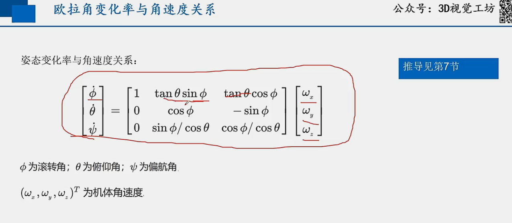

# 欧拉角运动学、角速度与万向节死锁奇点的综合分析报告

## 1. 根本性区别：机体角速度与欧拉角变化率

在三维空间中描述刚体旋转运动时，区分机体角速度向量 ($\vec{\omega}$) 和欧拉角的变化率 ($\dot{\vec{E}}$) 是理解旋转运动学的核心。尽管两者都描述了旋转的“快慢”，但它们在数学定义和物理内涵上存在本质差异。简单地将两者等同是一个普遍的误解，其根源在于未能区分瞬时运动状态的矢量描述与静态姿态参数的时间变化率。

### 1.1 机体角速度 ($\vec{\omega}$) 的本质：瞬时运动的真实矢量

机体角速度 $\vec{\omega}$ 是一个描述刚体在某一瞬间旋转状态的物理矢量（严格来说是伪矢量）。它的定义基于欧拉旋转定理（Euler's rotation theorem），该定理指出，在三维空间中，刚体在任意时刻的复杂转动都可以等效为绕着一个瞬时轴的简单旋转 [1]。

- **定义与几何解释**：角速度矢量 $\vec{\omega}$ 的方向即为这个瞬时旋转轴的方向，遵循右手定则；其大小（模长）$|\vec{\omega}|$ 则表示绕该轴旋转的瞬时角速率，单位通常为 rad/s。因此，$\vec{\omega}$ 完整地捕捉了刚体在“此时此刻”是如何转动的，是一个描述“状态”的量。

- **矢量属性**：至关重要的一点是，角速度（以及其基础——无穷小转动）遵循矢量运算法则。这意味着角速度矢量可以被分解到任意正交坐标系的基上，例如机体坐标系 {B} 的 (x, y, z) 轴，表示为 $\vec{\omega} = \omega_x \hat{i} + \omega_y \hat{j} + \omega_z \hat{k}$。不同来源的角速度可以像普通矢量一样进行合成（相加），这一特性是推导运动学方程的基石 [2]。

### 1.2 欧拉角 ($\vec{E} = [\psi, \theta, \phi]^T$) 的本质：静态姿态的参数化描述

与描述瞬时运动的角速度不同，欧拉角是一组（通常为三个）用于描述刚体相对于某个参考坐标系的最终*静态姿态*的参数 [3, 4]。这个最终姿态是通过按照一个预先定义的顺序，进行三次连续的、有限大小的旋转得到的 [5]。

- **有限旋转的非交换性**：有限大小的旋转不满足交换律。例如，将一本书先绕其 x 轴旋转 90 度，再绕其 y 轴旋转 90 度，其最终姿态与先绕 y 轴再绕 x 轴旋转的结果完全不同。这种非交换性意味着欧拉角的三个分量不能被视为一个真正的矢量，因为矢量的分量相加必须满足交换律。

- **路径依赖性**：最终的姿态不仅取决于三个欧拉角的大小，还严重依赖于旋转的顺序。总共有 12 种可能的旋转顺序约定，分为两类：经典欧拉角（如 ZXZ）和泰特-布莱恩角（Tait-Bryan angles，如 ZYX）。对于同样一组角度值，不同的旋转顺序会产生截然不同的最终姿态 [5, 6, 7]。因此，欧拉角描述的是一个依赖于“路径”的最终结果。

### 1.3 核心差异：为何 $\dot{\vec{E}} \neq \vec{\omega}$

基于以上分析，欧拉角变化率 $\dot{\vec{E}} = [\dot{\psi}, \dot{\theta}, \dot{\phi}]^T$ 不等于机体角速度 $\vec{\omega} = [\omega_x, \omega_y, \omega_z]^T$ 的根本原因在于，这两个“向量”的各个分量是在完全不同的坐标基准下定义的 。

- **旋转轴的失配**：这是两者不等价的核心物理解释。以航空航天领域常用的 ZYX（偏航-俯仰-滚转）内旋顺序为例：
    - 偏航率 $\dot{\psi}$ 是绕初始参考坐标系 {I} 的 Z 轴的转动速率。
    - 俯仰率 $\dot{\theta}$ 是绕*经过一次偏航旋转后*的中间坐标系 {B'} 的 Y' 轴的转动速率。
    - 滚转率 $\dot{\phi}$ 是绕*经过偏航和俯仰两次旋转后*的最终机体坐标系 {B} 的 X'' (即 x) 轴的转动速率。

- **直接等同的谬误**：将这三个分别在不同坐标系（甚至是随时间变化的非正交坐标系）下定义的角速率简单地组合成一个向量 $[\dot{\phi}, \dot{\theta}, \dot{\psi}]^T$ 并在物理上直接使用，是缺乏数学基础的。与之形成鲜明对比的是，机体角速度的三个分量 $[\omega_x, \omega_y, \omega_z]^T$（在航空领域常记为 $[p, q, r]^T$）是总的瞬时角速度矢量 $\vec{\omega}$ 在*同一个、最终的、正交的*机体坐标系 {B} 上的投影。

这种概念上的差异可以类比于描述一辆汽车的运动。假设汽车先沿高速公路（Z 轴）行驶，然后转入匝道（新的 Y' 轴），最后转入停车位（最终的 X'' 轴）。将这三个过程中的速率值直接组合成一个速度矢量是没有意义的，因为它们的方向基准不同。要获得汽车最终的瞬时速度矢量，必须将前两个过程的速度通过坐标变换，统一投影到最终的车身坐标系中，然后进行矢量合成。对于旋转运动，第二节将要推导的运动学变换矩阵就扮演了这个坐标变换和合成的角色。

## 2. 运动学微分方程的推导

为了建立机体角速度 $\vec{\omega}$ 和欧拉角变化率 $\dot{\vec{E}}$ 之间的精确数学关系，需要推导运动学微分方程。这个过程的核心思想是利用角速度的矢量可加性原理，将每一次欧拉旋转产生的角速度分量统一投影到最终的机体坐标系中，然后进行矢量求和。本节将以 ZYX（或记为 3-2-1）的内旋顺序（Intrinsic Rotation）为例进行详细推导，这在航空航天和机器人学中非常普遍。

### 2.1 坐标系与 ZYX (3-2-1) 旋转序列的定义

首先，我们定义所使用的坐标系：
- **惯性坐标系 {I}**：一个固定的参考坐标系，也称为地面坐标系或世界坐标系，其坐标轴为 $(X, Y, Z)$。
- **机体坐标系 {B}**：一个固连在刚体上，随刚体一同运动的坐标系，其坐标轴为 $(x, y, z)$。初始状态下，我们假设 {B} 与 {I} 完全重合。
- **中间坐标系**：为了清晰地描述旋转过程，我们引入两个中间坐标系：
    1.  **{B'}**：机体坐标系 {B} 首先绕惯性系 {I} 的 Z 轴旋转一个偏航角 (Yaw) $\psi$ 后得到的新坐标系。
    2.  **{B''}**：坐标系 {B'} 接着绕其自身的 Y' 轴旋转一个俯仰角 (Pitch) $\theta$ 后得到的新坐标系。
    3.  最终的机体坐标系 {B} 是由坐标系 {B''} 再绕其自身的 X'' 轴旋转一个滚转角 (Roll) $\phi$ 得到的。

每一次基础旋转都可以用一个旋转矩阵来表示。从坐标系 {a} 到坐标系 {b} 的旋转矩阵记为 $R_{ba}$。对于 ZYX 内旋序列，从惯性系 {I} 到机体系 {B} 的总旋转矩阵 $R_{BI}$ 是三次基础旋转矩阵的连乘积：
$$R_{BI} = R_x(\phi) R_y(\theta) R_z(\psi)$$
其中，$R_z(\psi)$, $R_y(\theta)$, $R_x(\phi)$ 分别是绕 Z, Y, X 轴旋转的基础旋转矩阵。

### 2.2 角速度的矢量叠加原理

刚体从惯性系 {I} 到机体系 {B} 的总角速度 $\vec{\omega}_{BI}$，是构成该运动的各次欧拉旋转所产生的角速度的矢量和 [2]。
$$\vec{\omega}_{BI} = \vec{\omega}_{\psi} + \vec{\omega}_{\theta} + \vec{\omega}_{\phi}$$
其中：
- $\vec{\omega}_{\psi}$ 是由偏航率 $\dot{\psi}$ 产生的角速度矢量，其方向沿 Z 轴。
- $\vec{\omega}_{\theta}$ 是由俯仰率 $\dot{\theta}$ 产生的角速度矢量，其方向沿中间坐标系 {B'} 的 Y' 轴。
- $\vec{\omega}_{\phi}$ 是由滚转率 $\dot{\phi}$ 产生的角速度矢量，其方向沿最终坐标系 {B} 的 x 轴。

### 2.3 逐步推导：将各角速率投影至机体坐标系

为了能将上述三个角速度矢量相加，必须将它们表示在同一个坐标系下。我们选择最终的机体坐标系 {B} 作为统一的参考基准。

1.  **在各自的坐标系中表示角速度矢量**：
    - 滚转角速度 $\vec{\omega}_{\phi}$ 本身就是绕最终机体坐标系的 x 轴（即 X'' 轴）进行的，因此在 {B} 系中的表示为：
      $$\vec{\omega}_{\phi|B} = \begin{bmatrix} \dot{\phi} \\ 0 \\ 0 \end{bmatrix}$$
    - 俯仰角速度 $\vec{\omega}_{\theta}$ 是绕中间坐标系 {B'} 的 Y' 轴进行的。要将其表示在 {B} 系中，需要将它左乘一个从 {B'} 到 {B} 的旋转矩阵。从 {B'} 到 {B} 只经历了一次绕 X'' 轴的滚转 ($\phi$)，因此变换矩阵为 $R_x(\phi)$。在 {B'} 系中，$\vec{\omega}_{\theta|B'} = [0, \dot{\theta}, 0]^T$，所以：
      $$\vec{\omega}_{\theta|B} = R_x(\phi) \begin{bmatrix} 0 \\ \dot{\theta} \\ 0 \end{bmatrix} = \begin{bmatrix} 1 & 0 & 0 \\ 0 & \cos\phi & \sin\phi \\ 0 & -\sin\phi & \cos\phi \end{bmatrix} \begin{bmatrix} 0 \\ \dot{\theta} \\ 0 \end{bmatrix} = \begin{bmatrix} 0 \\ \dot{\theta}\cos\phi \\ -\dot{\theta}\sin\phi \end{bmatrix}$$
    - 偏航角速度 $\vec{\omega}_{\psi}$ 是绕惯性系 {I} 的 Z 轴进行的。要将其表示在 {B} 系中，需要将其从 {I} 系变换到 {B} 系。这个变换需要经过俯仰和滚转两次旋转。在 {I} 系中，$\vec{\omega}_{\psi|I} = [0, 0, \dot{\psi}]^T$，变换矩阵为 $R_{BI'} = R_x(\phi)R_y(\theta)$：
      $$\vec{\omega}_{\psi|B} = R_x(\phi)R_y(\theta) \begin{bmatrix} 0 \\ 0 \\ \dot{\psi} \end{bmatrix} = \begin{bmatrix} 1 & 0 & 0 \\ 0 & \cos\phi & \sin\phi \\ 0 & -\sin\phi & \cos\phi \end{bmatrix} \begin{bmatrix} \cos\theta & 0 & \sin\theta \\ 0 & 1 & 0 \\ -\sin\theta & 0 & \cos\theta \end{bmatrix} \begin{bmatrix} 0 \\ 0 \\ \dot{\psi} \end{bmatrix} = \begin{bmatrix} -\dot{\psi}\sin\theta \\ \dot{\psi}\cos\theta\sin\phi \\ \dot{\psi}\cos\theta\cos\phi \end{bmatrix}$$

2.  **矢量求和**：
    将以上三个在机体坐标系 {B} 中表示的角速度矢量相加，得到总的机体角速度 $\vec{\omega}_B = [\omega_x, \omega_y, \omega_z]^T = [p, q, r]^T$：
    $$\vec{\omega}_B = \vec{\omega}_{\phi|B} + \vec{\omega}_{\theta|B} + \vec{\omega}_{\psi|B} = \begin{bmatrix} \dot{\phi} \\ 0 \\ 0 \end{bmatrix} + \begin{bmatrix} 0 \\ \dot{\theta}\cos\phi \\ -\dot{\theta}\sin\phi \end{bmatrix} + \begin{bmatrix} -\dot{\psi}\sin\theta \\ \dot{\psi}\cos\theta\sin\phi \\ \dot{\psi}\cos\theta\cos\phi \end{bmatrix}$$
    合并各项，我们得到：
    $$p = \dot{\phi} - \dot{\psi}\sin\theta$$ $$q = \dot{\theta}\cos\phi + \dot{\psi}\cos\theta\sin\phi$$ $$r = -\dot{\theta}\sin\phi + \dot{\psi}\cos\theta\cos\phi$$

### 2.4 完整的矩阵形式运动学关系

将上述结果整理成矩阵形式，可以更清晰地展示两者之间的线性变换关系。

- **从欧拉角变化率到机体角速度**：
  上述方程组可以写成 $\vec{\omega}_B = \mathbf{T}(\vec{E})\dot{\vec{E}}$ 的形式 [7]：
  $$
  \begin{bmatrix} p \\ q \\ r \end{bmatrix} = \begin{bmatrix} 1 & 0 & -\sin\theta \\ 0 & \cos\phi & \cos\theta\sin\phi \\ 0 & -\sin\phi & \cos\theta\cos\phi \end{bmatrix} \begin{bmatrix} \dot{\phi} \\ \dot{\theta} \\ \dot{\psi} \end{bmatrix}
  $$
  这个矩阵 $\mathbf{T}(\vec{E})$ 就是将欧拉角变化率映射到机体角速度的变换矩阵。这个矩阵的每一列都有明确的几何意义：它分别是滚转轴（最终的 x 轴）、俯仰轴（中间的 Y' 轴）和偏航轴（初始的 Z 轴）这三个旋转轴在最终机体坐标系 {B} 下的单位矢量表示。因此，整个方程的物理意义就是将三个不同轴上的角速率，通过投影（由矩阵元素，即方向余弦实现）的方式，合成为在最终机体坐标系下的总角速度。

- **从机体角速度到欧拉角变化率**：
  在飞行器仿真或姿态控制中，通常已知的是由陀螺仪测得的机体角速度 $\vec{\omega}_B$，需要求解的是欧拉角的变化率 $\dot{\vec{E}}$，以便进行积分更新姿态。这需要对上述矩阵求逆，得到 $\dot{\vec{E}} = \mathbf{T}^{-1}(\vec{E})\vec{\omega}_B$ [8]：
  $$
  \begin{bmatrix} \dot{\phi} \\ \dot{\theta} \\ \dot{\psi} \end{bmatrix} = \begin{bmatrix} 1 & \sin\phi\tan\theta & \cos\phi\tan\theta \\ 0 & \cos\phi & -\sin\phi \\ 0 & \sin\phi/\cos\theta & \cos\phi/\cos\theta \end{bmatrix} \begin{bmatrix} p \\ q \\ r \end{bmatrix}
  $$
  这个逆矩阵 $\mathbf{T}^{-1}(\vec{E})$ 就是用户问题中提到的“转换矩阵”。观察此矩阵可以发现，当俯仰角 $\theta = \pm90^\circ$ 时，$\cos\theta = 0$，导致矩阵中的 $\tan\theta$ 和 $1/\cos\theta$ 项变为无穷大。这正是下一节将要深入探讨的“万向节死锁”奇点的数学根源。

## 3. 万向节死锁奇点 (Gimbal Lock Singularity)

万向节死锁，或称欧拉角死锁，是使用欧拉角描述三维姿态时一个固有的、无法回避的严重问题。它并非物理设备真的“锁死”，而是描述姿态的数学参数化方法在特定点失效，导致系统行为异常。

### 3.1 奇点的数学分析

奇点的出现可以直接从上一节推导出的运动学逆变换矩阵中看出 。
$$
\dot{\vec{E}} = \mathbf{T}^{-1}(\vec{E})\vec{\omega}_B = \frac{1}{\cos\theta} \begin{bmatrix} \cos\theta & \sin\phi\sin\theta & \cos\phi\sin\theta \\ 0 & \cos\phi\cos\theta & -\sin\phi\cos\theta \\ 0 & \sin\phi & \cos\phi \end{bmatrix} \begin{bmatrix} p \\ q \\ r \end{bmatrix}
$$
- **矩阵奇异性**：当俯仰角 $\theta$ 趋近于 $\pm90^\circ$（即 $\pm\pi/2$ 弧度）时，$\cos\theta$ 趋近于 0。这导致矩阵 $\mathbf{T}^{-1}(\vec{E})$ 的部分元素趋于无穷大。同时，正向变换矩阵 $\mathbf{T}(\vec{E})$ 的行列式 $\det(\mathbf{T}) = \cos\theta$ 也趋于 0。当行列式为零时，该矩阵是奇异的（singular），不可逆 。

- **数学后果**：在 $\theta = \pm90^\circ$ 这个点，运动学微分方程失效。这意味着，即使存在一个明确的机体角速度 $\vec{\omega}_B$，也无法计算出唯一对应的欧拉角变化率 $\dot{\phi}$ 和 $\dot{\psi}$。从方程组的角度看，滚转率 $\dot{\phi}$ 和偏航率 $\dot{\psi}$ 的影响线性相关，它们的组合 $(\dot{\psi} \mp \dot{\phi})$ 共同决定了绕竖直轴的旋转，而无法单独求解。

### 3.2 万向节死锁的几何与物理解释

为了直观地理解这一数学现象，我们可以借助一个机械万向节装置作为类比 [9]。一个三轴万向节由三个相互嵌套的环组成，分别对应欧拉角的三次旋转。

- **旋转轴的重合**：对于 ZYX 序列，外环代表偏航（绕 Z 轴），中环代表俯仰（绕 Y' 轴），内环代表滚转（绕 X'' 轴）。当飞行器执行俯仰操作，使中环旋转 $90^\circ$ 时，内环的旋转轴（滚转轴）会与外环的旋转轴（偏航轴）完全重合，两者都指向竖直方向 [10, 11, 12]。

- **自由度的丢失**：一旦这两个旋转轴重合，系统就失去了一个旋转自由度。原本由内环（滚转）和外环（偏航）独立控制的两个旋转，现在变成了等效的、共同绕同一个竖直轴的旋转。此时，无论如何改变滚转角 $\phi$ 或偏航角 $\psi$，都只能使物体绕着这个重合的轴线旋转。系统无法产生绕原滚转轴方向（即当前指向前方的轴）的角速度分量。这就是“死锁”的物理意义——系统丧失了向某个方向转动的能力 [10, 13, 11, 12, 9]。

万向节死锁的本质是参数化方法的失效。物理实体本身仍然拥有三个旋转自由度，但我们用来描述和控制它的欧拉角“语言”在此刻变得有缺陷，失去了描述其中一个自由度运动的能力。这类似于在地球的北极点，经度的定义失效了：无论经度值如何变化，地理位置都不变。

### 3.3 实际应用中的后果与历史背景

万向节死锁在许多工程领域都曾导致严重问题。

- **机器人学与三维动画**：在机器人领域，特别是对于串联机械臂的末端腕部，万向节死锁会导致所谓的“腕部翻转”（wrist flip）。当机械臂路径规划经过奇点附近时，为了维持末端执行器的姿态，第二个关节可能需要瞬间旋转 $180^\circ$，这会产生极大的角速度和加速度，对机械臂造成冲击和损害 。在三维动画中，对两个关键帧之间的姿态进行欧拉角插值时，如果路径穿过奇点，会导致物体发生非预期的快速翻转或沿最长路径旋转的现象 。

- **航空航天与阿波罗计划**：最著名的例子莫过于阿波罗登月计划。阿波罗飞船的惯性测量单元（IMU）使用了一个三轴机械万向节平台。工程师和宇航员都清楚万向节死锁的风险。当飞船的俯仰角接近 $85^\circ$ 时，导航计算机会发出“万向节死锁”警告，并锁定 IMU 以防止陀螺平台失稳，此时宇航员必须手动重新对准平台 。这给任务规划和飞行员操作带来了极大的限制。当时曾有关于采用四轴万向节系统（增加一个冗余轴来避免奇点）的讨论，但出于进度和复杂度的考虑，最终还是采用了三轴系统 [14]。

### 3.4 解决方案与替代方法：四元数的引入

解决万向节死锁问题的根本方法是采用一种没有奇点的姿态表示方法。

- **四元数简介**：四元数（Quaternion）是一种扩展的复数，由一个实部和三个虚部组成 ($q = q_0 + q_1\mathbf{i} + q_2\mathbf{j} + q_3\mathbf{k}$)。单位四元数（模长为 1）可以用来表示三维空间中的任意旋转。它本质上编码了一个旋转轴和一个旋转角的信息，与欧拉旋转定理直接对应 [15, 16]。

- **四元数的优势**：四元数最大的优点在于它提供了一个全局无奇点的姿态表示。任意姿态都可以用一个单位四元数唯一（或双重覆盖，即 $q$ 和 $-q$ 表示相同旋转）表示，并且在所有姿态之间都可以平滑过渡，从而完美地避免了万向节死锁问题。此外，四元数在计算上更为高效，尤其是在组合多个旋转（四元数乘法）和姿态插值（球面线性插值，SLERP）方面。

下表总结了欧拉角和四元数作为姿态表示方法的优缺点。

**表 3.4.1: 姿态表示方法的比较：欧拉角 vs. 四元数**

| 特性           | 欧拉角                                     | 四元数                                                    |
| :------------- | :----------------------------------------- | :-------------------------------------------------------- |
| **参数数量**   | 3个 (例如, $\psi, \theta, \phi$)           | 4个 (例如, $q_0, q_1, q_2, q_3$)，但有约束 $q^Tq=1$       |
| **直观性**     | 非常直观，易于人类理解（偏航、俯仰、滚转） | 抽象，非直观的四维概念                                    |
| **奇异点**     | 存在（万向节死锁）                         | 不存在，是全局无奇点的表示方法                            |
| **旋转组合**   | 计算成本较高（需转换为矩阵再相乘）         | 计算高效（四元数乘法）                                    |
| **姿态插值**   | 存在问题，可能导致非最短路径旋转和奇点问题 | 使用球面线性插值（SLERP）可以实现平滑、高效的最短路径插值 |
| **表示冗余性** | 一个姿态可能对应多组欧拉角（非唯一）       | 双重覆盖（$q$ 和 $-q$ 表示相同旋转），但易于处理          |

## 4. 旋转约定与坐标系关系澄清

用户的提问中包含了“欧拉角 zyx 和地面坐标系 xyz 是保持一致的吗”这一问题。要准确回答这个问题，必须澄清旋转约定中的几个关键概念，特别是泰特-布莱恩角与经典欧拉角的区别，以及内旋与外旋的定义。

### 4.1 泰特-布莱恩角 (ZYX) vs. 经典欧拉角 (ZXZ)

“欧拉角”这个术语在不同领域有广义和狭义之分。严格来说，欧拉角序列分为两大类 ：

- **经典欧拉角 (Proper Euler Angles)**：三次旋转中的第一次和第三次旋转绕*同一个*轴进行。例如，ZXZ 序列（进动、章动、自旋），这在经典力学和天体动力学中很常用。
- **泰特-布莱恩角 (Tait-Bryan Angles)**：三次旋转分别绕*三个不同*的轴进行。例如，ZYX 序列（偏航、俯仰、滚转），这在航空航天、机器人和计算机图形学中非常流行。

在许多工程应用中，泰特-布莱恩角被俗称为“欧拉角”。因此，用户提到的“欧拉角 zyx”指的是一种泰特-布莱恩角序列。

### 4.2 内旋 vs. 外旋：ZYX 与 XYZ 的内在联系

旋转的定义还需要明确一个关键点：旋转轴是固定的还是随物体运动的。

- **内旋 (Intrinsic Rotations)**：也称为动坐标系旋转。每一次后续的旋转都是绕着*经过前一次旋转后得到的新坐标系*的轴进行的。旋转轴随着物体一起运动。我们在第二节的推导中使用的就是内旋约定 。
- **外旋 (Extrinsic Rotations)**：也称为定坐标系旋转。所有三次旋转都是绕着*初始的、固定的*惯性坐标系 {I} 的轴进行的。旋转轴始终保持不动。

这两种旋转约定之间存在一个非常重要的等价关系：**一个内旋序列等价于一个以相反顺序执行的外旋序列** 。

现在我们可以直接回答用户的问题了：
- 一个 **ZYX 内旋**序列，即：
    1.  首先绕初始的 Z 轴（偏航）旋转 $\psi$。
    2.  然后绕*新的* Y' 轴（俯仰）旋转 $\theta$。
    3.  最后绕*最终的* X'' 轴（滚转）旋转 $\phi$。
- 这个操作所达到的最终姿态，与一个 **XYZ 外旋**序列完全相同，即：
    1.  首先绕*固定的* X 轴（滚转）旋转 $\phi$。
    2.  然后绕*固定的* Y 轴（俯仰）旋转 $\theta$。
    3.  最后绕*固定的* Z 轴（偏航）旋转 $\psi$。

这个等价关系可以通过旋转矩阵的乘法来证明。对于内旋，由于旋转轴在变动，新的旋转矩阵需要左乘（pre-multiplication）到已有的旋转矩阵上。而对于外旋，由于旋转轴固定，新的旋转矩阵需要右乘（post-multiplication）。最终，两种方式得到的总旋转矩阵是相同的：
$$R_{\text{intrinsic ZYX}} = R_x(\phi) R_y(\theta) R_z(\psi)$$
$$R_{\text{extrinsic XYZ}} = R_z(\psi) R_y(\theta) R_x(\phi)$$
当将一个向量从机体坐标系变换到惯性坐标系时，这两个矩阵表达式是等价的。

因此，欧拉角 ZYX 序列（通常指内旋）与地面坐标系 XYZ 并非“保持一致”，而是通过上述的内外旋等价关系紧密地联系在一起。选择内旋还是外旋，往往取决于描述问题的便利性。从飞行员或机器人控制器的角度看，内旋（“我先偏航，再相对于我的新朝向进行俯仰”）更为自然；而对于外部观测者，外旋可能更易于分析。理解这种对偶关系是精确使用和转换不同旋转约定的关键。

## 结论

本报告深入剖析了刚体旋转运动学中的核心概念，旨在澄清关于欧拉角、机体角速度和万向节死锁的常见困惑。通过系统性的分析和推导，可以得出以下关键结论：

1.  **本质区别**：机体角速度 ($\vec{\omega}$) 是描述刚体瞬时旋转状态的物理矢量，其分量定义在同一个正交坐标系下，并遵循矢量运算法则。而欧拉角变化率 ($\dot{\vec{E}}$) 是一组描述姿态参数变化快慢的标量，其每个分量对应于不同旋转阶段、不同方向的旋转轴，因此两者不能直接等同。

2.  **数学联系**：机体角速度与欧ラ角变化率之间通过一个依赖于当前姿态的线性变换矩阵相互关联。本报告详细推导了这一运动学变换矩阵，揭示了其作为不同旋转轴之间几何投影的物理内涵，为姿态的动态仿真和控制提供了数学基础。

3.  **万向节死锁的根源**：万向节死锁是欧拉角参数化方法在特定姿态（例如，俯仰角为 $\pm90^\circ$）下的固有缺陷。其数学根源是运动学变换矩阵的奇异性，物理表现为两个旋转轴重合，导致一个旋转自由度的“丢失”。这是一个参数化失效问题，而非物理限制，但在实际应用中会导致控制系统失稳或动画突变等严重后果。

4.  **旋转约定的重要性**：对三维旋转的任何讨论都必须明确所使用的约定。本报告澄清了泰特-布莱恩角（如 ZYX）与经典欧拉角（如 ZXZ）的区别，并阐明了内旋与外旋的等价关系（内旋 ZYX 等价于外旋 XYZ）。这为在不同参考系和约定之间进行准确的姿态描述和转换提供了清晰的框架。

综上所述，虽然欧拉角因其直观性而被广泛使用，但其固有的万向节死锁奇点限制了其在高性能和高机动性应用中的可靠性。为了实现鲁棒、无奇点的姿态表示与控制，现代工程实践，特别是在航空航天、机器人和虚拟现实领域，已广泛转向使用四元数等更为先进的数学工具。对这些基础运动学原理的深刻理解，是所有相关领域工程师和研究人员必备的知识。