## **01 pid控制器原理讲解**
> pid原理
> 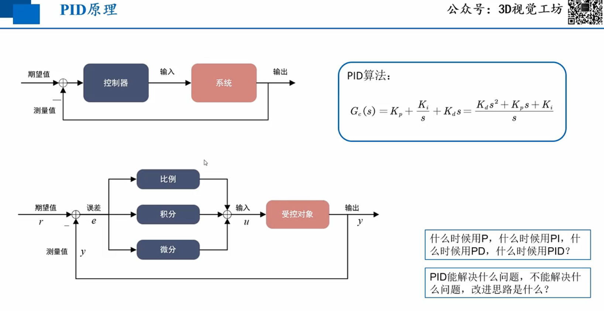
> 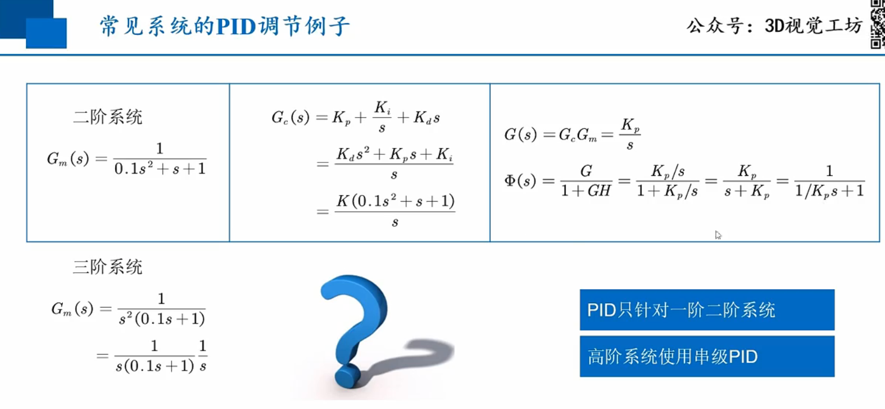
> 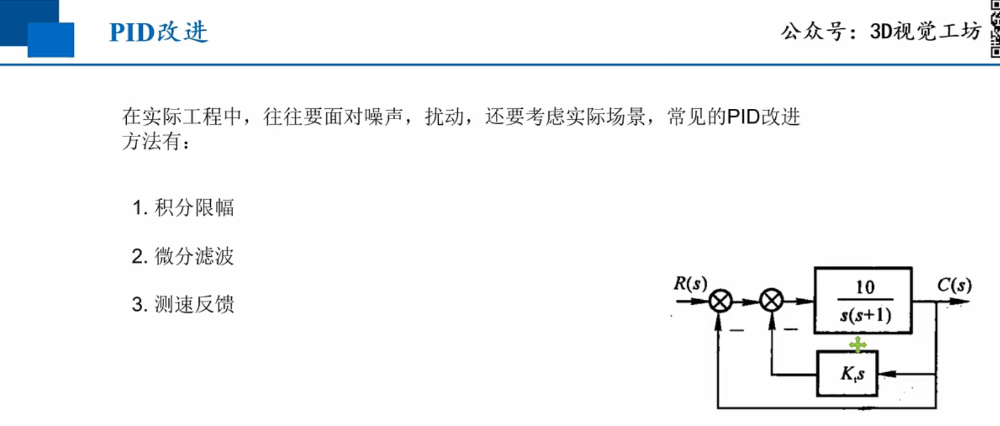
## **02 角速度环pid控制器**
> 角速度控制器原理
> 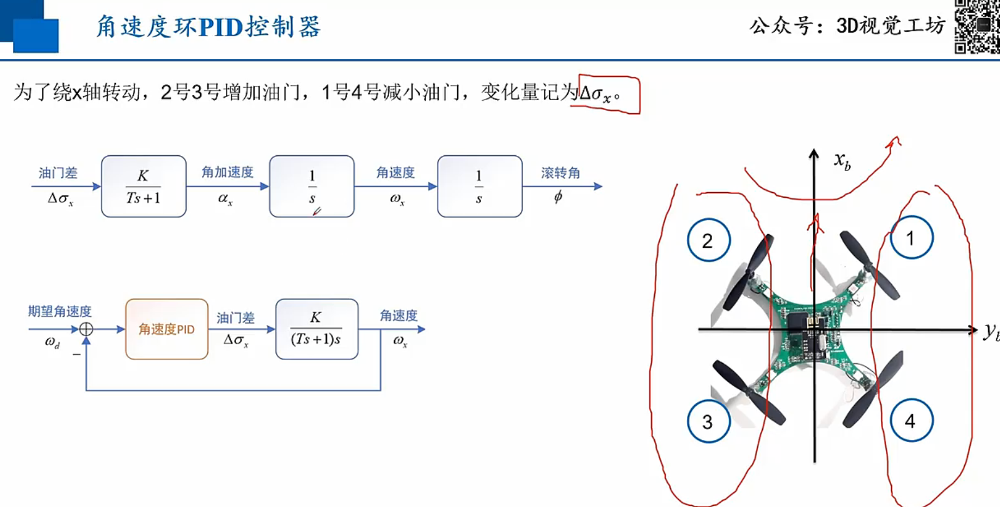
> 控制过程
> 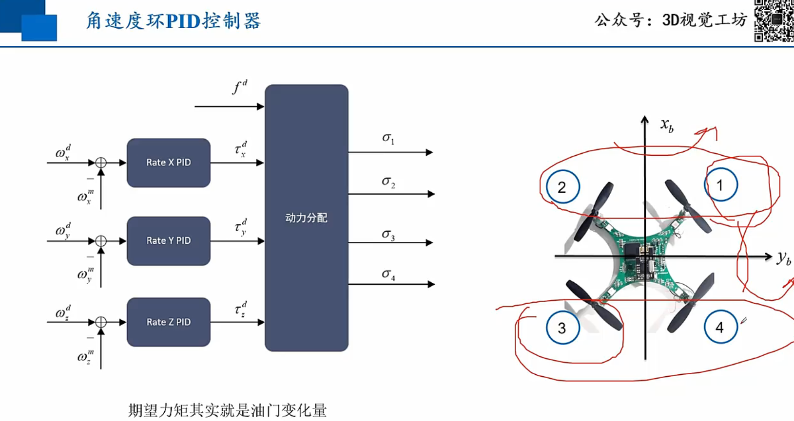
> 动力分配 （相当于对原方程求逆运算）
> f是升力， taoxyz是xyz轴力矩
> 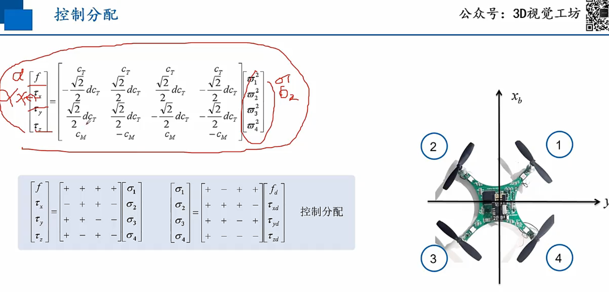
> 姿态环
> 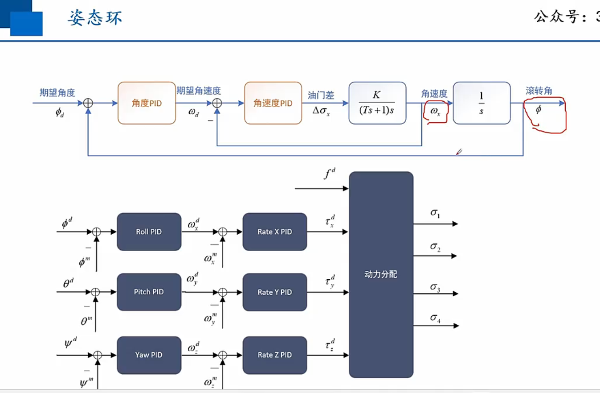
> 速度环
> 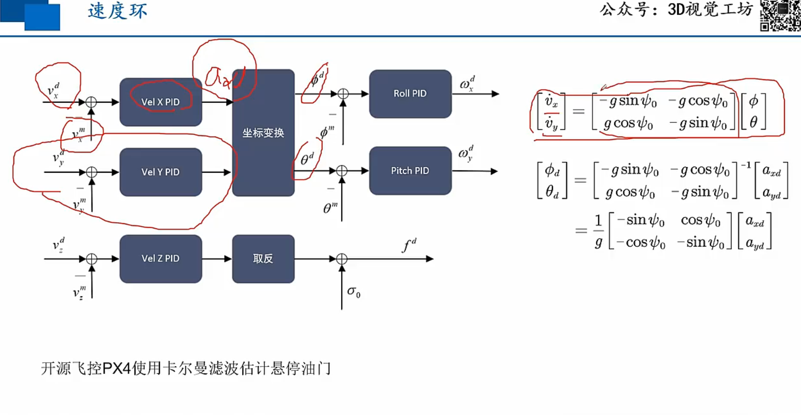
> 位置环
> 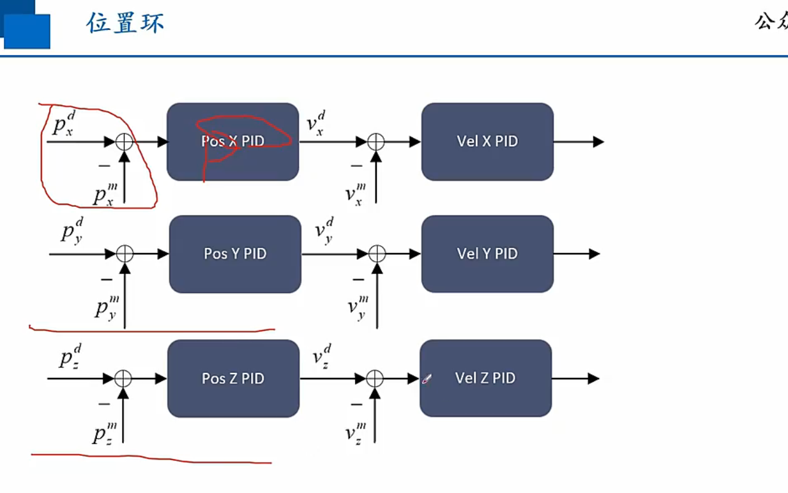
## **03 代码实现**
> 姿态pid
> 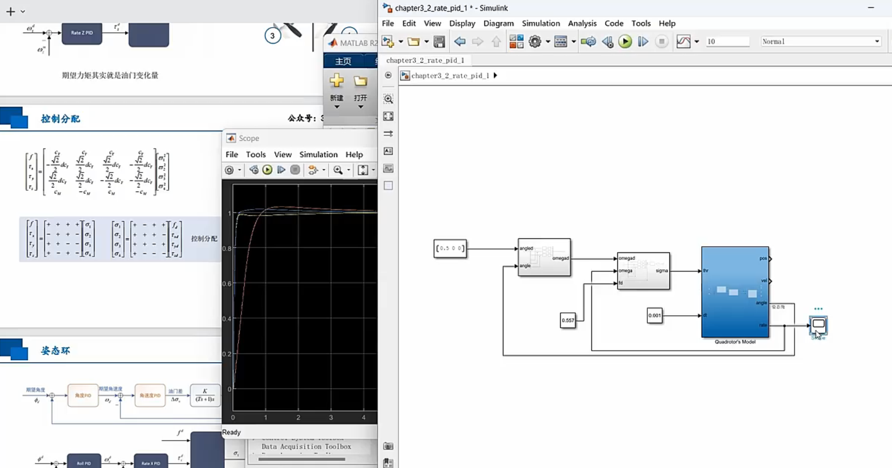
> 位置pid
> 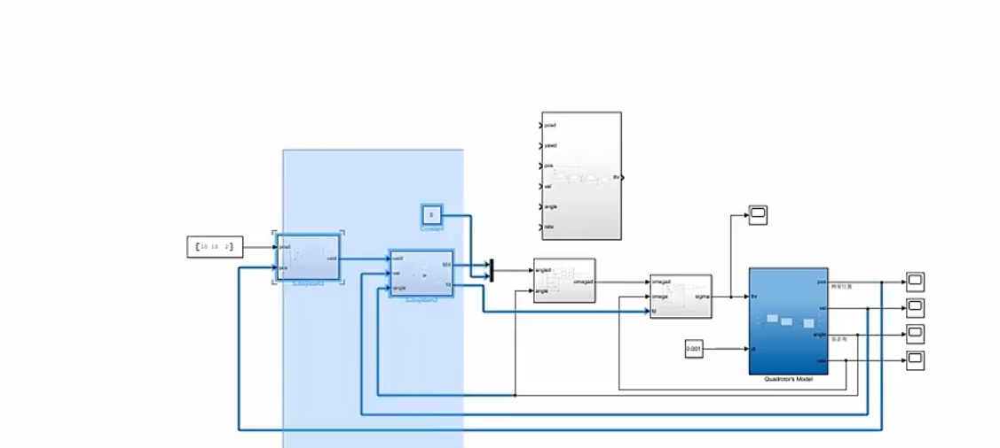
## **04 轨迹跟踪控制器**
> 无人机反馈控制
> 
> 反馈+前馈控制 
> 提高响应速度
> 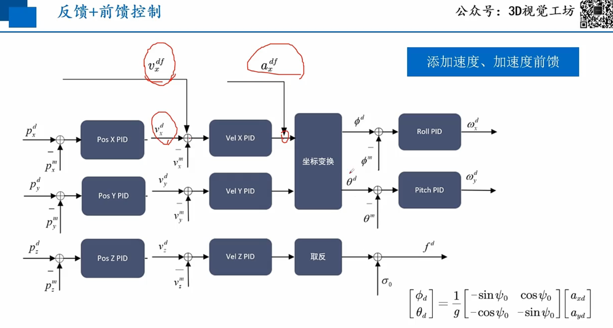
> 五次样条曲线轨迹控制
> 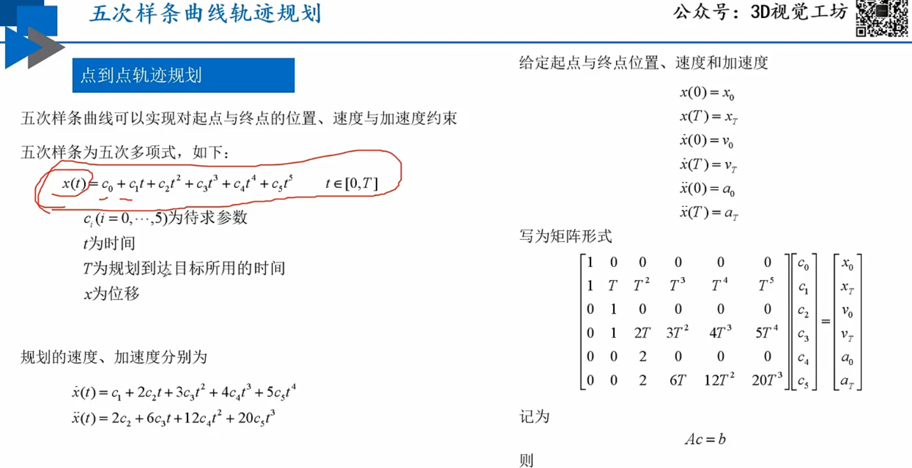
> 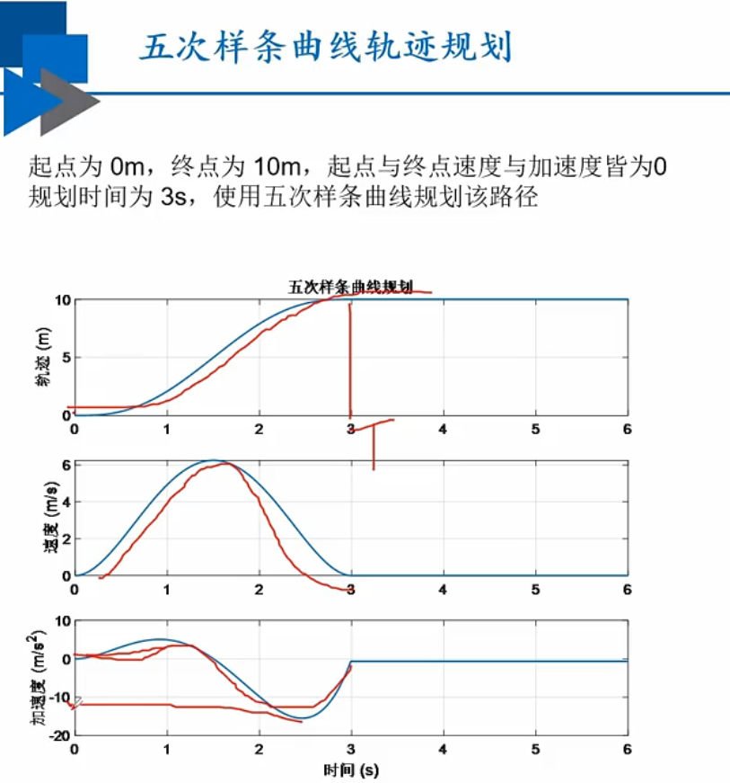