## **01四元数基础**
> 四元数定义 
> 与罗德里格斯公式关系
> 单位四元数
> 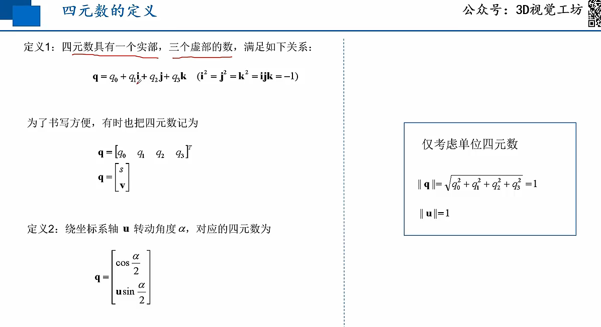
> 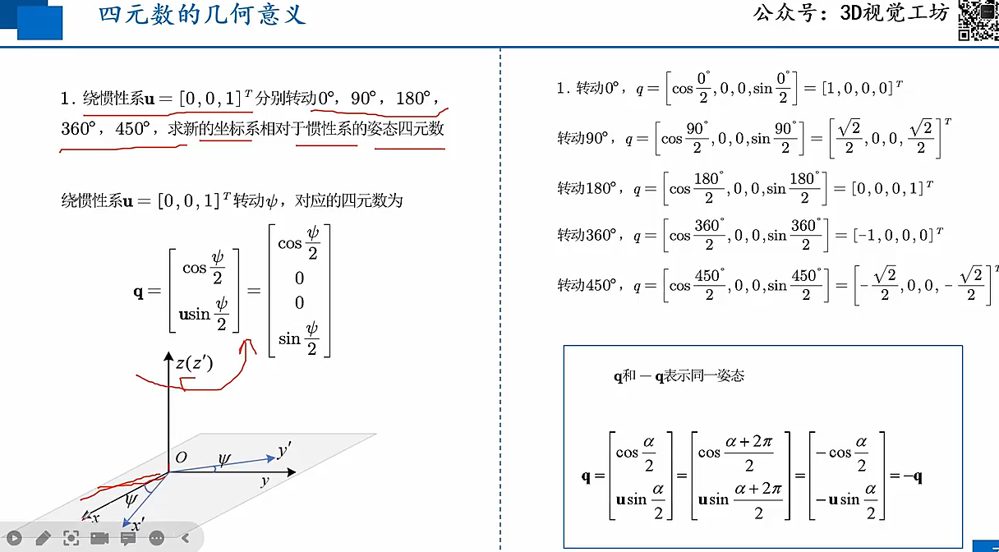
> 四单元数几何意义
> 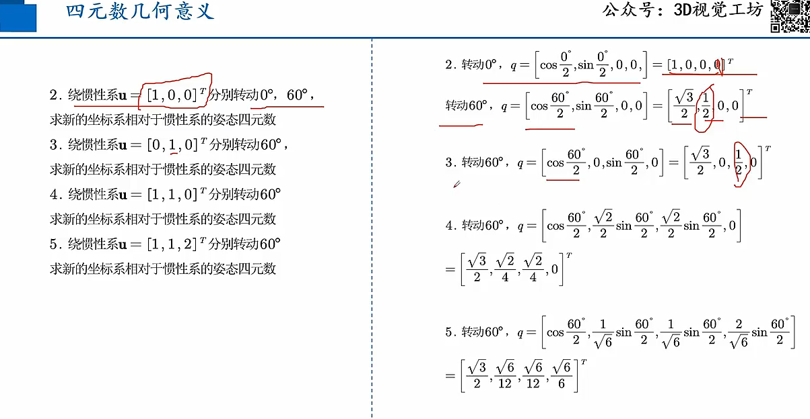
> 四元数的乘法 
> 代表两次旋转
> 
> 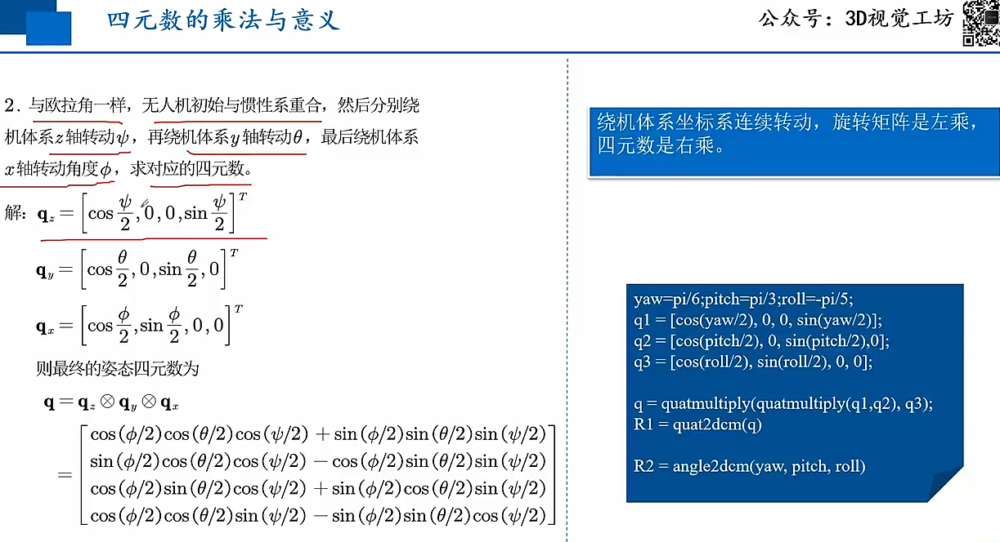
> 四元数的逆与意义
> 四元数的逆表示绕反方向转动相同的角度
> 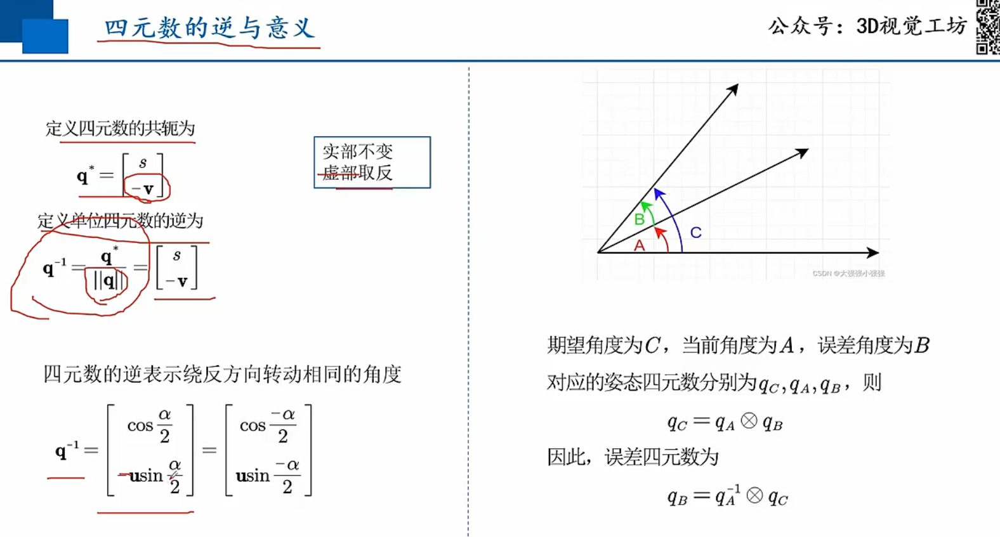
> 四元数与欧拉角、旋转矩阵的关系
> 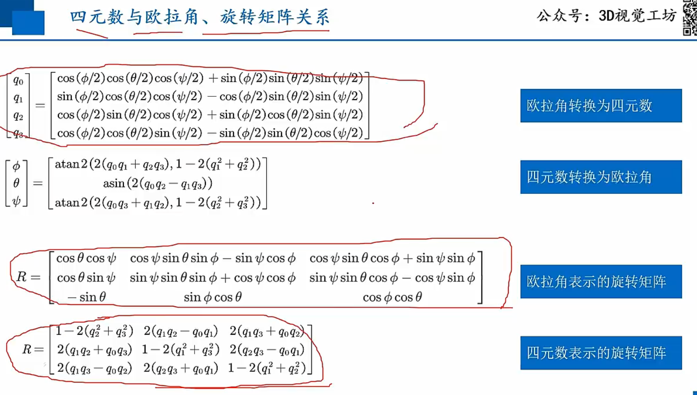
> 四元数与角速度的关系
> 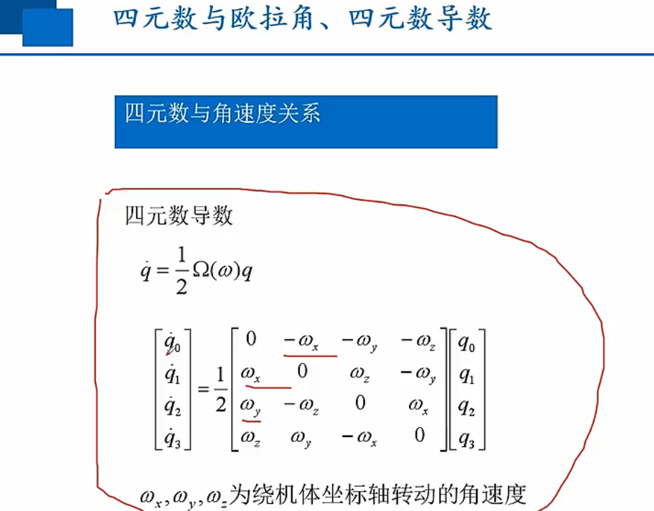
## **02四元数姿态控制**
> 基本原理
> 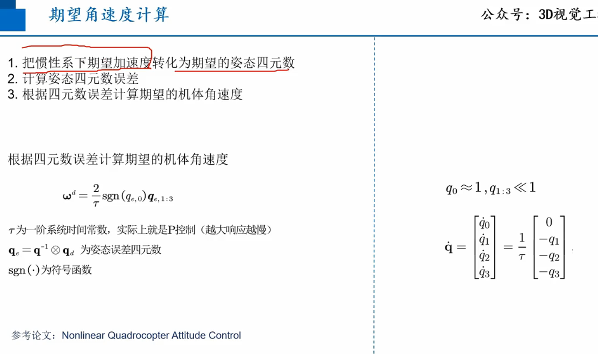
> 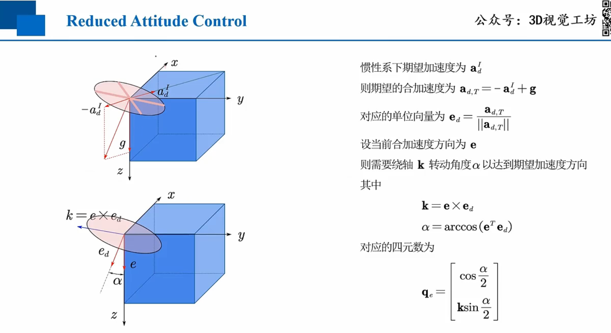
> 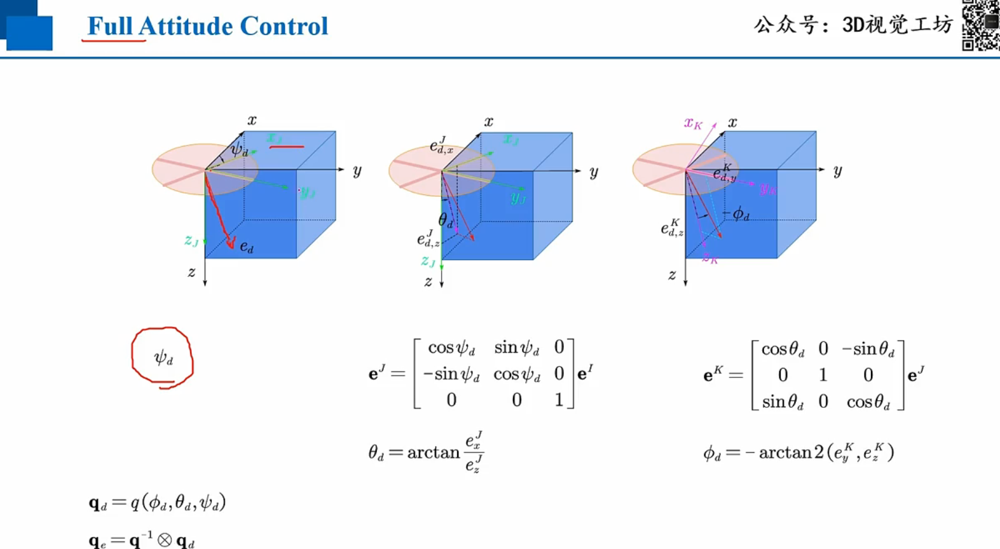
> 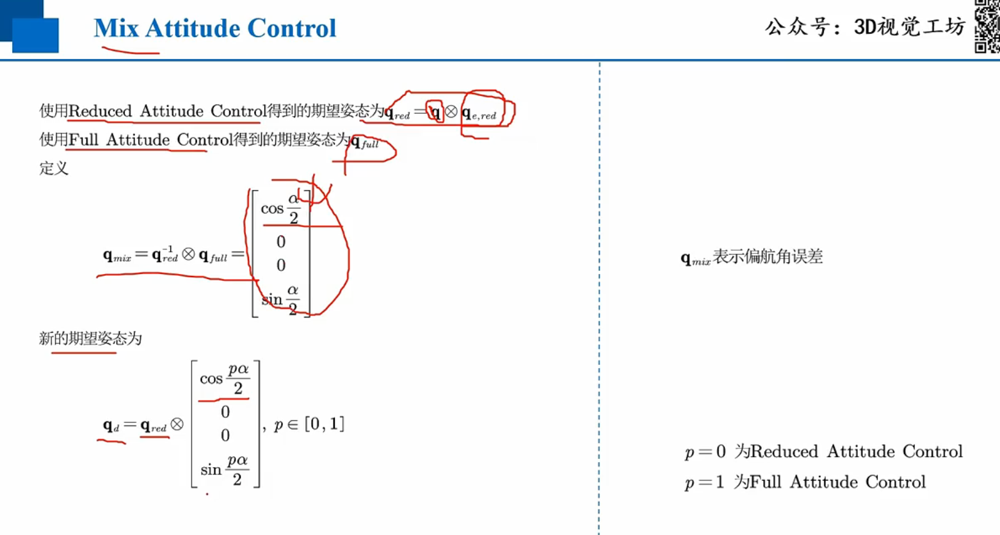
## **03旋转矩阵姿态控制**
> 旋转矩阵定义
> 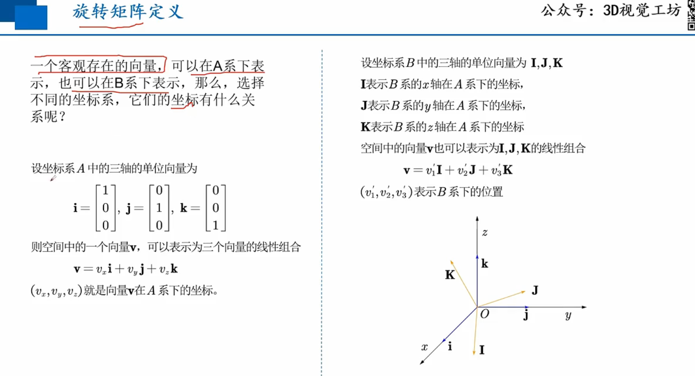
> 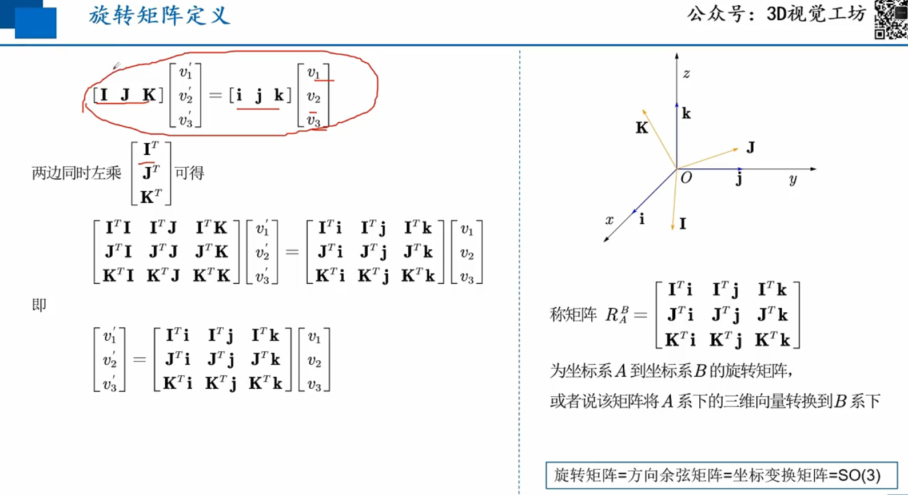
> 旋转矩阵性质
> 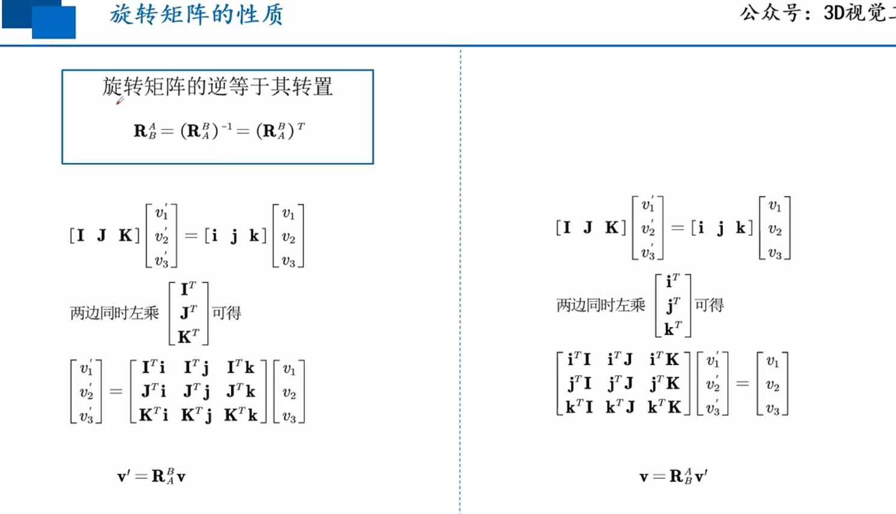
> 旋转矩阵表示连续旋转
> 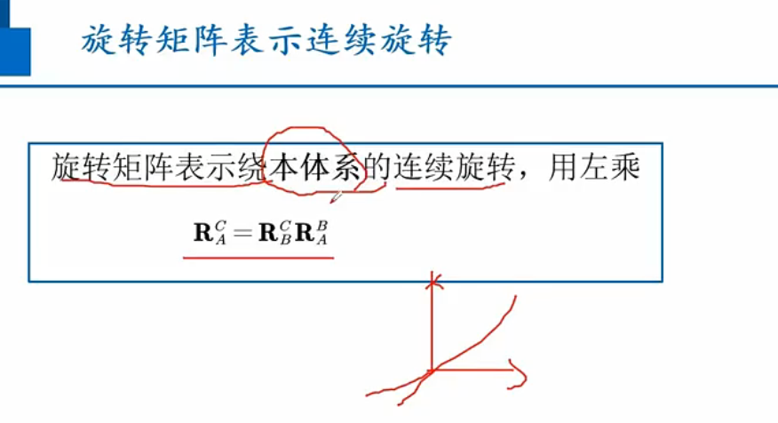
> 旋转矩阵的导数
> 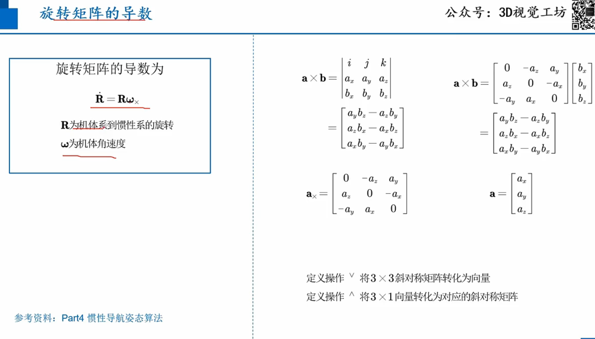
> 姿态控制原理
> 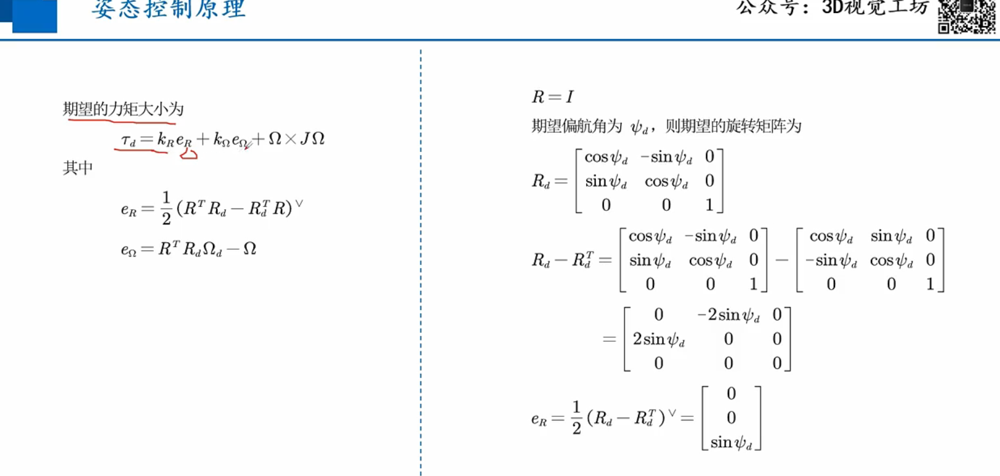