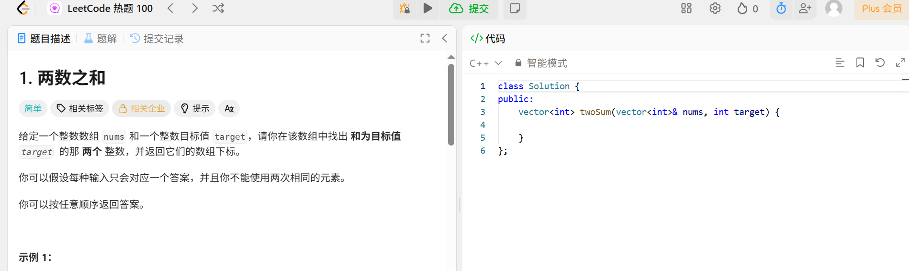
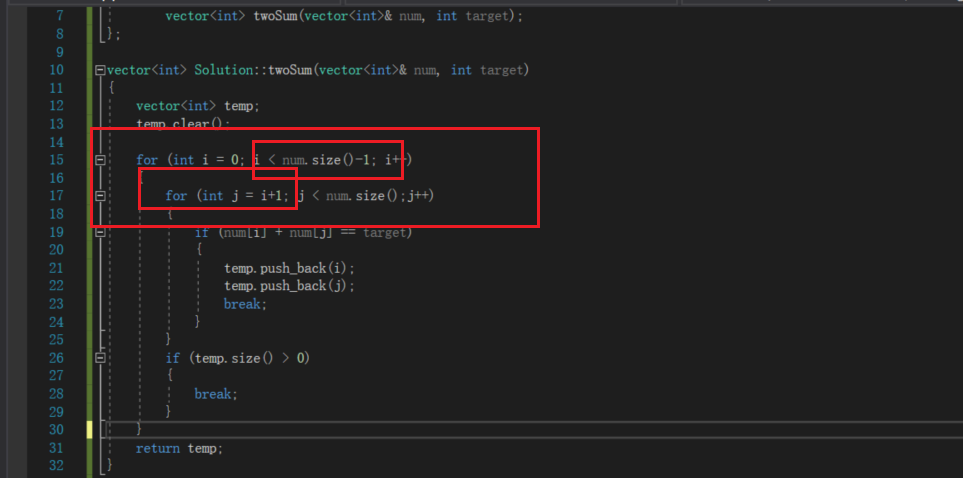
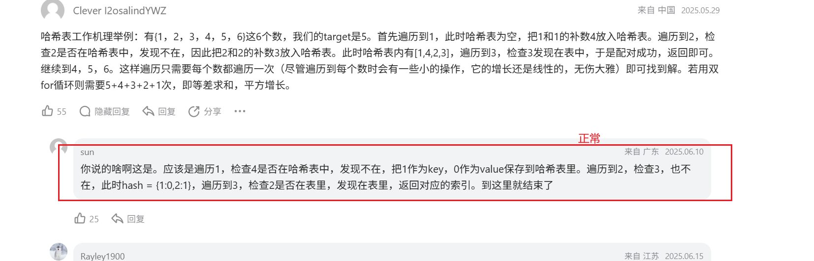
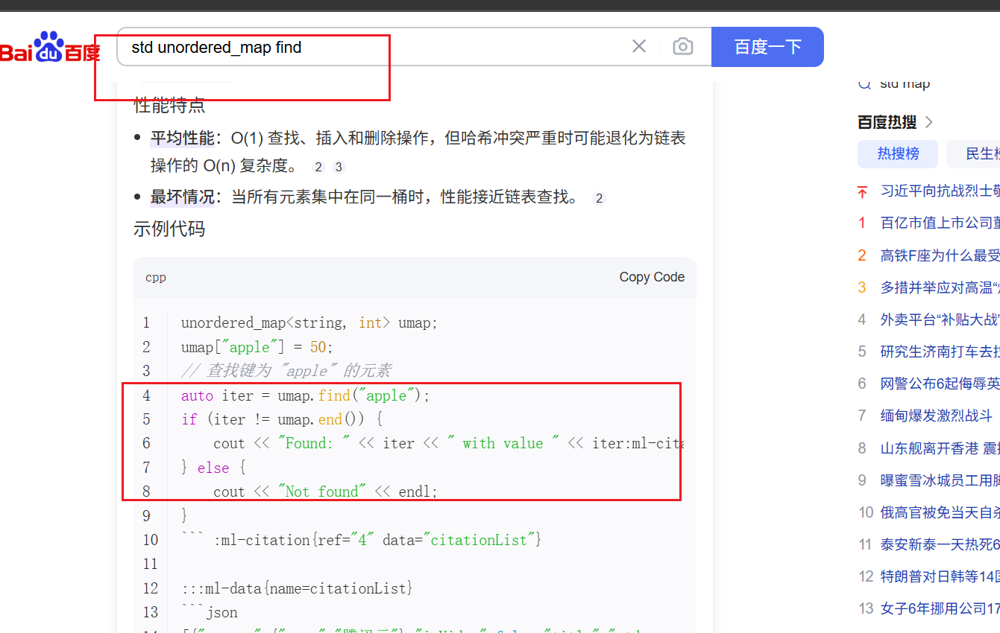
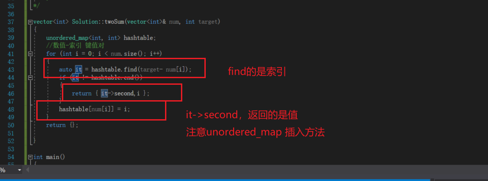

## 两数之和
> 
> **穷举法：二维循环可以解决 注意索引**
> 
> 
> **哈希表 思路，依次向hash表中填写值**
> 
> unordered map find使用方法
> 
> 键值对
>
> **hash表find操作**
> 通过find找结果，利用it.end()来看是否找到
	for (int i = 0; i < num.size(); i++)
	{
		auto it = hashtable.find(target- num[i]);
		if (it != hashtable.end())
		{
			return { it->second,i };
		}
		hashtable[num[i]] = i;
	}