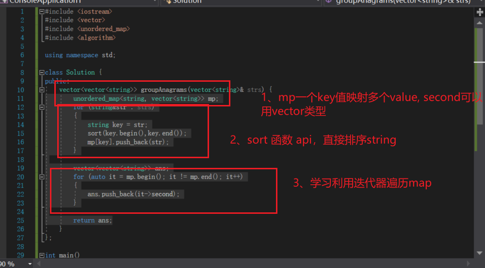

## 字母异位词分组
> 
> 先对字母进行排序，因为排序后的字符串是一致的
> **sort api学习**
>		for (string&str : strs)
		{
			string key = str;
			sort(key.begin(),key.end());
			mp[key].push_back(str);
		}
> **hash表一对多映射**
> unordered_map<string, vector<string>> mp;
> **hash表迭代遍历**
> for (auto it = mp.begin(); it != mp.end(); it++)
    {
        ans.push_back(it->second);
    }
> **vector pushback函数**
> ans.push_back(it->second);
> **map索引值**
> it->second
> 
> 