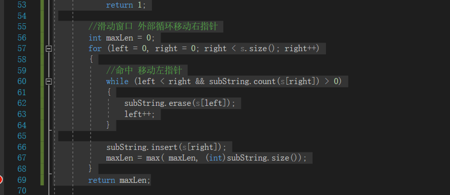

## 最长无重复子串
> 滑动窗口模板
> 非常好的公式
```cpp
//外层循环扩展右边界，内层循环扩展左边界
for (int l = 0, r = 0 ; r < n ; r++) {
	//当前考虑的元素
	while (l <= r && check()) {//区间[left,right]不符合题意
        //扩展左边界
    }
    //区间[left,right]符合题意，统计相关信息
}
```
> 这里记住使用set的count方法，判断是否有元素重复
> 可以利用erase方法
> 
> 代码如下：
> 