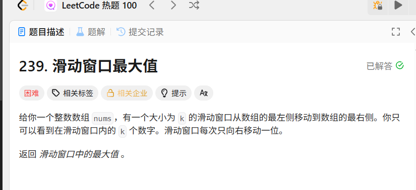
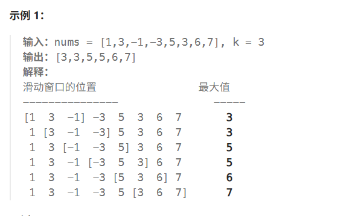

## 滑动窗口最大值
>
>
>利用优先队列计算最大值，同时利用延迟删除，清除不在滑窗内的元素
> 注意堆的使用方法
> 1）利用仿函数构建最大最小堆
> 2） top()函数查看堆顶
> 3） push pop函数 进堆 出堆
> 4）priority_queue<pair<int,int>> 构建可以延迟删除的堆
```cpp
	//239 滑动窗口最大值
	vector<int> maxSlidingWindow(vector<int>& nums, int k) {
		priority_queue<pair<int, int>> slideQueue;
		vector<int> resVec;
		if (nums.size() < k)
			return resVec;

		//构建堆
		for (int i = 0; i < k; i++)
		{
			pair<int, int> t(nums[i],i);
			slideQueue.push(t);
		}
		resVec.push_back(slideQueue.top().first);

		//生成最大值
		for (int i = k ; i < nums.size(); i++)
		{
			pair<int, int> t(nums[i], i);
			slideQueue.push(t);
			
			while (slideQueue.top().second <= i - k)
			{
				slideQueue.pop();
			}
			resVec.push_back(slideQueue.top().first);
		}

		return resVec;
	}
	12
```