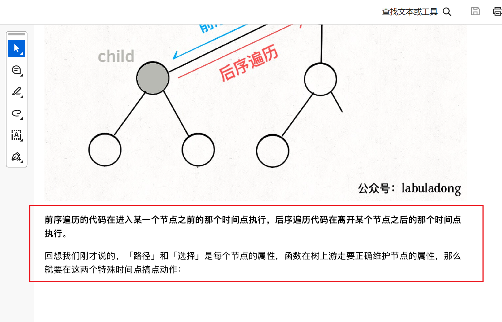

## 二叉树中序遍历
> 先序：递归前处理
> 后续：递归后再处理
> 

```cpp
class Solution {
public:
    vector<int> result;
    void inorderTraversal_inner(TreeNode* root)
    {
        

        if(root->left!=nullptr)
            inorderTraversal_inner(root->left);
        
        result.push_back(root->val);
        
        if(root->right!=nullptr)
            inorderTraversal_inner(root->right);
    }


    vector<int> inorderTraversal(TreeNode* root) {
        result.clear();
        if(root==nullptr)
            return result;

        inorderTraversal_inner(root);
        return result;

    }
};
```