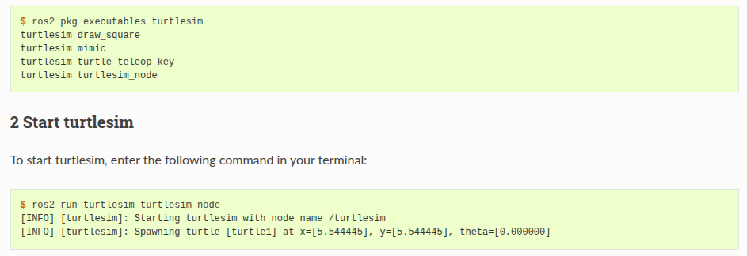
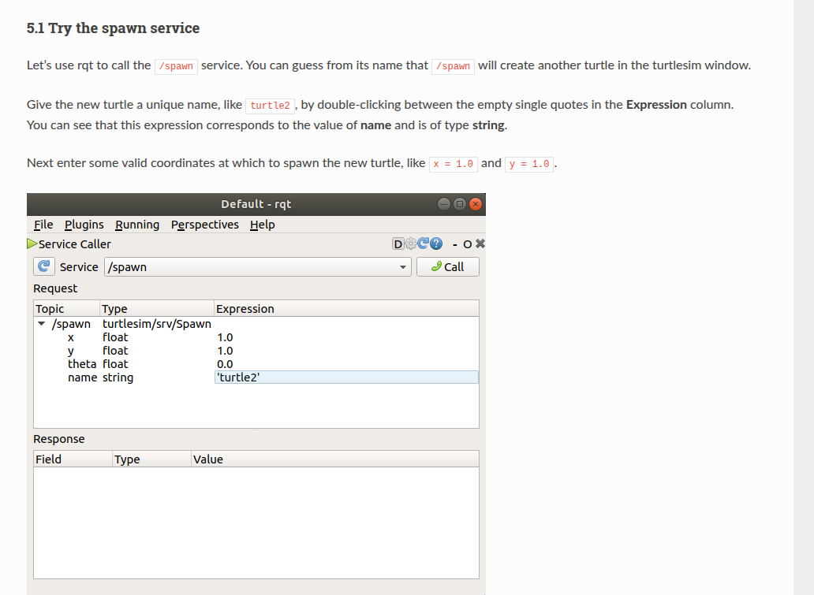
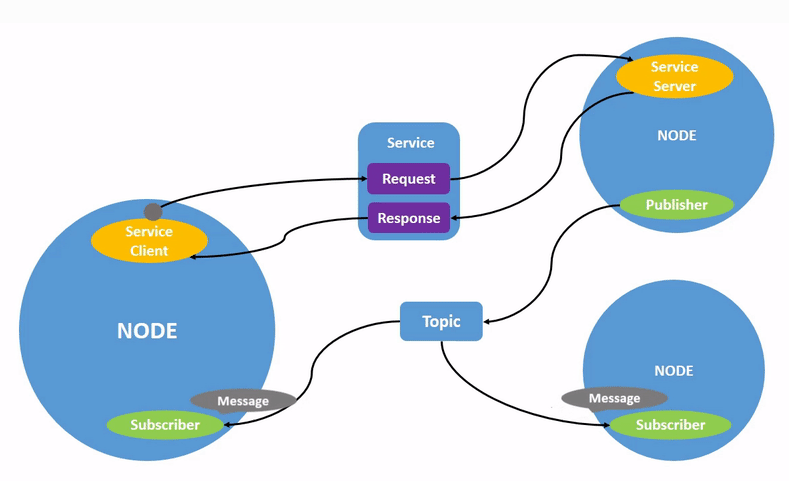

## 1 basic 
> 1 setup env
source /opt/ros/humble/setup.bash
> 2 try some examples
source /opt/ros/humble/setup.bash
ros2 run demo_nodes_cpp talker
source /opt/ros/humble/setup.bash
ros2 run demo_nodes_py listener

---

## 2 env
在source env后，新增的环境变量
root@jzm:/workspace# printenv | grep -i ROS
ROS_VERSION=2
ROS_PYTHON_VERSION=3
AMENT_PREFIX_PATH=/opt/ros/humble
PYTHONPATH=/opt/ros/humble/lib/python3.10/site-packages:/opt/ros/humble/local/lib/python3.10/dist-packages
LD_LIBRARY_PATH=/opt/ros/humble/opt/rviz_ogre_vendor/lib:/opt/ros/humble/lib/x86_64-linux-gnu:/opt/ros/humble/lib
ROS_LOCALHOST_ONLY=0
PATH=/opt/ros/humble/bin:/usr/local/sbin:/usr/local/bin:/usr/sbin:/usr/bin:/sbin:/bin
ROS_DISTRO=humble

## 3 Using turtlesim, ros2, and rqt
> turtle2 sim
> 
> use rqt add a turtle
> 
> remapping cmd
> 

## 4 understand nodes
学习使用ros2 node list指令和ros2 node info
> ros2 graph

> 1 ros2 run 指令
ros2 run <package_name> <executable_name> 
> 2 ros2 node list
显示正在运行的所有节点
ros2 node list
/turtlesim
/teleop_turtle
> 3 remapping 
ros2 run turtlesim turtlesim_node --ros-args --remap __node:=my_turtle
/my_turtle
/turtlesim
/teleop_turtle
> 4 ros2 node info
ros2 node info <node_name>
返回list of subscribers publishers services actions

---

## 5 understanding topics
