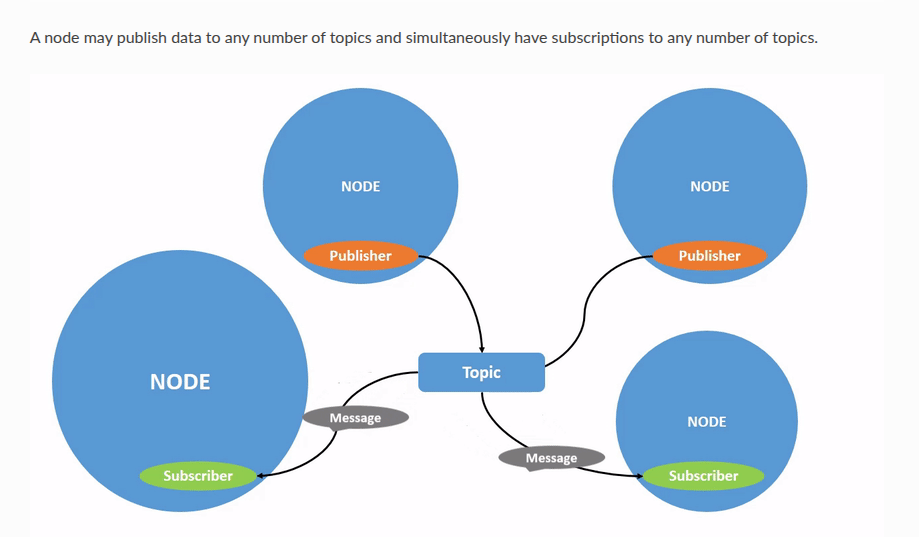
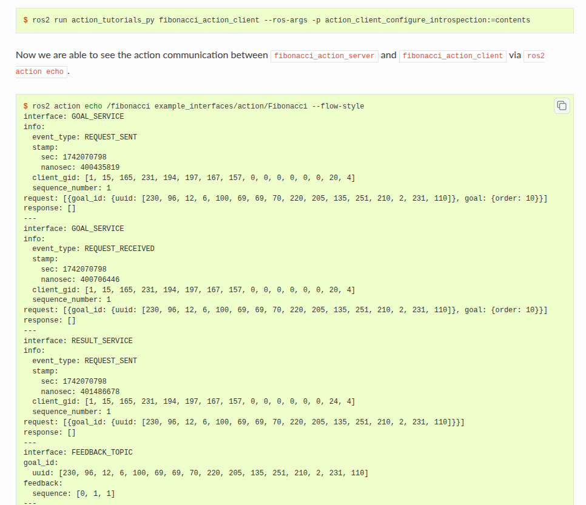

## 1 basic 
> 1 setup env
source /opt/ros/humble/setup.bash
> 2 try some examples
source /opt/ros/humble/setup.bash
ros2 run demo_nodes_cpp talker
source /opt/ros/humble/setup.bash
ros2 run demo_nodes_py listener

---

## 2 env
在source env后，新增的环境变量
root@jzm:/workspace# printenv | grep -i ROS
ROS_VERSION=2
ROS_PYTHON_VERSION=3
AMENT_PREFIX_PATH=/opt/ros/humble
PYTHONPATH=/opt/ros/humble/lib/python3.10/site-packages:/opt/ros/humble/local/lib/python3.10/dist-packages

## 3 Using turtlesim, ros2, and rqt
> turtle2 sim
> 
> use rqt add a turtle
> 
> remapping cmd
> 

## 4 understand nodes
学习使用ros2 node list指令和ros2 node info
> ros2 graph

> 1 ros2 run 指令
ros2 run <package_name> <executable_name> 
> 2 ros2 node list
显示正在运行的所有节点
ros2 node list
/turtlesim
/teleop_turtle
> 3 remapping 
ros2 run turtlesim turtlesim_node --ros-args --remap __node:=my_turtle
/my_turtle
/turtlesim
/teleop_turtle
> 4 ros2 node info
ros2 node info <node_name>
返回list of subscribers publishers services actions

---

## 5 understanding topics
> **1 background**
> 可能一个topic有多个publisher
> 
> **2 rqt graph**
> ros2 run rqt_graph rqt_graph
> 
> **3 ros2 topic list**
> ros2 topic list -t
> 显示topic和msg
> 
> **4 ros2 topic echo**
> **5 ros2 topic info**
> **6 ros2 interface show**
> 显示msg结构信息
> 
> **7 ros2 topib pub**
> 发布topic信息
> ros2 topic pub <topic_name> <msg_type> '<args>'>
> 示例如下
> ros2 topic pub /turtle1/cmd_vel geometry_msgs/msg/Twist "{linear: {x: 2.0, y: 0.0, z: 0.0}, angular: {x: 0.0, y: 0.0, z: 1.8}}"
> 设定消息发布频率
> ros2 topic pub /turtle1/cmd_vel geometry_msgs/msg/Twist "{linear: {x: 0.0, y: 0.0, z: 0.0}, angular: {x: 0.0, y: 0.0, z: 0.0}}" --rate 1
> 只发布一次消息
> ros2 topic pub --once -w 2 /turtle1/cmd_vel geometry_msgs/msg/Twist "{linear: {x: 2.0, y: 0.0, z: 0.0}, angular: {x: 0.0, y: 0.0, z: 1.8}}"
> **8 ros2 topic hz/ros2 topic bw**
> 查看top 发布频率
ros2 topic hz /turtle1/pose
> 查看bw 带宽
ros2 topic bw /turtle1/pose
> **9 ros2 topic find**
> 通过已知msg信息查找topic
ros2 topic find geometry_msgs/msg/Twist
/turtle1/cmd_vel

--- 

## 6 understading services
> services graph
> 
> **1 ros2 service list**
ros2 service list
/clear
/kill
/reset
/spawn
/teleop_turtle/describe_parameters
/teleop_turtle/get_parameter_types
/teleop_turtle/get_parameters
> **2 ros2 service type/ ros2 service list -t**
> 查看service结构
> ros2 service type /clear
ros2 service type /clear
std_srvs/srv/Empty
> 查看所有的srv type 
> ros2 service list -t
/clear [std_srvs/srv/Empty]
/spawn [turtlesim_msgs/srv/Spawn]
> **3 ros2 service info/ ros2 service find/ ros2 interface show**
> 可以查找 src的clients和service数量
> ros2 service info /clear
Type: std_srvs/srv/Empty
Clients count: 0
Services count: 1
> interface show
> ros2 interface show turtlesim_msgs/srv/Spawn
float32 x
float32 y
float32 theta
string name # Optional.  A unique name will be created and returned if this is empty
---
string name
> **4 ros2 service call**
> 服务调用
> ros2 service call <service_name> <service_type> <arguments>
> 示例如下
> 1.ros2 service call /clear std_srvs/srv/Empty
> 2.ros2 service call /spawn turtlesim_msgs/srv/Spawn "{x: 2, y: 2, theta: 0.2, name: ''}"
requester: making request: turtlesim_msgs.srv.Spawn_Request(x=2.0, y=2.0, theta=0.2, name='')

response:
turtlesim_msgs.srv.Spawn_Response(name='turtle2')
> **5 ros2 service echo**
> echo标准格式
> ros2 service echo <service_name | service_type> <arguments>
> 示例如下
> ros2 service echo --flow-style /add_two_ints
 info:
   event_type: REQUEST_SENT
   stamp:
     sec: 1709408301
     nanosec: 423227292
   client_gid: [1, 15, 0, 18, 250, 205, 12, 100, 0, 0, 0, 0, 0, 0, 21, 3]
   sequence_number: 618
 request: [{a: 2, b: 3}]
 response: []

与topic（单向）不同，serice是一种请求相应的模式

---

## 7 uderstanding parameters
> **1 ros2 param list**
> ros2 param list
/teleop_turtle:
  qos_overrides./parameter_events.publisher.reliability
  scale_angular
  scale_linear
  use_sim_time
> **2 ros2 param set/get**
> ros2 param get <node_name> <parameter_name>
> ros2 param set <node_name> <parameter_name> <value>
> **3 ros2 param dump**
> 查看所有的参数
> ros2 param dump <node_name>
> ros2 param dump /turtlesim > turtlesim.yaml
/turtlesim:
  ros__parameters:
    background_b: 255
    background_r: 150
> **4 ros2 param load**
> 从文件中加载参数
> ros2 param load /turtlesim turtlesim.yaml
Set parameter background_b successful
Set parameter background_g successful
> **5 load parameter file on node start**
> 在节点启动时加载参数
> ros2 run <package_name> <executable_name> --ros-args --params-file <file_name>
> 示例
> ros2 run turtlesim turtlesim_node --ros-args --params-file turtlesim.yaml

---

## 8 understanding actions
> background
> 由topic和server组成，三个part：a goal,feedback,a result
> 注意调用顺序，受到result request后才会有feedback topic
> 
> **ros2 action list/ros2 action list -t/ros2 action type**
> 查询action list
> ros2 action list
/turtle1/rotate_absolute
> ros2 action list -t
/turtle1/rotate_absolute [turtlesim_msgs/action/
RotateAbsolute]
> 查询action type
> ros2 action type /turtle1/rotate_absolute
turtlesim_msgs/action/RotateAbsolute
> **2 ros2 action info/ros2 interface show**
> 查询action结构
> ros2 action info /turtle1/rotate_absolute
Action: /turtle1/rotate_absolute
Action clients: 1
    /teleop_turtle
Action servers: 1
    /turtlesim
> ros2 interface show turtlesim_msgs/action/RotateAbsolute
float32 theta
---
float32 delta
---
float32 remaining
> **3 ros2 action send_goal**
> 发送目标 action
> ros2 action send_goal <action_name> <action_type> <values>
> 示例
> ros2 action send_goal /turtle1/rotate_absolute turtlesim_msgs/action/RotateAbsolute "{theta: 1.57}"
Waiting for an action server to become available...
Sending goal:
   theta: 1.57

Goal accepted with ID: f8db8f44410849eaa93d3feb747dd444

Result:
  delta: -1.568000316619873

Goal finished with status: SUCCEEDED
> 查看feedback 持续收到feedback反馈
> ros2 action send_goal /turtle1/rotate_absolute 
> 
> **4 ros2 action echo**
> 回显结构
> ros2 action echo <action_name> <optional arguments/action_type>
> 示例如下
> ros2 action echo /fibonacci example_interfaces/action/
> 

---

## 9 using rqt_console to view logs
> **1 setup过程**
> ros2 run rqt_console rqt_console
> 
> **2 messages on rqt console**
> 
> **3 loger levels**
> 5个等级 
> Fatal Error Warn Info Debug
> 设置节点记录等级
> ros2 run turtlesim turtlesim_node --ros-args --log-level WARN

---

## 10 launching nodes
> 使用launch files 来配置启动节点
> 启动多个turtlesim 不同的命名空间
> 

## 11 recording and playing back data
> **1 record topics**
> ros2 bag record --topics <topic_name>
> ros2 bag record --topics /turtle1/cmd_vel
[INFO] [rosbag2_storage]: Opened database 'rosbag2_2019_10_11-05_18_45'.
[INFO] [rosbag2_transport]: Listening for topics...
> 记录多个topics
> ros2 bag record -o subset --topics /turtle1/cmd_vel /turtle1/pose
[INFO] [rosbag2_storage]: Opened database 'subset'.
[INFO] [rosbag2_transport]: Listening for topics...
> 拆分多个文件
> ros2 bag record -o subset_split -d 5 --topics /turtle1/cmd_vel /turtle1/pose
[INFO] [rosbag2_recorder]: Press SPACE for pausing/resuming
[INFO] [rosbag2_recorder]: Listening for topics...
> **2 inspect topic data**
> ros2 bag info <bag_name>
> **3 play topic data**
> ros2 bag play subset
> ros2 bag record -o subset_cmd_vel --topics /turtle1/cmd_vel
> ros2 bag record -o subset_pose --topics /turtle1/pose
> **4 managing service data**
> ros2 bag record --service <service_names>
> ros2 bag record --all-services
> ros2 bag info <bag_file_name>
> ros2 bag play --publish-service-requests <bag_file_name>
> **5 managing action data**
> ros2 action echo --flow-style /fibonacci
> ros2 bag record --action <action_names>
> ros2 bag play --send-actions-as-client <bag_file_name>

