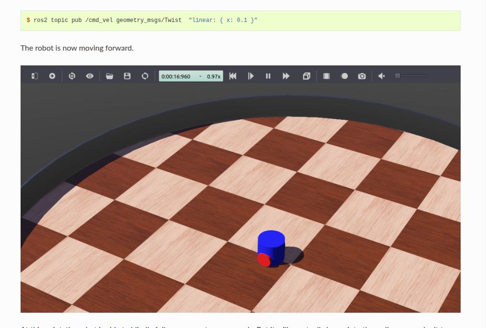
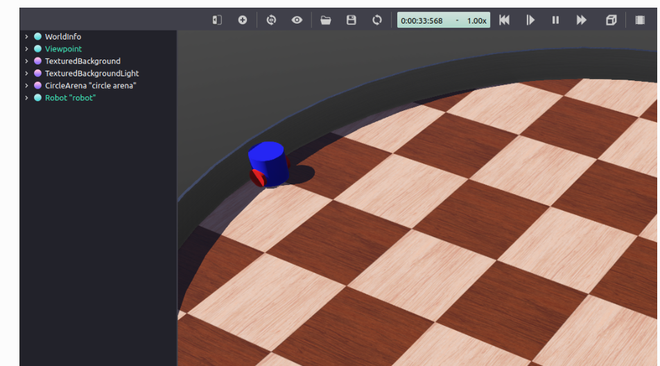

没问题，我们来学习这篇 ROS 2 (Jazzy) 的基础仿真教程。

这篇文章的目标是：**建立一个 Webots 仿真环境，并从 ROS 2 来控制它。**

-----

### 背景 (Background)

本教程将使用 `webots_ros2` 包，特别是 `webots_ros2_driver` 子包。它充当 ROS 2 和 Webots 中机器人控制器之间的接口。我们将创建一个自定义插件（Python 或 C++）来控制机器人。

### 先决条件 (Prerequisites)

  * 已安装 `webots_ros2` (如上一篇教程所示)。
  * 了解 ROS 2 基础：工作空间、包、节点、话题和启动文件。

-----

### 任务1：创建包结构 (Create the package structure)

我们需要创建一个 ROS 2 包来存放代码。进入你的工作空间 `src` 目录 (例如 `~/ros2_ws/src`)。

(教程提供了 Python 和 C++ 两种方式，这里我们以 **Python** 为例进行精简讲解，C++ 的步骤类似但文件不同。)

**a. 创建包**

```bash
# 源码 (命令) - 创建一个 Python 包
ros2 pkg create --build-type ament_python --license Apache-2.0 \
    --node-name my_robot_driver my_package \
    --dependencies rclpy geometry_msgs webots_ros2_driver
```

  * `--node-name my_robot_driver` 会自动在 `my_package/my_package/` 下创建一个 `my_robot_driver.py` 文件，这就是我们的插件。
  * `--dependencies` 指明了依赖项。

**b. 创建额外目录**
我们需要 `launch` 目录来存放启动文件，`worlds` 目录存放仿真世界文件，以及 `resource` 目录（C++需要，Python 示例中也用到了）存放 URDF。

```bash
# 源码 (命令)
cd my_package
mkdir launch
mkdir worlds
mkdir resource  # 教程中 C++ 部分提到了 resource，Python 后面也用到了
```

### 任务2：设置仿真世界 (Setup the simulation world)

你需要一个 `.wbt` 世界文件。教程建议下载[这个世界文件](https://www.google.com/search?q=https://docs.ros.org/en/jazzy/Tutorials/Advanced/Simulators/Webots/Setting-Up-Simulation-Webots-Basic.html%23setup-the-simulation-world) (一个简单的包含机器人的世界)，并将它保存到 `my_package/worlds/my_world.wbt` 路径下。

### 任务3：编辑 `my_robot_driver` 插件

这个插件是一个 ROS 节点，它充当 Webots 中的机器人控制器。它会订阅 ROS 话题（例如 `cmd_vel`）并控制 Webots 中机器人的电机。

打开 `my_package/my_package/my_robot_driver.py` 文件，将其内容替换为：

```python
# 源码 (Python 插件: my_robot_driver.py)
# (精简提炼版)

import rclpy
from geometry_msgs.msg import Twist

# 定义机器人常量
HALF_DISTANCE_BETWEEN_WHEELS = 0.045
WHEEL_RADIUS = 0.025

class MyRobotDriver:
    def init(self, webots_node, properties):
        # 初始化 ROS 节点
        rclpy.init(args=None)
        self.__node = rclpy.create_node('my_robot_driver')

        # 获取 Webots 机器人实例和电机设备
        self.__robot = webots_node.robot
        self.__left_motor = self.__robot.getDevice('left wheel motor')
        self.__right_motor = self.__robot.getDevice('right wheel motor')

        # 设置电机为速度控制模式
        self.__left_motor.setPosition(float('inf'))
        self.__left_motor.setVelocity(0.0)
        self.__right_motor.setPosition(float('inf'))
        self.__right_motor.setVelocity(0.0)

        # 创建 /cmd_vel 订阅
        self.__cmd_vel_subscriber = self.__node.create_subscription(
            Twist,
            'cmd_vel',
            self.__cmd_vel_callback,
            1
        )

    # /cmd_vel 话题的回调函数
    def __cmd_vel_callback(self, twist):
        # 计算左右轮速度
        forward_speed = twist.linear.x
        angular_speed = twist.angular.z

        command_motor_left = (forward_speed - angular_speed * HALF_DISTANCE_BETWEEN_WHEELS) / WHEEL_RADIUS
        command_motor_right = (forward_speed + angular_speed * HALF_DISTANCE_BETWEEN_WHEELS) / WHEEL_RADIUS

        # 设置电机速度
        self.__left_motor.setVelocity(command_motor_left)
        self.__right_motor.setVelocity(command_motor_right)

    # Webots 仿真的每一步都会调用 step 函数
    def step(self):
        # 驱动 ROS 节点运行
        rclpy.spin_once(self.__node, timeout_sec=0)

```

  * `init` 函数：初始化 ROS 节点、获取 Webots 电机设备、创建 `cmd_vel` 订阅者。
  * `__cmd_vel_callback` 函数：接收 `Twist` 消息，并将其转换为左右轮的速度。
  * `step` 函数：在 Webots 的每个仿真步骤中被调用，用于驱动 ROS 节点（`rclpy.spin_once`）。

*(C++ 版本的插件代码会更复杂，涉及 `rclcpp::Node` 的继承和 `pluginlib`，但逻辑相同。)*

### 任务4：创建 `my_robot.urdf` 文件

URDF (统一机器人描述格式) 文件在这里用于声明我们刚刚创建的插件，以便 `webots_ros2_driver` 知道要加载它。

在 `my_package/resource/` 目录下创建 `my_robot.urdf` 文件：

```xml
<?xml version="1.0" ?>
<robot name="My robot">
    <webots>
        <plugin type="my_package.my_robot_driver.MyRobotDriver" />
    </webots>
</robot>
```

  * 这个 URDF 非常简单，只包含了 `<webots>` 标签和 `<plugin>` 标签。
  * `type` 属性告诉 `webots_ros2_driver` 加载哪个插件。

### 任务5：创建启动文件 (Launch File)

启动文件用于同时启动 Webots 仿真器和我们的机器人驱动节点。
在 `my_package/launch/` 目录下创建 `robot_launch.py` 文件：

```python
# 源码 (Launch file: robot_launch.py)
import os
import launch
from launch import LaunchDescription
from ament_index_python.packages import get_package_share_directory
from webots_ros2_driver.webots_launcher import WebotsLauncher
from webots_ros2_driver.webots_controller import WebotsController

def generate_launch_description():
    package_dir = get_package_share_directory('my_package')
    
    # 找到 URDF 文件路径
    robot_description_path = os.path.join(package_dir, 'resource', 'my_robot.urdf')
    
    # 找到 WBT 世界文件路径
    world_path = os.path.join(package_dir, 'worlds', 'my_world.wbt')

    # 1. 启动 Webots 仿真器
    webots = WebotsLauncher(
        world=world_path
    )

    # 2. 启动机器人控制器 (WebotsController)
    # 这个节点会读取 URDF 并加载我们在其中定义的插件
    my_robot_driver = WebotsController(
        robot_name='my_robot', # 对应 Webots 世界中机器人的 'name' 字段
        parameters=[
            {'robot_description': robot_description_path},
        ]
    )

    # 3. (可选) 添加事件处理，当 Webots 关闭时，自动关闭所有节点
    event_handler = launch.actions.RegisterEventHandler(
        event_handler=launch.event_handlers.OnProcessExit(
            target_action=webots,
            on_exit=[launch.actions.EmitEvent(event=launch.events.Shutdown())],
        )
    )

    return LaunchDescription([
        webots,
        my_robot_driver,
        event_handler
    ])
```

  * `WebotsLauncher`: 负责启动 Webots 仿真器实例并加载 `.wbt` 世界。
  * `WebotsController`: 负责连接到仿真器中的特定机器人（通过 `robot_name`）。它会读取 `robot_description` (URDF) 并加载其中指定的插件（即我们的 `MyRobotDriver`）。

### 任务6：编辑额外文件 (Additional Files)

我们需要告诉 ROS 2 的构建系统 (colcon) 如何处理我们添加的 `launch`、`worlds` 和 `resource` 文件。

打开 `my_package/setup.py` 文件，修改 `data_files` 列表：

```python
# 源码 (setup.py)
from setuptools import find_packages, setup

package_name = 'my_package'
data_files = []
# (精简提炼 - 添加以下几行)
data_files.append(('share/ament_index/resource_index/packages', ['resource/' + package_name]))
data_files.append(('share/' + package_name + '/launch', ['launch/robot_launch.py']))
data_files.append(('share/' + package_name + '/worlds', ['worlds/my_world.wbt']))
data_files.append(('share/' + package_name + '/resource', ['resource/my_robot.urdf']))
data_files.append(('share/' + package_name, ['package.xml']))

setup(
    name=package_name,
    version='0.0.0',
    packages=find_packages(exclude=['test']),
    data_files=data_files, # 确保 data_files 在这里被使用
    install_requires=['setuptools'],
    zip_safe=True,
    maintainer='user',
    maintainer_email='user.name@mail.com',
    description='TODO: Package description',
    license='TODO: License declaration',
    tests_require=['pytest'],
    entry_points={
        'console_scripts': [
            # 确保这里的入口点正确
            'my_robot_driver = my_package.my_robot_driver:main', 
        ],
    },
)
```

*(对于 C++ 版本，你需要修改 `CMakeLists.txt` 来安装这些文件，并创建 `my_robot_driver.xml` 来配置 `pluginlib`。)*

### 任务7：测试代码 (Test the code)

现在，回到你的工作空间根目录 (例如 `~/ros2_ws`) 编译和运行。

**a. 编译**

```bash
# 源码 (命令)
cd ~/ros2_ws
colcon build
```

**b. Source 环境**

```bash
# 源码 (命令)
source install/local_setup.bash
```

**c. 运行启动文件**

```bash
# 源码 (命令)
ros2 launch my_package robot_launch.py
```

这会启动 Webots 仿真器。

**d. 发送控制命令**
打开**另一个**终端，Source 你的工作空间 (`source install/local_setup.bash`)，然后使用 `ros2 topic pub` 发送速度指令：

```bash
# 源码 (命令) - 让机器人前进
ros2 topic pub --once /cmd_vel geometry_msgs/msg/Twist "{linear: {x: 0.1, y: 0.0, z: 0.0}, angular: {x: 0.0, y: 0.0, z: 0.0}}"


# 源码 (命令) - 让机器人旋转
ros2 topic pub --once /cmd_vel geometry_msgs/msg/Twist "{linear: {x: 0.0, y: 0.0, z: 0.0}, angular: {x: 0.0, y: 0.0, z: 0.2}}"
```

你应该能看到 Webots 中的机器人在移动。