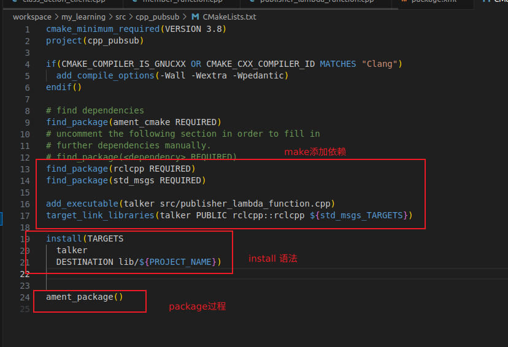

## 1 simple publisher and subscriber
>  注意学习 <c++ learn> 3-11 构造函数 ::全局命名解析 智能指针语法 lambda表达式 std::bind std::funciton
>  注意学习<ros learn> 14-15 createWallTimer使用及rclcpp::spin用法
>  注意学习 <ros learn> 9-13 ament_cmake cmake过程 install语法基本使用 ament_package()过程
>  注意学习<c++ learn > 12-13 泛型 allocator的使用
>  注意学习<ros learn> 16 17 python包使用
> **1 created a package**
> ros2 pkg create --build-type ament_cmake --license Apache-2.0 cpp_pubsub
> 
> **2 source code**
> 
> **3 cmakelist 和 packageXml**
> 
> 
> **4 subsription code**
> 
> 
> **5 python code**
> 
> 
> 

## 2 simple service and client
> 注意学习<c++ learn> 14-16 异步执行操作 future和thread cinttypes
> 注意学习<ros learn> 18 service同步异步讲解
> **1 create a package**
> ros2 pkg create --build-type ament_cmake --license Apache-2.0 cpp_srvcli --dependencies rclcpp example_interfaces
> update xml
> **2 service node code**
> 

