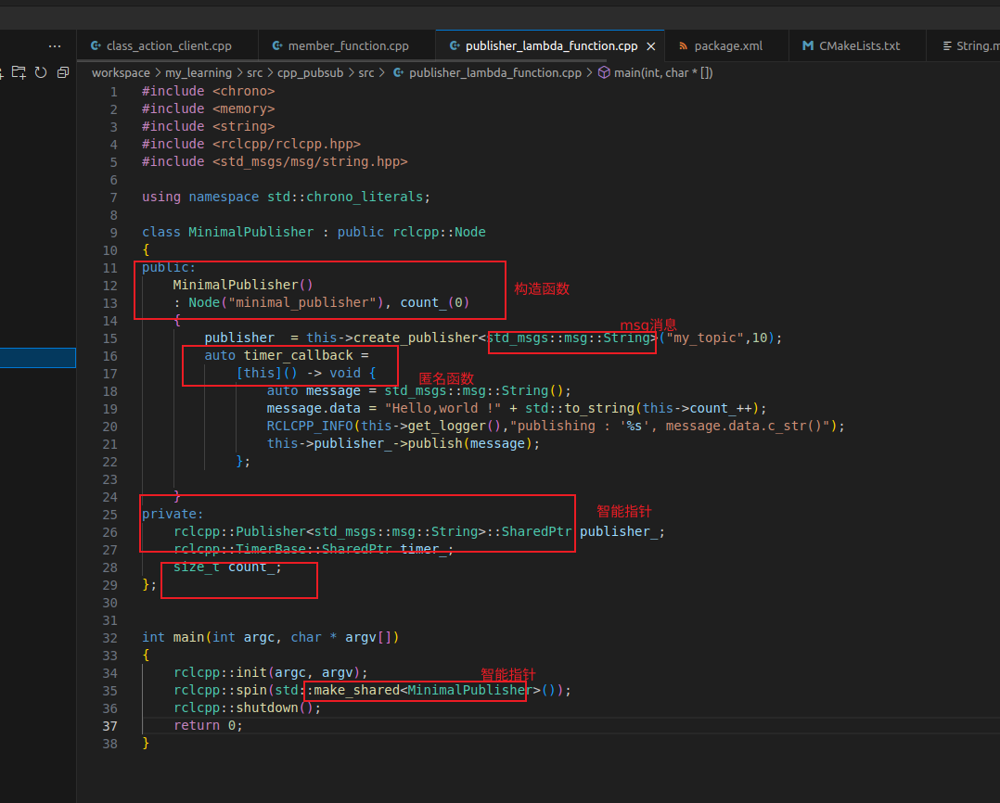
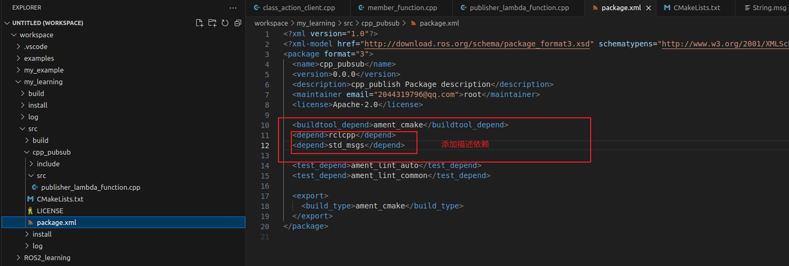
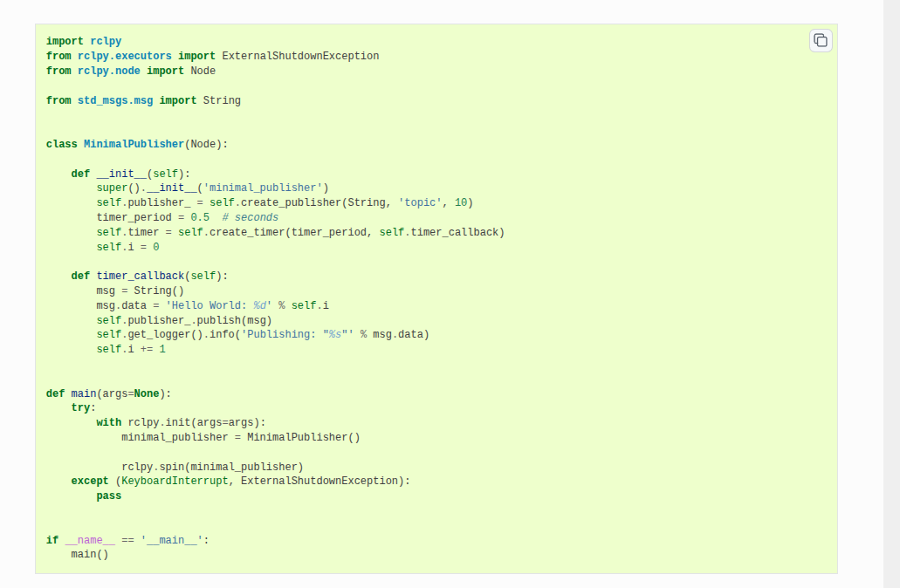
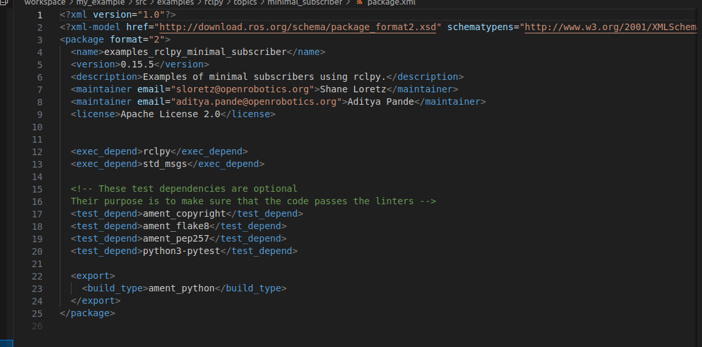

## 1 simple publisher and subscriber
>  注意学习 <c++ learn> 3-11 构造函数 ::全局命名解析 智能指针语法 lambda表达式 std::bind std::funciton
>  注意学习<ros learn> 14-15 createWallTimer使用及rclcpp::spin用法
>  注意学习 <ros learn> 9-13 ament_cmake cmake过程 install语法基本使用 ament_package()过程
>  注意学习<c++ learn > 12-13 泛型 allocator的使用
>  注意学习<ros learn> 16 17 python包使用
> **1 created a package**
> ros2 pkg create --build-type ament_cmake --license Apache-2.0 cpp_pubsub
> 
> **2 source code**
> 
> **3 cmakelist 和 packageXml**
> 
> 
> **4 subsription code**
> 
> 
> **5 python code**
> 
> 
> 

## 2 simple service and client
> 注意学习<c++ learn> 14-16 异步执行操作 future和thread cinttypes
> 注意学习<ros learn> 18 service同步异步讲解
> 注意学习<ros learn> 19-21 代码详解 client_spin函数理解 ros异步与std异步差异
> 注意学习<ros learn> 22-24 vscode调试环境配置 25 fastrtps中间键
> 注意学习<c++ learn> 17-19 lamdba按值捕获和按引用捕获 promise和feature使用 lamdbd捕获变量生命周期
> 注意学习<ros learn> 26 27 excutor概念与spin区别 single_multiThreadExecutor理解
> 注意学习<ros learn> 28-30 异步客户端代码解读 rclrmw关系 异步请求时序
> **1 create a package**
> ros2 pkg create --build-type ament_cmake --license Apache-2.0 cpp_srvcli --dependencies rclcpp example_interfaces
> update xml
> **2 service node code**
> 
> **3 client node code**
> 
> **4 cmake**
> 
> **5 python package**
> 
> 
> 
> **6 额外程序**
> 异步客户端
> 
> 
> 

## 3 custom msg and srv files

> **1 create a new pakage**
> ros2 pkg create --build-type ament_cmake --license Apache-2.0 tutorial_interfaces
> **2 custom msg and srv defines**
> mkdir msg srv
> 
> **3 CMakeLists**
> 使用的是 rosidl_default_generators 工具 进行编译
> 注意使用的语法 后面第一个是（package名称）
```cpp
find_package(geometry_msgs REQUIRED)
find_package(rosidl_default_generators REQUIRED)

rosidl_generate_interfaces(${PROJECT_NAME}
  "msg/Num.msg"
  "msg/Sphere.msg"
  "srv/AddThreeInts.srv"
  DEPENDENCIES geometry_msgs # Add packages that above messages depend on, in this case geometry_msgs for Sphere.msg
)
```
> **4 package.xml**
> 依赖 rosidl_default_generators (runtime execution-stage)
```xml
<depend>geometry_msgs</depend>
<buildtool_depend>rosidl_default_generators</buildtool_depend>
<exec_depend>rosidl_default_runtime</exec_depend>
<member_of_group>rosidl_interface_packages</member_of_group>
```
> **5 build package**
> colcon build --packages-select tutorial_interfaces
> **6 comfirm and use**
> 服务和topic 确认
> 
> c++ 代码
> 
> python 代码
> 
> cmake lists
> 


