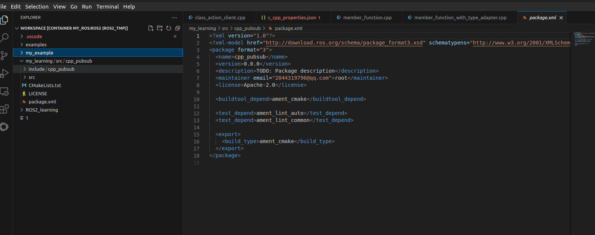

## simple publisher and subscriber
> **1 created a package**
> ros2 pkg create --build-type ament_cmake --license Apache-2.0 cpp_pubsub
> 
> **2 source code**
> 注意学习 <c++ learn> 3-11 构造函数 ::全局命名解析 智能指针语法 lambda表达式 std::bind std::funciton
> 注意学习<ros learn> 14-15 createWallTimer使用及rclcpp::spin用法
> 
> **3 cmakelist 和 packageXml**
> 注意学习 <ros learn> 9-13 ament_cmake cmake过程 install语法基本使用 ament_package()过程
> 
> 