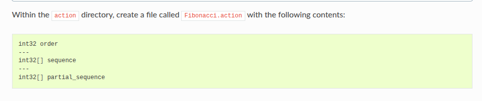
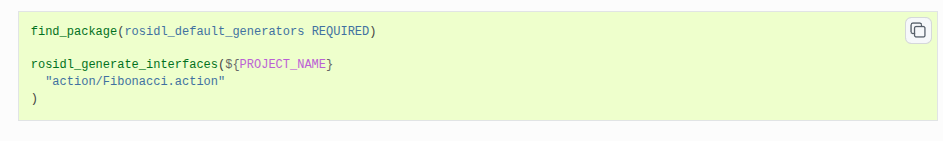
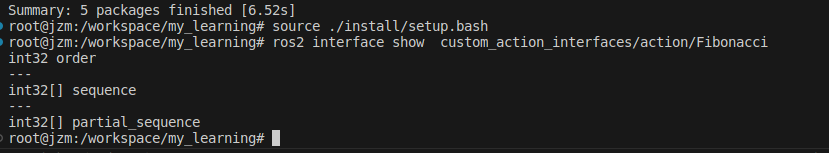

## 1 action 编写
> **1 create package/ define an action**
> ros2 pkg create --license Apache-2.0 custom_action_interfaces
> 
> **2 building action**
> cmakelist
> 
> package xml
> 
> 结果显示
> 

## 2 writing an action server and client
> **1 creating package**
> ros2 pkg create --dependencies custom_action_interfaces rclcpp rclcpp_action rclcpp_components --license Apache-2.0 -- custom_action_cpp
