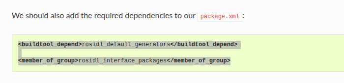

## 1 action 编写
> **1 create package/ define an action**
> ros2 pkg create --license Apache-2.0 custom_action_interfaces
> 
> **2 building action**
> cmakelist
> 
> package xml
> 
> 结果显示
> 

## 2 writing an action server and client
> 注意学习<ros learn> 37-40 visibility可见性控制 node_plugin插件注册 action通信 action客户端代码
> 注意学习<c++ learn> 20 21 链接可见性 动态库符号导入导出
