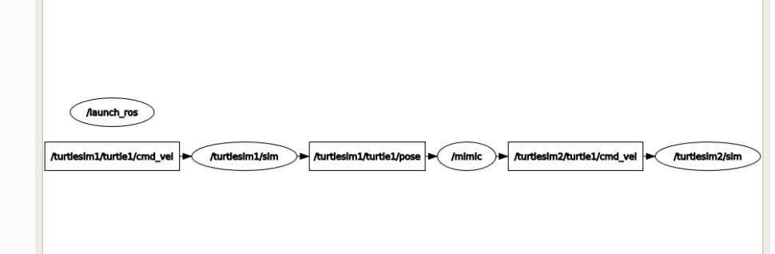

非常好 👍
这一篇教程讲的是 **ROS 2 的 Launch 系统** —— 它是你在构建复杂系统（多个节点、参数、命名空间、话题重映射等）时的核心工具。
我们来一起深入理解这篇文章的内容，让你以后能**独立写 launch 文件来启动整个 ROS2 系统**。

---

## 🧩 一、背景：什么是 Launch 文件？

在 ROS 2 中，每个节点（Node）都是一个独立的进程。
如果你需要运行多个节点，比如：

* 摄像头驱动
* 图像处理节点
* 控制算法节点
* 可视化工具（如 RViz）

那手动一个个 `ros2 run` 启动会非常麻烦。

**Launch 文件** 就是解决这个问题的：

> 它让你一次性配置并启动一整套 ROS 2 节点。

---

## ⚙️ 二、Launch 系统的职责

Launch 系统不仅仅是“帮你运行多个节点”，它还做这些事：

| 功能       | 说明                           |
| -------- | ---------------------------- |
| 配置系统结构   | 定义要启动哪些节点、命名空间、参数等           |
| 设置通信映射   | 重映射话题、参数名等，避免冲突              |
| 管理节点生命周期 | 监控节点是否崩溃、自动重启、终止时清理          |
| 响应事件     | 可以根据节点状态触发行为（例如某个节点退出后启动另一个） |

---

## 🐢 三、实例：turtlesim 模拟双海龟同步动作

你将创建一个 Python Launch 文件，运行三个节点：

* `turtlesim1/sim`
* `turtlesim2/sim`
* `mimic` （让第二只海龟模仿第一只）

### 🧱 文件结构

```
ros2_ws/
 ├── src/
 │    └── your_package/
 │          └── launch/
 │                └── turtlesim_mimic_launch.py
```

---

## ✨ 四、Launch 文件详解（Python版）

```python
from launch import LaunchDescription
from launch_ros.actions import Node

def generate_launch_description():
    return LaunchDescription([
        Node(
            package='turtlesim',
            namespace='turtlesim1',
            executable='turtlesim_node',
            name='sim'
        ),
        Node(
            package='turtlesim',
            namespace='turtlesim2',
            executable='turtlesim_node',
            name='sim'
        ),
        Node(
            package='turtlesim',
            executable='mimic',
            name='mimic',
            remappings=[
                ('/input/pose', '/turtlesim1/turtle1/pose'),
                ('/output/cmd_vel', '/turtlesim2/turtle1/cmd_vel'),
            ]
        )
    ])
```

---

### 🔍 一步步解释

#### ✅ 1. `from launch import LaunchDescription`

导入 Launch 系统的基础结构。

#### ✅ 2. `from launch_ros.actions import Node`

导入 ROS 专用的 `Node` 动作（Action）类，用于启动节点。

#### ✅ 3. `generate_launch_description()`

每个 Python Launch 文件都必须定义这个函数，返回一个 `LaunchDescription` 对象。
它是“这个系统要启动的所有内容的清单”。

#### ✅ 4. `Node(...)` 参数解析：

| 参数           | 作用           | 示例                                              |
| ------------ | ------------ | ----------------------------------------------- |
| `package`    | 节点所属包名       | `'turtlesim'`                                   |
| `executable` | 节点可执行文件名     | `'turtlesim_node'`                              |
| `namespace`  | 给节点分组，避免命名冲突 | `'turtlesim1'`                                  |
| `name`       | 节点名          | `'sim'`                                         |
| `remappings` | 重映射话题或服务名    | `[('/input/pose', '/turtlesim1/turtle1/pose')]` |

---

## 🪄 五、运行 Launch 文件

在终端中执行：

```bash
cd launch
ros2 launch turtlesim_mimic_launch.py
```

> 💡 注意：
> 你也可以用 package 方式运行（推荐在项目中用这种）：

```bash
ros2 launch your_package turtlesim_mimic_launch.py
```

前提：你在 `package.xml` 里声明依赖：

```xml
<exec_depend>ros2launch</exec_depend>
```

---

## 🐢 六、运行结果

会弹出两个 `turtlesim` 窗口：

* `/turtlesim1/sim`：主海龟
* `/turtlesim2/sim`：模仿海龟
* `/mimic`：负责把第一只海龟的运动复制给第二只

现在在另一个终端运行：

```bash
ros2 topic pub -r 1 /turtlesim1/turtle1/cmd_vel geometry_msgs/msg/Twist \
"{linear: {x: 2.0}, angular: {z: -1.8}}"
```

✅ 你会看到第二只海龟同步移动。

---

## 🔍 七、rqt_graph 可视化系统拓扑

运行：

```bash
ros2 run rqt_graph rqt_graph
```

你会看到类似这样的结构：

```
[input publisher] --> /turtlesim1/sim --> [mimic] --> /turtlesim2/sim
```

表示：

* `ros2 topic pub` 在发布 `/turtlesim1/turtle1/cmd_vel`
* 第一只 turtle 发布自己的 `/pose`
* mimic 订阅 `/turtlesim1/turtle1/pose` 并发布 `/turtlesim2/turtle1/cmd_vel`
* 第二只 turtle 根据该速度指令运动

---

## 🧠 八、知识点总结

| 概念                | 说明           | 示例                            |
| ----------------- | ------------ | ----------------------------- |
| LaunchDescription | 整个系统的描述      | 一组 Node                       |
| Node              | 单个节点启动配置     | package + executable          |
| namespace         | 节点命名空间       | `/robot1/`                    |
| remappings        | 重映射话题        | `('/input', '/robot1/input')` |
| ros2 launch       | 启动 launch 文件 | `ros2 launch pkg file.py`     |

---

## 💡 九、进阶延伸：你能做什么？

1. **启动你自己的节点**

   ```python
   Node(package='my_robot', executable='controller', name='ctrl')
   ```

2. **添加参数文件**

   ```python
   Node(
     package='my_robot',
     executable='controller',
     parameters=['config/controller_params.yaml']
   )
   ```

3. **同时启动 RViz 或 rqt 工具**

   ```python
   Node(package='rviz2', executable='rviz2', name='rviz')
   ```

4. **定义启动顺序 / 条件启动**
   用 `launch.actions.RegisterEventHandler` 控制事件触发。

---

## ✅ 十、总结

| 你学会了什么           | 说明                      |
| ---------------- | ----------------------- |
| Launch 文件用途      | 一次性启动多个 ROS2 节点         |
| Python Launch 格式 | 最灵活，可配置参数、命名空间、重映射      |
| 命名空间的作用          | 避免话题冲突，让多个实例共存          |
| mimic 例子         | 展示了节点间通信与 remapping 的用法 |
| rqt_graph        | 可视化调试工具，理解话题连接关系        |

---

# 第二部分映射关系
非常好，这部分是 **ROS 2 launch 文件中 remappings（话题重映射）** 的关键内容，我们来一步一步讲透 👇

---

### 🧩 背景：为什么需要 remapping

在 ROS 2 中，**话题（topic）名称是全局唯一的**。
多个节点如果使用相同的话题名，就会互相通信；
但如果你启动两个节点，它们都发布或订阅 `/cmd_vel`，那就冲突了。

所以当我们想让两个节点 **复用相同代码**（如两个 turtlesim 窗口），但各自使用 **不同话题**，就要用到 remapping 来改名。

---

### 📘 remappings 的语法

```python
remappings=[
    ('<旧话题名>', '<新话题名>'),
]
```

意思是：

> “把节点内部使用 `<旧话题名>` 的地方，都改成 `<新话题名>`。”

这不改节点代码，就能改变它连接的话题，非常灵活。

---

### 🐢 在这个例子里

```python
Node(
    package='turtlesim',
    executable='mimic',
    name='mimic',
    remappings=[
        ('/input/pose', '/turtlesim1/turtle1/pose'),
        ('/output/cmd_vel', '/turtlesim2/turtle1/cmd_vel'),
    ]
)
```

`mimic` 节点是一个 **中间节点**，它作用是：

> 接收一只乌龟的位置，然后把它的动作指令发给另一只乌龟。

它内部使用了两个话题：

* `/input/pose` —— 订阅输入（被模仿乌龟的位置）
* `/output/cmd_vel` —— 发布输出（模仿者乌龟的速度指令）

---

### 🔁 通过 remapping，它变成：

| mimic 内部话题        | 实际连接到系统中的话题                   | 作用                         |
| ----------------- | ----------------------------- | -------------------------- |
| `/input/pose`     | `/turtlesim1/turtle1/pose`    | 从第一个 turtlesim 的 pose 订阅消息 |
| `/output/cmd_vel` | `/turtlesim2/turtle1/cmd_vel` | 向第二个 turtlesim 发布速度命令      |

---

### 🧠 这样系统逻辑就是：

1️⃣ `/turtlesim1/sim` 发布它自己的 `/turtlesim1/turtle1/pose`
2️⃣ `mimic` 订阅这个话题（通过 remap）
3️⃣ `mimic` 处理数据后发布 `/output/cmd_vel`
4️⃣ 这个被 remap 成 `/turtlesim2/turtle1/cmd_vel`
5️⃣ `/turtlesim2/sim` 订
是否想让我画一个图（用箭头展示 `/turtlesim1` → `mimic` → `/turtlesim2` 的话题流动关系）来帮你更直观看懂？阅这个话题，于是它动起来模仿第一只 🐢

---

### ✅ 总结一句话

> remappings 就像在 launch 文件里做“话题改名”：
>
> * 左边是节点**原本使用的名字**；
> * 右边是你**想让它连接的真实名字**。

这样可以在不改节点源码的情况下，让节点“接上正确的线”。

---
# 第三部分 原有话题

非常好的问题 👍
你这个问题其实是理解 ROS 2 话题 remapping 的 **关键点** ——
👉 当我们 remap 一个话题时，“原本的话题”到底会怎样？它还存在吗？

---

### 🧩 先看情况：

`turtlesim_node`（也就是 `/turtlesim2/sim`）本身会：

* **订阅** `/turtle1/cmd_vel`（默认控制输入）
* **发布** `/turtle1/pose`（当前位姿输出）

并且因为我们在 launch 文件中给它指定了 namespace：

```python
namespace='turtlesim2',
```

所以它的完整话题名会变成：

```
/turtlesim2/turtle1/cmd_vel
/turtlesim2/turtle1/pose
```

这两个话题是由 `/turtlesim2/sim` 节点自动创建的。

---

### 🐢 然后我们再看 mimic：

```python
Node(
    package='turtlesim',
    executable='mimic',
    remappings=[
        ('/input/pose', '/turtlesim1/turtle1/pose'),
        ('/output/cmd_vel', '/turtlesim2/turtle1/cmd_vel'),
    ]
)
```

mimic 节点自己并不会创建 `/turtlesim2/turtle1/cmd_vel`，
而是将它**原本内部的话题名 `/output/cmd_vel`**
**重映射为** `/turtlesim2/turtle1/cmd_vel`。

也就是说：

* mimic 会往 `/turtlesim2/turtle1/cmd_vel` **发布消息**
* turtlesim2 会从 `/turtlesim2/turtle1/cmd_vel` **订阅消息**

---

### ✅ 所以，原有的 `/turtlesim2/turtle1/cmd_vel`：

**依然存在**。
它是 `/turtlesim2/sim` 订阅的那个话题。

只是现在，有了 mimic 节点往这个话题里**发布速度命令**，
相当于 mimic 在“远程控制”第二只乌龟。
第一只乌龟的动作（pose）→ mimic 转换 → `/turtlesim2/turtle1/cmd_vel` → 第二只乌龟。

---

### 🧠 举个生活比喻：

| 角色                | 话题                                                         | 作用         |
| ----------------- | ---------------------------------------------------------- | ---------- |
| `/turtlesim1/sim` | `/turtlesim1/turtle1/pose`                                 | 报告自己的位置    |
| `mimic`           | `/turtlesim1/turtle1/pose` → `/turtlesim2/turtle1/cmd_vel` | 模仿动作的“翻译机” |
| `/turtlesim2/sim` | `/turtlesim2/turtle1/cmd_vel`                              | 听命行事的“模仿者” |

`/turtlesim2/turtle1/cmd_vel` 本来就存在（第二只乌龟在监听它），
只是你通过 remapping 让 mimic 负责往里“说话”。

---

🧩 总结一句话：

> remapping 不会删除或覆盖原有的话题，它只是把节点内部使用的话题名“重新指向”系统中已经存在的那个话题。

---

要不要我帮你画一个简图，用箭头标出三个节点之间的话题连接关系？
一图看懂 remapping 的效果。
