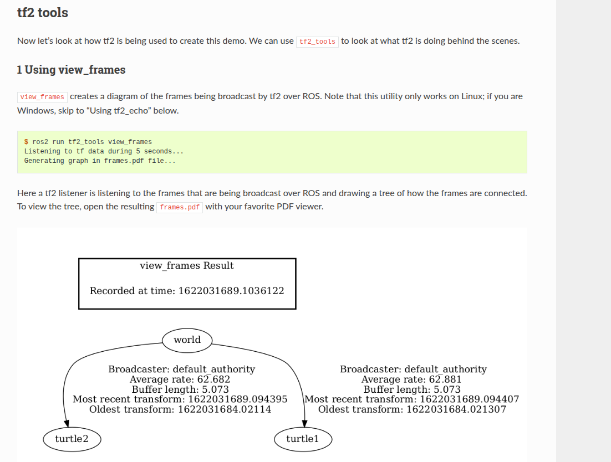
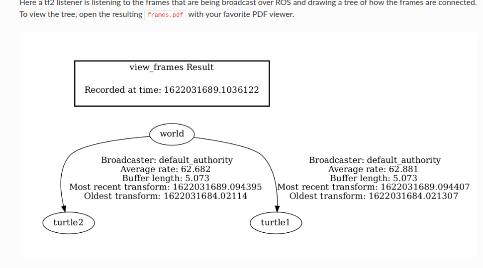
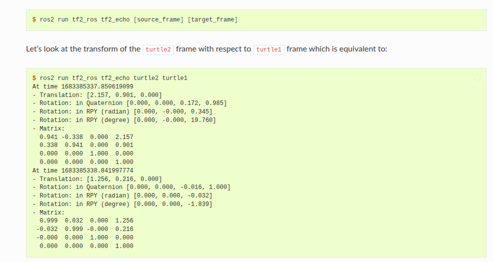
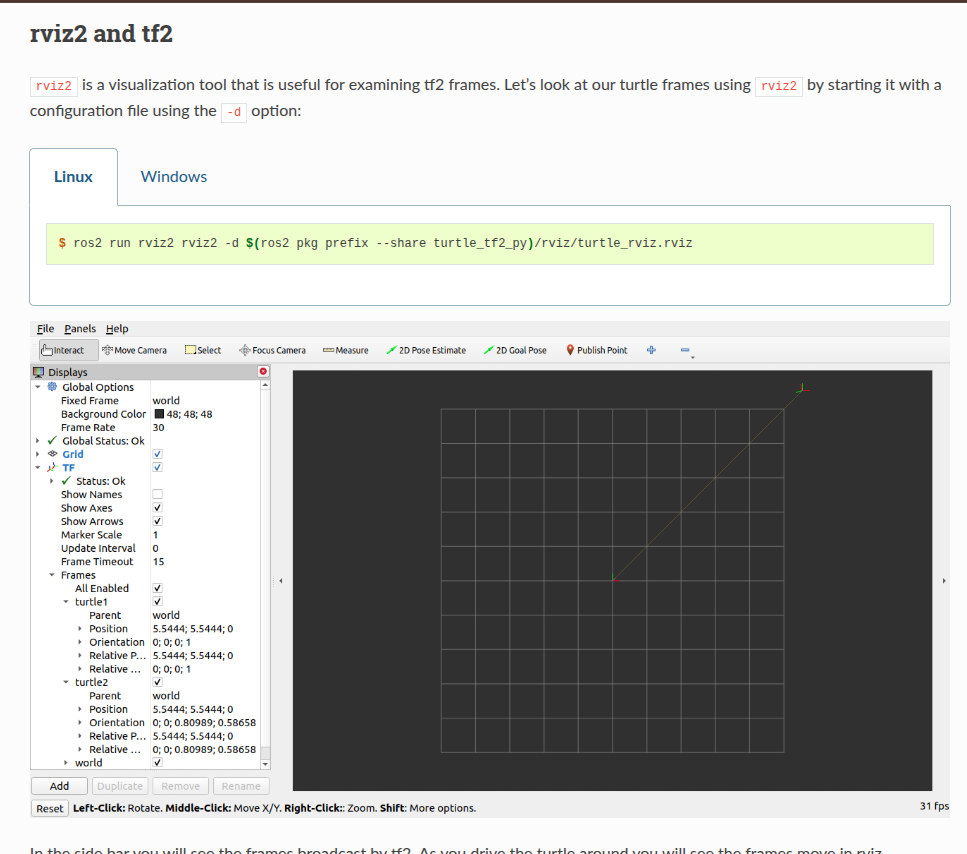

好的，我们来一起学习 tf2（ROS 2 中的坐标变换库）这篇教程：*“Introducing tf2”*。我会把教程的主要内容提炼出来、解释关键点，并补充一些中文说明，方便你理解。如果你愿意，我也可以帮你做一个实践练习。下面分几个部分来讲。

> tf树

---

## 🧭 教程概览

这篇教程来源于 ROS 2 的官方文档，针对 Intermediate 级别，目标是在 10 分钟内通过一个示例（用 turtlesim）理解 tf2 的用法。 ([ROS Docs][1])
主要内容包括：

* 安装示例程序
* 运行 Demo
* “发生了什么”——即背后坐标变换框架
* tf2 工具的使用（view_frames、tf2_echo、rviz2）

---

## 1. 安装 Demo

教程中首先要求安装一些包（以 Ubuntu 为例）：

```bash
sudo apt-get install ros-rolling-rviz2 ros-rolling-turtle-tf2-py ros-rolling-tf2-ros ros-rolling-tf2-tools ros-rolling-turtlesim
```

([ROS Docs][1])
也可从源码安装。

**说明**：这一步是为了拿到一个可运行的示例环境，其中包含 `turtle_tf2_py` 包等，用来演示 tf2。

---

## 2. 运行 Demo

安装完后，教程指导如下：

1. 在一个终端中 `source` 你的 ROS 2 安装环境。 ([ROS Docs][1])
2. 启动 Demo：

   ```bash
   ros2 launch turtle_tf2_py turtle_tf2_demo.launch.py
   ```

   这时会看到 turtlesim 启动，有两只 turtles。 ([ROS Docs][1])
3. 在另一个终端运行键盘控制：

   ```bash
   ros2 run turtlesim turtle_teleop_key
   ```

   然后用键盘箭头控制其中一只 turtle。 ([ROS Docs][1])
4. 在画面中，你会看到另一只 turtle 自动跟随你所控制的那只。这个“跟随”就是基于坐标变换关系计算得到的。

---

## 3. “什么在发生？”（What is happening?）

这是理解 tf2 的核心部分。教程解释：

* 在该示例中，有三个坐标系（frames）：`world`、`turtle1`、`turtle2`。 ([ROS Docs][1])
* `turtle1` 和 `turtle2` 都是基于 `world` 的子坐标系。
* 使用 tf2 的 broadcaster（广播器）不断发布每个坐标系相对于其父坐标系的变换。
* 另一方面，listener（监听器）使用这些变换信息来计算两个 turtle 之间的位置、姿态差，从而控制第二只 turtle 跟随第一只。

**补充说明**：

* “坐标系（frame）”可理解为一个参考系，比如一个机器人、有传感器的臂、有世界坐标系。
* tf2 的作用，就是管理这些坐标系之间的关系（变换／transform），而不是你专注于具体控制逻辑。
* 在机器人系统里，常常你有：世界坐标系 → 机器人底盘坐标系 → 传感器坐标系 → 工具末端坐标系。tf2 就是用来统一管理、查询这些坐标系之间的位置＋旋转关系。
* 在这个简单示例里，第二只 turtle 的跟随逻辑就是在不断计算：第二只 turtle 坐标系相对于第一只 turtle 坐标系是多少，然后用这个变换来控制它。

---

## 4. tf2 工具（tf2 tools）

教程提供几个实用工具来理解和调试 tf2：

### 4.1 使用 view_frames

* 命令：

  ```bash
  ros2 run tf2_tools view_frames
  ```
* 功能：监听 tf2 广播的变换，生成一棵坐标系树 (graph) 并输出为 `frames.pdf`。 ([ROS Docs][1])
* 在示例中，你会看到 `world` 为根，下面 `turtle1` 和 `turtle2`。 ([ROS Docs][1])
* 同时，这个工具还能报告每个变换的最旧／最新接收时间、以及发布频率等，有助于调试。



### 4.2 使用 tf2_echo

* 命令格式：

  ```bash
  ros2 run tf2_ros tf2_echo [source_frame] [target_frame]
  ```

  例如：

  ```bash
  ros2 run tf2_ros tf2_echo turtle2 turtle1
  ```

  将显示 `turtle2` 坐标系相对于 `turtle1` 坐标系的变换（包括平移、旋转／四元数、RPY、矩阵）([ROS Docs][1])
* 当你用键盘控制第一只 turtle 移动时，观察输出会发现这些数值在变化——因为两只 turtle 的相对位置在变。



### 4.3 使用 RViz2 可视化

* 使用命令（在 Linux）：

  ```bash
  ros2 run rviz2 rviz2 -d $(ros2 pkg prefix --share turtle_tf2_py)/rviz/turtle_rviz.rviz
  ```

  ([ROS Docs][1])
* 在 RViz2 界面，你可以看到坐标系（frames）树，以及随 turtle 移动这些坐标系的变化。
* 可视化对于理解变换关系、调试非常有帮助。


---

## 5. 核心概念总结

下面把 tf2 的几个关键概念整理一下：

* **Frame（坐标系）**：一个参考系，通常以某个实体或参考点为原点，有自己的坐标轴定义。
* **Transform／变换**：描述一个坐标系相对于另一个坐标系的位置（平移）和姿态（旋转）。
* **Broadcaster（广播器）**：负责不断将某个坐标系的变换发布出去。
* **Listener（监听器）**：订阅变换信息，并用于查询、计算两个坐标系之间的变换。
* **变换树（Transform Graph）**：系统中多个坐标系间通过变换连接起来，形成一棵树状结构（或有时 DAG）。
* **使用场景**：机器人中，当你有多个传感器、机械臂、相机、地图、世界坐标系时，需要知道“这个物体在世界中的位置”“这个传感器在机器人底盘坐标系中的位置”“机器人底盘在世界坐标系中的位置”。tf2 就统一管理这些。
* **为何有用**：你就可以通过“一条语句”查询坐标系 A 相对于 B 的变换，而不必手动追踪中间多级变换。比如：世界 → 机器人 → 相机 → 工具末端。
* **注意事项**：

  * 时间戳和同步很重要。因为变换是时间相关的。
  * 发布频率和缓存大小可能影响变换查询是否有效。
  * 变换树中不要有环。通常是树结构。
  * 可视化和工具（如 view_frames, tf2_echo）是调试变换关系的利器。

---

## 6. 应用到你的场景（给你一个关联建议）

假如你在台北，用某个小型机器人做实验，想让机器人用激光雷达、相机、机械臂同时工作。你可以这样用 tf2：

* 定义世界坐标系 `world`（可能是实验室地面或全局定位系统）。
* 机器人底盘定义坐标系 `base_link`。使用广播器将其相对于 `world` 发布。
* 激光雷达坐标系 `laser_link` 发布相对于 `base_link` 的变换。
* 相机坐标系 `camera_link` 同样。
* 如果有机械臂末端 `ee_link`，也发布其变换。
* 当你要做“相机看到的物体在世界坐标系中的位置”时，你只需 listener 查询 `world` 和 `camera_link` 之间的变换，然后再结合相机测量。这样就简化了很多。
* 使用 view_frames 查看你的坐标系连接是否如预期；用 tf2_echo 检查某个具体关系；用 RViz2 可视化整个变换树。

---

如果你愿意的话，我可以帮你**汉化并作笔记**这份教程，或者**生成一份练习题目**让你自己跑起来（比如从零开始搭建一个 tf2 示例）。你想选择哪一种？

[1]: https://docs.ros.org/en/rolling/Tutorials/Intermediate/Tf2/Introduction-To-Tf2.html "Introducing tf2 — ROS 2 Documentation: Rolling  documentation"
