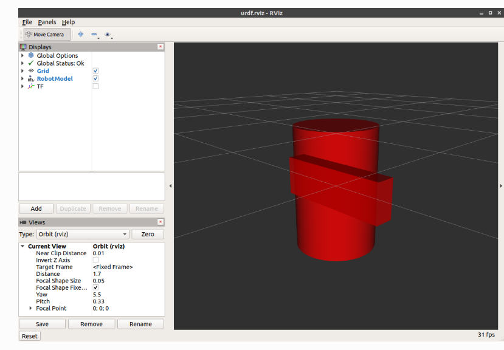
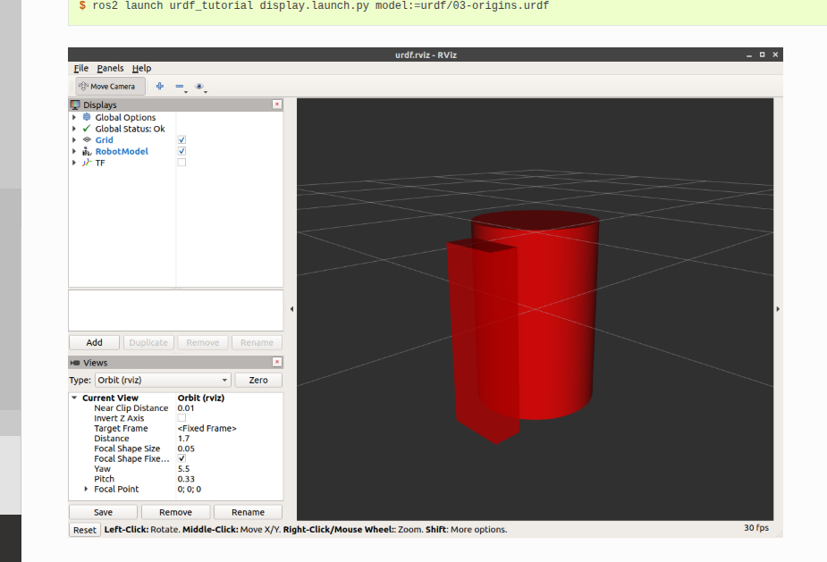
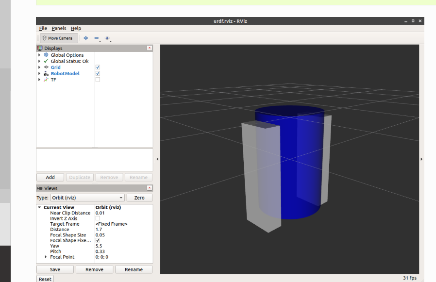
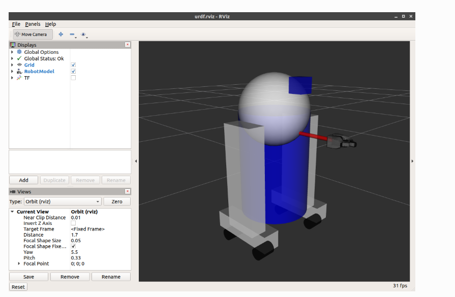

好的，我们来详细学习这篇 ROS 2 教程，并附上教程中每个步骤的关键代码。

这篇教程的目标是教你如何**从零开始创建一个机器人的可视化 URDF (Unified Robot Description Format) 模型**。URDF 是一种 XML 格式，用于描述机器人的结构，包括连杆、关节、视觉外观等。最终，你将可以在 RViz 2 (ROS 2 的 3D 可视化工具) 中看到你创建的模型。

-----

### 1\. 单一形状 (One Shape)

这是最基础的 "Hello World" 示例。它只定义了一个机器人，这个机器人只有一个部件（一个连杆）。

  * **`<robot name="myfirst">`**：这是 URDF 文件的根标签，定义了机器人叫 "myfirst"。
  * **`<link name="base_link">`**：定义一个名为 "base\_link" 的连杆（部件）。这通常是机器人的根连杆。
  * **`<visual>`**：定义这个连杆的外观。
  * **`<geometry>`**：定义外观的几何形状。
  * **`<cylinder length="0.6" radius="0.2"/>`**：定义形状为一个高 0.6 米、半径 0.2 米的圆柱体。

**代码 (`01-myfirst.urdf`)**：

```xml
<?xml version="1.0"?>
<robot name="myfirst">
  <link name="base_link">
    <visual>
      <geometry>
        <cylinder length="0.6" radius="0.2"/>
      </geometry>
    </visual>
  </link>
</robot>
```

**如何查看：**

```bash
ros2 launch urdf_tutorial display.launch.py model:=urdf/01-myfirst.urdf
```

启动 RViz 后，你会看到一个圆柱体。注意：由于默认原点在几何中心，这个圆柱体一半在网格平面之上，一半在网格平面之下。

-----

### 2\. 多个形状 (Multiple Shapes)

现在我们添加第二个连杆（一条腿）。要连接两个连杆，必须使用 `<joint>` (关节)。

  * **`<link name="right_leg">`**：定义了第二个连杆，形状是一个 `<box>` (长方体)。
  * **`<joint name="base_to_right_leg" type="fixed">`**：定义一个关节。
      * `name`：关节的名称。
      * `type="fixed"`：表示这是一个**固定关节**，两个连杆之间不能运动（就像焊接在一起）。
  * **`<parent link="base_link"/>`**：指定父连杆（"base\_link"）。
  * **`<child link="right_leg"/>`**：指定子连杆（"right\_leg"）。

**代码 (`02-multipleshapes.urdf`)**：

```xml
<?xml version="1.0"?>
<robot name="multipleshapes">
  <link name="base_link">
    <visual>
      <geometry>
        <cylinder length="0.6" radius="0.2"/>
      </geometry>
    </visual>
  </link>

  <link name="right_leg">
    <visual>
      <geometry>
        <box size="0.6 0.1 0.2"/>
      </geometry>
    </visual>
  </link>

  <joint name="base_to_right_leg" type="fixed">
    <parent link="base_link"/>
    <child link="right_leg"/>
  </joint>
</robot>
```

**问题**：启动 RViz 后，你会发现圆柱体和长方体**重叠**了，因为它们的默认原点都在 (0,0,0)。

-----

### 3\. 定位 (Origins)

这是本教程**最核心**的部分。我们使用 `<origin>` 标签来精确定位连杆和视觉元素。

`<origin>` 标签有两个关键用途：

1.  **在 `<joint>` 内部**：

      * `<joint ...> <origin xyz="0 -0.22 0.25"/> </joint>`
      * **含义**：定义**子连杆 (`child`) 的原点**相对于**父连杆 (`parent`) 原点**的偏移量。
      * `xyz`：x, y, z 方向的平移（单位：米）。
      * `rpy`：Roll (绕X轴), Pitch (绕Y轴), Yaw (绕Z轴) 的旋转（单位：弧度）。
      * *示例中*：它将 `right_leg` 的原点移动到 `base_link` 原点 $y$ 轴负方向 0.22 米、$z$ 轴正方向 0.25 米处（即身体的侧上方）。

2.  **在 `<visual>` 内部**：

      * `<visual> <origin rpy="0 1.57075 0" xyz="0 0 -0.3"/> ... </visual>`
      * **含义**：定义**几何体 (`<geometry>`) 的中心**相对于**它所属连杆 (`<link>`) 原点**的偏移量。
      * *示例中*：腿的 `box` 长度为 0.6 米。默认原点在盒子中心。我们希望关节连接在腿的**顶端**，所以我们将视觉模型（盒子）沿 $z$ 轴**向下**移动 0.3 米 ( `xyz="0 0 -0.3"` )。
      * `rpy="0 1.57075 0"` (1.57075 约等于 $\pi/2$) 表示绕 $y$ 轴旋转 90 度，使腿竖直。

**代码 (`03-origins.urdf`)**：

```xml
<?xml version="1.0"?>
<robot name="origins">
  <link name="base_link">
    <visual>
      <geometry>
        <cylinder length="0.6" radius="0.2"/>
      </geometry>
    </visual>
  </link>

  <link name="right_leg">
    <visual>
      <geometry>
        <box size="0.6 0.1 0.2"/>
      </geometry>
      <origin rpy="0 1.57075 0" xyz="0 0 -0.3"/>
    </visual>
  </link>

  <joint name="base_to_right_leg" type="fixed">
    <parent link="base_link"/>
    <child link="right_leg"/>
    <origin xyz="0 -0.22 0.25"/>
  </joint>
</robot>
```

现在启动 RViz，腿会正确地挂在身体的侧面。

-----

### 4\. 材质和颜色 (Material Girl)

模型默认是红色的。我们可以添加 `<material>` 标签来定义颜色。

  * **`<material name="blue">`**：在 `<robot>` 标签下定义一个可重用的材质，命名为 "blue"。
  * **`<color rgba="0 0 0.8 1"/>`**：定义颜色。`rgba` 分别代表红、绿、蓝和透明度 (Alpha)，取值范围 [0, 1]。这里定义了蓝色 ( $R=0, G=0, B=0.8, A=1.0$ )。
  * **`<material name="blue"/>`**：在 `<visual>` 标签内部，通过名称引用这个定义好的材质。
  * 本示例还添加了 "white" 材质，并复制了 `right_leg` 和 `base_to_right_leg` 的代码来创建 `left_leg`（注意 `origin` 中 $y$ 值的变化）。

**代码 (`04-materials.urdf`)**：

```xml
<?xml version="1.0"?>
<robot name="materials">
  <material name="blue">
    <color rgba="0 0 0.8 1"/>
  </material>
  <material name="white">
    <color rgba="1 1 1 1"/>
  </material>

  <link name="base_link">
    <visual>
      <geometry>
        <cylinder length="0.6" radius="0.2"/>
      </geometry>
      <material name="blue"/>
    </visual>
  </link>

  <link name="right_leg">
    <visual>
      <geometry>
        <box size="0.6 0.1 0.2"/>
      </geometry>
      <origin rpy="0 1.57075 0" xyz="0 0 -0.3"/>
      <material name="white"/>
    </visual>
  </link>

  <joint name="base_to_right_leg" type="fixed">
    <parent link="base_link"/>
    <child link="right_leg"/>
    <origin xyz="0 -0.22 0.25"/>
  </joint>

  <link name="left_leg">
    <visual>
      <geometry>
        <box size="0.6 0.1 0.2"/>
      </geometry>
      <origin rpy="0 1.57075 0" xyz="0 0 -0.3"/>
      <material name="white"/>
    </visual>
  </link>

  <joint name="base_to_left_leg" type="fixed">
    <parent link="base_link"/>
    <child link="left_leg"/>
    <origin xyz="0 0.22 0.25"/>
  </joint>
</robot>
```

-----

### 5\. 完成模型 (Finishing the Model)

最后一步是组合使用所有技术，并添加更多部件（脚、轮子、头、夹爪等），完成 R2D2 的造型。

这里引入了两种新的几何形状：

1.  **`<sphere radius="0.2"/>`**：
      * 用于制作头部 (`head` 连杆)。
2.  **`<mesh filename="..."/>`**：
      * 用于加载外部 3D 模型文件（如 `.stl` 或 `.dae` 文件），用于制作复杂的形状（如夹爪 `left_gripper`）。
      * `filename="package://urdf_tutorial/meshes/l_finger.dae"`：
          * `package://` 是 ROS 中定位文件的标准方式。
          * 这表示 "在名为 `urdf_tutorial` 的 ROS 2 包中，查找 `meshes/l_finger.dae` 文件"。
好的，我们来详细学习这篇 ROS 2 教程，并附上教程中每个步骤的关键代码。

这篇教程的目标是教你如何**从零开始创建一个机器人的可视化 URDF (Unified Robot Description Format) 模型**。URDF 是一种 XML 格式，用于描述机器人的结构，包括连杆、关节、视觉外观等。最终，你将可以在 RViz 2 (ROS 2 的 3D 可视化工具) 中看到你创建的模型。

-----

### 1\. 单一形状 (One Shape)

这是最基础的 "Hello World" 示例。它只定义了一个机器人，这个机器人只有一个部件（一个连杆）。

  * **`<robot name="myfirst">`**：这是 URDF 文件的根标签，定义了机器人叫 "myfirst"。
  * **`<link name="base_link">`**：定义一个名为 "base\_link" 的连杆（部件）。这通常是机器人的根连杆。
  * **`<visual>`**：定义这个连杆的外观。
  * **`<geometry>`**：定义外观的几何形状。
  * **`<cylinder length="0.6" radius="0.2"/>`**：定义形状为一个高 0.6 米、半径 0.2 米的圆柱体。

**代码 (`01-myfirst.urdf`)**：

```xml
<?xml version="1.0"?>
<robot name="myfirst">
  <link name="base_link">
    <visual>
      <geometry>
        <cylinder length="0.6" radius="0.2"/>
      </geometry>
    </visual>
  </link>
</robot>
```

**如何查看：**

```bash
ros2 launch urdf_tutorial display.launch.py model:=urdf/01-myfirst.urdf
```

启动 RViz 后，你会看到一个圆柱体。注意：由于默认原点在几何中心，这个圆柱体一半在网格平面之上，一半在网格平面之下。

-----

### 2\. 多个形状 (Multiple Shapes)

现在我们添加第二个连杆（一条腿）。要连接两个连杆，必须使用 `<joint>` (关节)。

  * **`<link name="right_leg">`**：定义了第二个连杆，形状是一个 `<box>` (长方体)。
  * **`<joint name="base_to_right_leg" type="fixed">`**：定义一个关节。
      * `name`：关节的名称。
      * `type="fixed"`：表示这是一个**固定关节**，两个连杆之间不能运动（就像焊接在一起）。
  * **`<parent link="base_link"/>`**：指定父连杆（"base\_link"）。
  * **`<child link="right_leg"/>`**：指定子连杆（"right\_leg"）。

**代码 (`02-multipleshapes.urdf`)**：

```xml
<?xml version="1.0"?>
<robot name="multipleshapes">
  <link name="base_link">
    <visual>
      <geometry>
        <cylinder length="0.6" radius="0.2"/>
      </geometry>
    </visual>
  </link>

  <link name="right_leg">
    <visual>
      <geometry>
        <box size="0.6 0.1 0.2"/>
      </geometry>
    </visual>
  </link>

  <joint name="base_to_right_leg" type="fixed">
    <parent link="base_link"/>
    <child link="right_leg"/>
  </joint>
</robot>
```

**问题**：启动 RViz 后，你会发现圆柱体和长方体**重叠**了，因为它们的默认原点都在 (0,0,0)。

-----

### 3\. 定位 (Origins)

这是本教程**最核心**的部分。我们使用 `<origin>` 标签来精确定位连杆和视觉元素。

`<origin>` 标签有两个关键用途：

1.  **在 `<joint>` 内部**：

      * `<joint ...> <origin xyz="0 -0.22 0.25"/> </joint>`
      * **含义**：定义**子连杆 (`child`) 的原点**相对于**父连杆 (`parent`) 原点**的偏移量。
      * `xyz`：x, y, z 方向的平移（单位：米）。
      * `rpy`：Roll (绕X轴), Pitch (绕Y轴), Yaw (绕Z轴) 的旋转（单位：弧度）。
      * *示例中*：它将 `right_leg` 的原点移动到 `base_link` 原点 $y$ 轴负方向 0.22 米、$z$ 轴正方向 0.25 米处（即身体的侧上方）。

2.  **在 `<visual>` 内部**：

      * `<visual> <origin rpy="0 1.57075 0" xyz="0 0 -0.3"/> ... </visual>`
      * **含义**：定义**几何体 (`<geometry>`) 的中心**相对于**它所属连杆 (`<link>`) 原点**的偏移量。
      * *示例中*：腿的 `box` 长度为 0.6 米。默认原点在盒子中心。我们希望关节连接在腿的**顶端**，所以我们将视觉模型（盒子）沿 $z$ 轴**向下**移动 0.3 米 ( `xyz="0 0 -0.3"` )。
      * `rpy="0 1.57075 0"` (1.57075 约等于 $\pi/2$) 表示绕 $y$ 轴旋转 90 度，使腿竖直。

**代码 (`03-origins.urdf`)**：

```xml
<?xml version="1.0"?>
<robot name="origins">
  <link name="base_link">
    <visual>
      <geometry>
        <cylinder length="0.6" radius="0.2"/>
      </geometry>
    </visual>
  </link>

  <link name="right_leg">
    <visual>
      <geometry>
        <box size="0.6 0.1 0.2"/>
      </geometry>
      <origin rpy="0 1.57075 0" xyz="0 0 -0.3"/>
    </visual>
  </link>

  <joint name="base_to_right_leg" type="fixed">
    <parent link="base_link"/>
    <child link="right_leg"/>
    <origin xyz="0 -0.22 0.25"/>
  </joint>
</robot>
```

现在启动 RViz，腿会正确地挂在身体的侧面。

-----

### 4\. 材质和颜色 (Material Girl)

模型默认是红色的。我们可以添加 `<material>` 标签来定义颜色。

  * **`<material name="blue">`**：在 `<robot>` 标签下定义一个可重用的材质，命名为 "blue"。
  * **`<color rgba="0 0 0.8 1"/>`**：定义颜色。`rgba` 分别代表红、绿、蓝和透明度 (Alpha)，取值范围 [0, 1]。这里定义了蓝色 ( $R=0, G=0, B=0.8, A=1.0$ )。
  * **`<material name="blue"/>`**：在 `<visual>` 标签内部，通过名称引用这个定义好的材质。
  * 本示例还添加了 "white" 材质，并复制了 `right_leg` 和 `base_to_right_leg` 的代码来创建 `left_leg`（注意 `origin` 中 $y$ 值的变化）。

**代码 (`04-materials.urdf`)**：

```xml
<?xml version="1.0"?>
<robot name="materials">
  <material name="blue">
    <color rgba="0 0 0.8 1"/>
  </material>
  <material name="white">
    <color rgba="1 1 1 1"/>
  </material>

  <link name="base_link">
    <visual>
      <geometry>
        <cylinder length="0.6" radius="0.2"/>
      </geometry>
      <material name="blue"/>
    </visual>
  </link>

  <link name="right_leg">
    <visual>
      <geometry>
        <box size="0.6 0.1 0.2"/>
      </geometry>
      <origin rpy="0 1.57075 0" xyz="0 0 -0.3"/>
      <material name="white"/>
    </visual>
  </link>

  <joint name="base_to_right_leg" type="fixed">
    <parent link="base_link"/>
    <child link="right_leg"/>
    <origin xyz="0 -0.22 0.25"/>
  </joint>

  <link name="left_leg">
    <visual>
      <geometry>
        <box size="0.6 0.1 0.2"/>
      </geometry>
      <origin rpy="0 1.57075 0" xyz="0 0 -0.3"/>
      <material name="white"/>
    </visual>
  </link>

  <joint name="base_to_left_leg" type="fixed">
    <parent link="base_link"/>
    <child link="left_leg"/>
    <origin xyz="0 0.22 0.25"/>
  </joint>
</robot>
```

-----

### 5\. 完成模型 (Finishing the Model)

最后一步是组合使用所有技术，并添加更多部件（脚、轮子、头、夹爪等），完成 R2D2 的造型。

这里引入了两种新的几何形状：

1.  **`<sphere radius="0.2"/>`**：
      * 用于制作头部 (`head` 连杆)。
2.  **`<mesh filename="..."/>`**：
      * 用于加载外部 3D 模型文件（如 `.stl` 或 `.dae` 文件），用于制作复杂的形状（如夹爪 `left_gripper`）。
      * `filename="package://urdf_tutorial/meshes/l_finger.dae"`：
          * `package://` 是 ROS 中定位文件的标准方式。
          * 这表示 "在名为 `urdf_tutorial` 的 ROS 2 包中，查找 `meshes/l_finger.dae` 文件"。

**代码 (`05-visual.urdf`)**：
(注意：这个文件很长，因为它定义了所有的部件)

```xml
<?xml version="1.0"?>
<robot name="visual">

  <material name="blue">
    <color rgba="0 0 0.8 1"/>
  </material>
  <material name="black">
    <color rgba="0 0 0 1"/>
  </material>
  <material name="white">
    <color rgba="1 1 1 1"/>
  </material>

  <link name="base_link">
    <visual>
      <geometry>
        <cylinder length="0.6" radius="0.2"/>
      </geometry>
      <material name="blue"/>
    </visual>
  </link>

  <link name="right_leg">
    <visual>
      <geometry>
        <box size="0.6 0.1 0.2"/>
      </geometry>
      <origin rpy="0 1.57075 0" xyz="0 0 -0.3"/>
      <material name="white"/>
    </visual>
  </link>

  <joint name="base_to_right_leg" type="fixed">
    <parent link="base_link"/>
    <child link="right_leg"/>
    <origin xyz="0 -0.22 0.25"/>
  </joint>

  <link name="right_base">
    <visual>
      <geometry>
        <box size="0.4 0.1 0.1"/>
      </geometry>
      <material name="white"/>
    </visual>
  </link>

  <joint name="right_base_joint" type="fixed">
    <parent link="right_leg"/>
    <child link="right_base"/>
    <origin xyz="0 0 -0.6"/>
  </joint>

  <link name="right_front_wheel">
    <visual>
      <origin rpy="1.57075 0 0" xyz="0 0 0"/>
      <geometry>
        <cylinder length="0.1" radius="0.035"/>
      </geometry>
      <material name="black"/>
    </visual>
  </link>

  <joint name="right_front_wheel_joint" type="fixed">
    <parent link="right_base"/>
    <child link="right_front_wheel"/>
    <origin rpy="0 0 0" xyz="0.133333333333 0 -0.085"/>
  </joint>

  <link name="right_back_wheel">
    <visual>
      <origin rpy="1.57075 0 0" xyz="0 0 0"/>
      <geometry>
        <cylinder length="0.1" radius="0.035"/>
      </geometry>
      <material name="black"/>
    </visual>
  </link>

  <joint name="right_back_wheel_joint" type="fixed">
    <parent link="right_base"/>
    <child link="right_back_wheel"/>
    <origin rpy="0 0 0" xyz="-0.133333333333 0 -0.085"/>
  </joint>

  <link name="left_leg">
    <visual>
      <geometry>
        <box size="0.6 0.1 0.2"/>
      </geometry>
      <origin rpy="0 1.57075 0" xyz="0 0 -0.3"/>
      <material name="white"/>
    </visual>
  </link>

  <joint name="base_to_left_leg" type="fixed">
    <parent link="base_link"/>
    <child link="left_leg"/>
    <origin xyz="0 0.22 0.25"/>
  </joint>

  <link name="left_base">
    <visual>
      <geometry>
        <box size="0.4 0.1 0.1"/>
      </geometry>
      <material name="white"/>
    </visual>
  </link>

  <joint name="left_base_joint" type="fixed">
    <parent link="left_leg"/>
    <child link="left_base"/>
    <origin xyz="0 0 -0.6"/>
  </joint>

  <link name="left_front_wheel">
    <visual>
      <origin rpy="1.57075 0 0" xyz="0 0 0"/>
      <geometry>
        <cylinder length="0.1" radius="0.035"/>
      </geometry>
      <material name="black"/>
    </visual>
  </link>

  <joint name="left_front_wheel_joint" type="fixed">
    <parent link="left_base"/>
    <child link="left_front_wheel"/>
    <origin rpy="0 0 0" xyz="0.133333333333 0 -0.085"/>
  </joint>

  <link name="left_back_wheel">
    <visual>
      <origin rpy="1.57075 0 0" xyz="0 0 0"/>
      <geometry>
        <cylinder length="0.1" radius="0.035"/>
      </geometry>
      <material name="black"/>
    </visual>
  </link>

  <joint name="left_back_wheel_joint" type="fixed">
    <parent link="left_base"/>
    <child link="left_back_wheel"/>
    <origin rpy="0 0 0" xyz="-0.133333333333 0 -0.085"/>
  </joint>

  <joint name="gripper_extension" type="fixed">
    <parent link="base_link"/>
    <child link="gripper_pole"/>
    <origin rpy="0 0 0" xyz="0.19 0 0.2"/>
  </joint>

  <link name="gripper_pole">
    <visual>
      <geometry>
        <cylinder length="0.2" radius="0.01"/>
      </geometry>
      <origin rpy="0 1.57075 0 " xyz="0.1 0 0"/>
    </visual>
  </link>

  <joint name="left_gripper_joint" type="fixed">
    <origin rpy="0 0 0" xyz="0.2 0.01 0"/>
    <parent link="gripper_pole"/>
    <child link="left_gripper"/>
  </joint>

  <link name="left_gripper">
    <visual>
      <origin rpy="0.0 0 0" xyz="0 0 0"/>
      <geometry>
        <mesh filename="package://urdf_tutorial/meshes/l_finger.dae"/>
      </geometry>
    </visual>
  </link>

  <joint name="left_tip_joint" type="fixed">
    <parent link="left_gripper"/>
    <child link="left_tip"/>
  </joint>

  <link name="left_tip">
    <visual>
      <origin rpy="0.0 0 0" xyz="0.09137 0.00495 0"/>
      <geometry>
        <mesh filename="package://urdf_tutorial/meshes/l_finger_tip.dae"/>
      </geometry>
    </visual>
  </link>

  <joint name="right_gripper_joint" type="fixed">
    <origin rpy="0 0 0" xyz="0.2 -0.01 0"/>
    <parent link="gripper_pole"/>
    <child link="right_gripper"/>
  </joint>

  <link name="right_gripper">
    <visual>
      <origin rpy="-3.1415 0 0" xyz="0 0 0"/>
      <geometry>
        <mesh filename="package://urdf_tutorial/meshes/l_finger.dae"/>
      </geometry>
    </visual>
  </link>

  <joint name="right_tip_joint" type="fixed">
    <parent link="right_gripper"/>
    <child link="right_tip"/>
  </joint>

  <link name="right_tip">
    <visual>
      <origin rpy="-3.1415 0 0" xyz="0.09137 0.00495 0"/>
      <geometry>
        <mesh filename="package://urdf_tutorial/meshes/l_finger_tip.dae"/>
      </geometry>
    </visual>
  </link>

  <link name="head">
    <visual>
      <geometry>
        <sphere radius="0.2"/>
      </geometry>
      <material name="white"/>
    </visual>
  </link>

  <joint name="head_swivel" type="fixed">
    <parent link="base_link"/>
    <child link="head"/>
    <origin xyz="0 0 0.3"/>
  </joint>

  <link name="box">
    <visual>
      <geometry>
        <box size="0.08 0.08 0.08"/>
      </geometry>
      <material name="blue"/>
    </visual>
  </link>

  <joint name="tobox" type="fixed">
    <parent link="head"/>
    <child link="box"/>
    <origin xyz="0.1814 0 0.1414"/>
  </joint>
</robot>
```

这个最终模型展示了如何通过不断添加 `link` (部件) 和 `joint` (关节) 来构建一个复杂的机器人，并使用 `<origin>` 标签将它们精确地组装在一起。
**代码 (`05-visual.urdf`)**：
(注意：这个文件很长，因为它定义了所有的部件)

```xml
<?xml version="1.0"?>
<robot name="visual">

  <material name="blue">
    <color rgba="0 0 0.8 1"/>
  </material>
  <material name="black">
    <color rgba="0 0 0 1"/>
  </material>
  <material name="white">
    <color rgba="1 1 1 1"/>
  </material>

  <link name="base_link">
    <visual>
      <geometry>
        <cylinder length="0.6" radius="0.2"/>
      </geometry>
      <material name="blue"/>
    </visual>
  </link>

  <link name="right_leg">
    <visual>
      <geometry>
        <box size="0.6 0.1 0.2"/>
      </geometry>
      <origin rpy="0 1.57075 0" xyz="0 0 -0.3"/>
      <material name="white"/>
    </visual>
  </link>

  <joint name="base_to_right_leg" type="fixed">
    <parent link="base_link"/>
    <child link="right_leg"/>
    <origin xyz="0 -0.22 0.25"/>
  </joint>

  <link name="right_base">
    <visual>
      <geometry>
        <box size="0.4 0.1 0.1"/>
      </geometry>
      <material name="white"/>
    </visual>
  </link>

  <joint name="right_base_joint" type="fixed">
    <parent link="right_leg"/>
    <child link="right_base"/>
    <origin xyz="0 0 -0.6"/>
  </joint>

  <link name="right_front_wheel">
    <visual>
      <origin rpy="1.57075 0 0" xyz="0 0 0"/>
      <geometry>
        <cylinder length="0.1" radius="0.035"/>
      </geometry>
      <material name="black"/>
    </visual>
  </link>

  <joint name="right_front_wheel_joint" type="fixed">
    <parent link="right_base"/>
    <child link="right_front_wheel"/>
    <origin rpy="0 0 0" xyz="0.133333333333 0 -0.085"/>
  </joint>

  <link name="right_back_wheel">
    <visual>
      <origin rpy="1.57075 0 0" xyz="0 0 0"/>
      <geometry>
        <cylinder length="0.1" radius="0.035"/>
      </geometry>
      <material name="black"/>
    </visual>
  </link>

  <joint name="right_back_wheel_joint" type="fixed">
    <parent link="right_base"/>
    <child link="right_back_wheel"/>
    <origin rpy="0 0 0" xyz="-0.133333333333 0 -0.085"/>
  </joint>

  <link name="left_leg">
    <visual>
      <geometry>
        <box size="0.6 0.1 0.2"/>
      </geometry>
      <origin rpy="0 1.57075 0" xyz="0 0 -0.3"/>
      <material name="white"/>
    </visual>
  </link>

  <joint name="base_to_left_leg" type="fixed">
    <parent link="base_link"/>
    <child link="left_leg"/>
    <origin xyz="0 0.22 0.25"/>
  </joint>

  <link name="left_base">
    <visual>
      <geometry>
        <box size="0.4 0.1 0.1"/>
      </geometry>
      <material name="white"/>
    </visual>
  </link>

  <joint name="left_base_joint" type="fixed">
    <parent link="left_leg"/>
    <child link="left_base"/>
    <origin xyz="0 0 -0.6"/>
  </joint>

  <link name="left_front_wheel">
    <visual>
      <origin rpy="1.57075 0 0" xyz="0 0 0"/>
      <geometry>
        <cylinder length="0.1" radius="0.035"/>
      </geometry>
      <material name="black"/>
    </visual>
  </link>

  <joint name="left_front_wheel_joint" type="fixed">
    <parent link="left_base"/>
    <child link="left_front_wheel"/>
    <origin rpy="0 0 0" xyz="0.133333333333 0 -0.085"/>
  </joint>

  <link name="left_back_wheel">
    <visual>
      <origin rpy="1.57075 0 0" xyz="0 0 0"/>
      <geometry>
        <cylinder length="0.1" radius="0.035"/>
      </geometry>
      <material name="black"/>
    </visual>
  </link>

  <joint name="left_back_wheel_joint" type="fixed">
    <parent link="left_base"/>
    <child link="left_back_wheel"/>
    <origin rpy="0 0 0" xyz="-0.133333333333 0 -0.085"/>
  </joint>

  <joint name="gripper_extension" type="fixed">
    <parent link="base_link"/>
    <child link="gripper_pole"/>
    <origin rpy="0 0 0" xyz="0.19 0 0.2"/>
  </joint>

  <link name="gripper_pole">
    <visual>
      <geometry>
        <cylinder length="0.2" radius="0.01"/>
      </geometry>
      <origin rpy="0 1.57075 0 " xyz="0.1 0 0"/>
    </visual>
  </link>

  <joint name="left_gripper_joint" type="fixed">
    <origin rpy="0 0 0" xyz="0.2 0.01 0"/>
    <parent link="gripper_pole"/>
    <child link="left_gripper"/>
  </joint>

  <link name="left_gripper">
    <visual>
      <origin rpy="0.0 0 0" xyz="0 0 0"/>
      <geometry>
        <mesh filename="package://urdf_tutorial/meshes/l_finger.dae"/>
      </geometry>
    </visual>
  </link>

  <joint name="left_tip_joint" type="fixed">
    <parent link="left_gripper"/>
    <child link="left_tip"/>
  </joint>

  <link name="left_tip">
    <visual>
      <origin rpy="0.0 0 0" xyz="0.09137 0.00495 0"/>
      <geometry>
        <mesh filename="package://urdf_tutorial/meshes/l_finger_tip.dae"/>
      </geometry>
    </visual>
  </link>

  <joint name="right_gripper_joint" type="fixed">
    <origin rpy="0 0 0" xyz="0.2 -0.01 0"/>
    <parent link="gripper_pole"/>
    <child link="right_gripper"/>
  </joint>

  <link name="right_gripper">
    <visual>
      <origin rpy="-3.1415 0 0" xyz="0 0 0"/>
      <geometry>
        <mesh filename="package://urdf_tutorial/meshes/l_finger.dae"/>
      </geometry>
    </visual>
  </link>

  <joint name="right_tip_joint" type="fixed">
    <parent link="right_gripper"/>
    <child link="right_tip"/>
  </joint>

  <link name="right_tip">
    <visual>
      <origin rpy="-3.1415 0 0" xyz="0.09137 0.00495 0"/>
      <geometry>
        <mesh filename="package://urdf_tutorial/meshes/l_finger_tip.dae"/>
      </geometry>
    </visual>
  </link>

  <link name="head">
    <visual>
      <geometry>
        <sphere radius="0.2"/>
      </geometry>
      <material name="white"/>
    </visual>
  </link>

  <joint name="head_swivel" type="fixed">
    <parent link="base_link"/>
    <child link="head"/>
    <origin xyz="0 0 0.3"/>
  </joint>

  <link name="box">
    <visual>
      <geometry>
        <box size="0.08 0.08 0.08"/>
      </geometry>
      <material name="blue"/>
    </visual>
  </link>

  <joint name="tobox" type="fixed">
    <parent link="head"/>
    <child link="box"/>
    <origin xyz="0.1814 0 0.1414"/>
  </joint>
</robot>
```

这个最终模型展示了如何通过不断添加 `link` (部件) 和 `joint` (关节) 来构建一个复杂的机器人，并使用 `<origin>` 标签将它们精确地组装在一起。