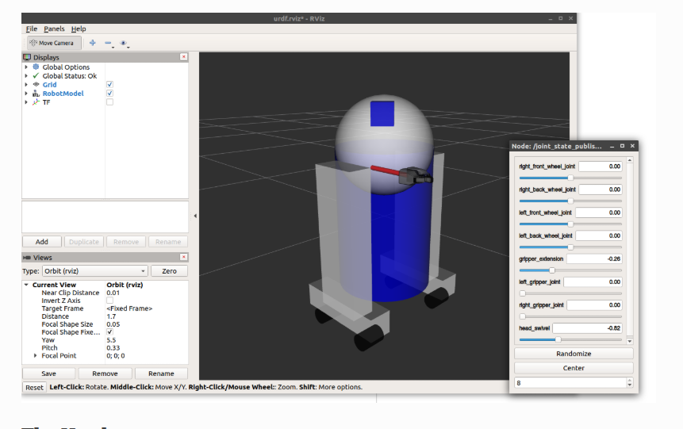

好的，我们来详细解读这篇教程 **《Building a Movable Robot Model with URDF》**。

这篇教程是上一篇（构建视觉模型）的延续。在上一篇中，我们创建了一个静态的、所有部件都**固定 (`fixed`)** 在一起的机器人模型。这篇教程的目标是让这个模型**动起来**。

核心知识点：

1.  **可动关节类型**：将 `type="fixed"` 替换为 `type="continuous"` (连续) 或 `type="revolute"` (旋转)。
2.  **`<axis>` 标签**：定义关节运动的轴。
3.  **`<limit>` 标签**：为有关节限制的关节（如 `revolute`）设置运动范围和力/速度限制。
4.  **`joint_state_publisher` GUI**：一个可以让你在 RViz 中手动控制关节的工具。
5.  **物理属性**：添加 `<collision>` (碰撞) 和 `<inertial>` (惯性) 标签，为物理仿真做准备。

-----

### 1\. 让头部转动 (Let's make the head turn)

第一步是让 R2D2 的头部可以旋转。

  * **文件**: `06-flexible.urdf`
  * **目标**：将头部的关节 `head_swivel` 从 `fixed` (固定) 修改为 `continuous` (连续)。
  * **`type="continuous"`**：这是一种**连续旋转关节**，意味着它可以绕指定轴无限旋转（没有角度限制）。
  * **新标签：`<axis>`**：
      * `<axis xyz="0 0 1"/>`
      * 因为关节可以动了，我们必须指定**哪个轴**是运动轴。
      * `xyz="0 0 1"` 表示关节将绕着其 $Z$ 轴旋转。

**代码 (`06-flexible.urdf` 中的 `head_swivel` 关节)**：

```xml
  <joint name="head_swivel" type="continuous">
    <parent link="base_link"/>
    <child link="head"/>
    <origin xyz="0 0 0.3"/>
    <axis xyz="0 0 1"/>
  </joint>
```

**如何查看：**

```bash
ros2 launch urdf_tutorial display.launch.py model:=urdf/06-flexible.urdf gui:=true
```

**关键变化**：

1.  我们添加了 `gui:=true` 参数。
2.  这会启动 `joint_state_publisher` 的一个**图形界面 (GUI)**。
3.  这个 GUI 窗口上会出现一个名为 `head_swivel` 的**滑块**。
4.  当你拖动这个滑块时，你会看到 RViz 中的头部模型**实时旋转**！

-----

### 2\. 让夹爪移动 (Let's make the gripper move)

接下来，我们让夹爪（gripper）的手指（finger）动起来。

  * **文件**: `07-physics.urdf`
  * **目标**：修改夹爪的关节，如 `left_gripper_joint`。
  * **`type="revolute"`**：这是一种**旋转关节**（也叫铰链关节）。它和 `continuous` 很像，但它有**运动范围限制**。
  * **新标签：`<limit>`**：
      * `<limit lower="0.0" upper="0.548" effort="1000.0" velocity="0.5"/>`
      * 这个标签只用于非 `fixed` 且非 `continuous` 的关节。
      * `lower` 和 `upper`：定义了关节的最小和最大位置（单位：弧度）。这里限制在 0 到 0.548 弧度之间。
      * `effort`：关节能施加的最大力或力矩（单位：牛顿或牛米）。
      * `velocity`：关节的最大速度（单位：米/秒 或 弧度/秒）。

**代码 (`07-physics.urdf` 中的 `left_gripper_joint` 关节)**：

```xml
  <joint name="left_gripper_joint" type="revolute">
    <origin rpy="0 0 0" xyz="0.2 0.01 0"/>
    <parent link="gripper_pole"/>
    <child link="left_gripper"/>
    <axis xyz="0 0 1"/>
    <limit lower="0.0" upper="0.548" velocity="0.5" effort="1000"/>
  </joint>
```

*（注意：教程中也为 `right_gripper_joint` 做了类似修改）*

当你再次启动 `display.launch.py` (并设置 `gui:=true`) 时，GUI 窗口中会**额外出现** `left_gripper_joint` 和 `right_gripper_joint` 的滑块，你可以控制它们张开和闭合。

-----

### 3\. 其他关节类型

教程中简要提到了其他几种关节类型，虽然这个例子没用上：

  * **`prismatic`**：平移关节。它沿着一个轴滑动（像抽屉），需要用 `<limit>` 来限制滑动距离。
  * **`planar`**：平面关节。允许在 2D 平面上运动（平移和旋转）。
  * **`floating`**：浮动关节。允许在 3D 空间中进行所有 6 自由度运动（三个平移，三个旋转）。这通常用于连接世界（world）和一个机器人的根连杆（base\_link）。

-----

### 4\. 定义物理属性 (Defining Physical Properties)

这是 `07-physics.urdf` 文件中引入的**另一个重大变化**。

到目前为止，我们只定义了 `<visual>` (视觉) 标签。这只管模型"看起来"什么样。
为了让模型能在 Gazebo 这样的物理仿真器中运行，我们必须定义另外两个属性：**碰撞**和**惯性**。

**a) `<collision>` (碰撞) 标签**

  * **目的**：定义连杆的**碰撞几何形状**。这用于物理引擎检测物体是否接触。
  * **为什么不直接用 `<visual>`?**：
      * 视觉模型 (`<visual>`) 可能非常复杂（比如高精度的 3D 网格），用它来计算碰撞会非常慢。
      * 碰撞模型 (`<collision>`) 通常使用更简单的几何体（如圆柱、球体、长方体），这能极大提高仿真效率。
  * 在 `07-physics.urdf` 中，几乎**每个 `<link>`** 都被添加了一个 `<collision>` 标签，其 `<geometry>` 通常与 `<visual>` 的 `<geometry>` 相同（但在复杂模型中它们可以不同）。

**b) `<inertial>` (惯性) 标签**

  * **目的**：定义连杆的**动力学属性**（质量、质心、惯性张量）。这是物理仿真器计算物体如何运动（如受重力影响、受力后如何加速）所必需的。
  * 它包含三个子标签：
      * **`<origin xyz="..." rpy="..."/>`**：定义这个连杆的**质心 (Center of Mass)** 相对于连杆原点的位置。
      * **`<mass value="..."/>`**：定义连杆的**质量**（单位：千克 kg）。
      * **`<inertia ixx="..." ixy="..." .../>`**：定义 $3 \times 3$ 的**惯性张量 (Inertia Matrix)**。它描述了质量如何围绕质心分布。

**代码 (`07-physics.urdf` 中的 `base_link` 示例)**：

```xml
  <link name="base_link">
    <visual>
      <geometry>
        <cylinder length="0.6" radius="0.2"/>
      </geometry>
      <material name="blue"/>
    </visual>

    <collision>
      <geometry>
        <cylinder length="0.6" radius="0.2"/>
      </geometry>
    </collision>

    <inertial>
      <mass value="10"/>
      <origin xyz="0 0 0"/>
      <inertia ixx="0.0866666666667" ixy="0" ixz="0"
               iyy="0.0866666666667" iyz="0"
               izz="0.2"/>
    </inertial>
  </link>
```

-----

### 总结

这篇教程是 URDF 的关键一步。你学会了：

1.  如何使用 `continuous`（连续）和 `revolute`（旋转）类型的关节来**让模型动起来**。
2.  如何使用 `<axis>` 来指定**运动轴**。
3.  如何使用 `<limit>` 来**限制关节的运动范围**、速度和力。
4.  如何使用 `joint_state_publisher` 的 GUI 来**测试和控制**你的可动关节。
5.  如何添加 `<collision>` 和 `<inertial>` 标签，为将来在 Gazebo 等环境中进行**物理仿真**打下基础。