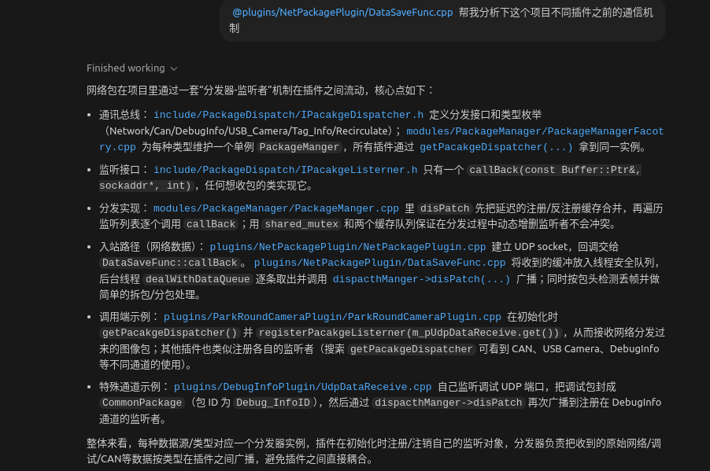
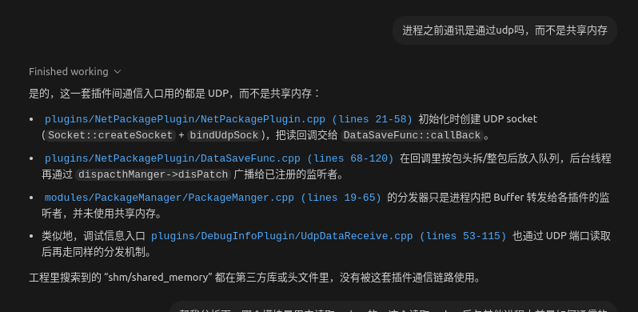
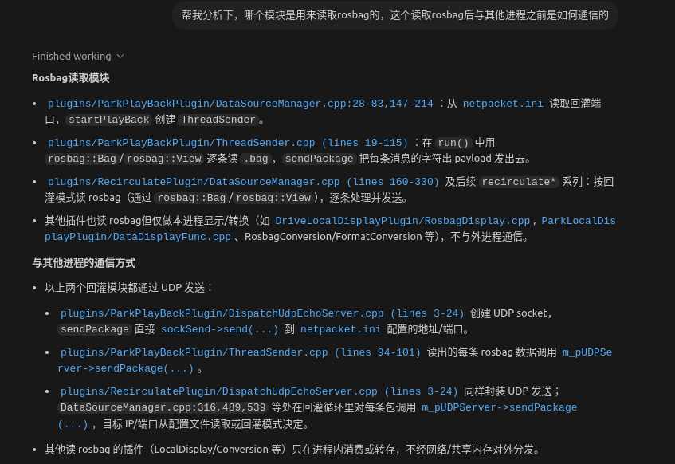
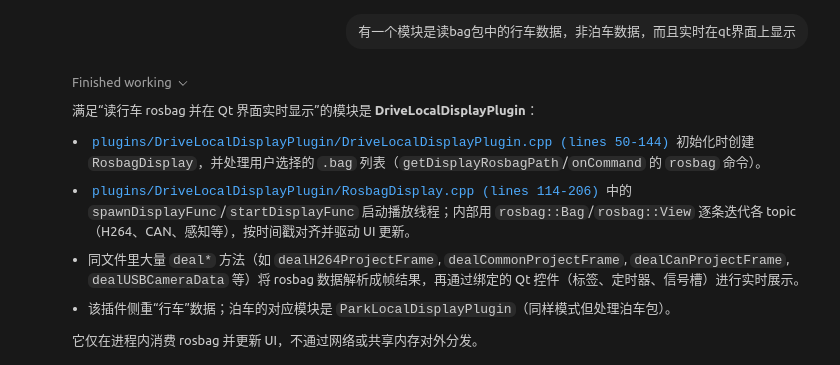
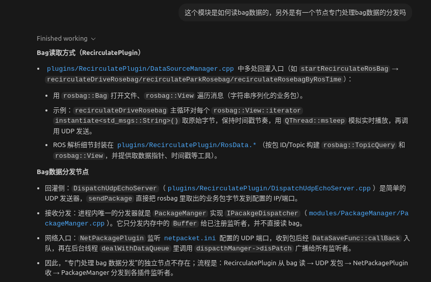
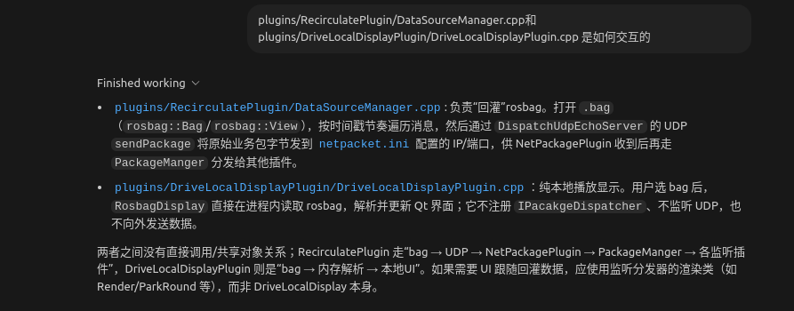
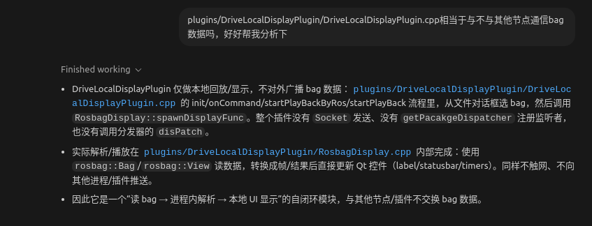
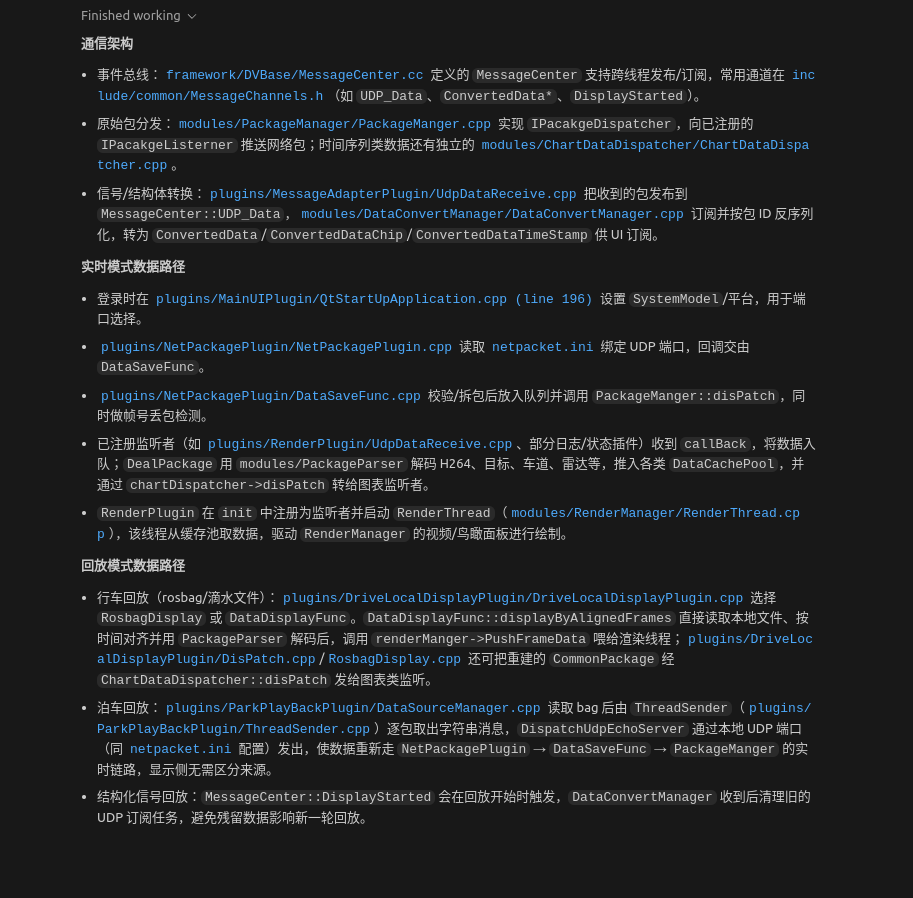

不同插件之前的通信机制

进程间通信走udp

rosbag的读取与通信

回放模式的实时显示

rosbag回放与显示界面的交互






这个项目的通信机制，实时模式和回放模式下，数据是如何接受的，如何传递给显示模块进行显示的---重要

下面是你截图内容的 **Markdown（MD）格式**，我已经按常规结构、代码引用和层级排版整理好了，可直接粘贴到文档中使用。

---

# 通信架构

## 事件总线

`framework/DBBase/MessageCenter.cc` 定义的 **MessageCenter** 支持跨线程发布/订阅，常用通道在
`include/common/MessageChannels.h`（如 `UDP_Data`、`ConvertedData`、`DisplayStarted`）。

## 原始包分发

* `modules/PackageManager/PackageManger.cpp` 实现 `IPackageDispatcher`，向已注册的 `IPackageListener` 推送网络包；
* 订阅列表数据在堆上的 `modules/ChartDataDispatcher/ChartDataDispatcher.cpp`。

## 信号/结构体转换模块

* `plugins/MessageAdapterPlugin/UdpDataReceive.cpp` 提供 UDP 包发到 `MessageCenter::UDP_Data`
* `modules/DataConvertManager/DataConvertManager.cpp` 订阅并按包 ID 反序列化，转为 `ConvertedData`/`ConvertedDataChip`/`ConvertedDataTimeStamp` 输出到 UI 层。

---

# 实时模式数据链路

### 登录时

* `plugins/MainUIPlugin/QtStartUpApplication.cpp (line 196)`
  设置 `SystemModel` 平台，用于端口选择。

### 绑定 UDP 端口

* `plugins/NetPackagePlugin/NetPackagePlugin.cpp`
  读取 `netpacket.ini`，绑定 UDP 端口，同时注册 `DataSaveFunc`。

### 回调存储

* `plugins/NetPackagePlugin/DataSaveFunc.cpp`
  校验任务成员队列是否启动。若未启动则调用 `PackageManger::disPatch`，同步储存已检测。

### 已注册监听者（如实时解码）

* `plugins/RenderPlugin/UdpDataReceive.cpp`
  部分队列状态推给 `callback`，数据进入队列；
  `DeaPackage` 由 `modules/PackageParser` 解码 H264、目标、车道、雷达等，推入缓存 `DataCachePool`，并通过 `chartDispatcher->disPatch` 转给图像监听者。

### 渲染启动

* `RenderPlugin` 在 `init` 中注册渲染任务并启动 `RenderThread`（`modules/RenderManager/RenderThread.cpp`）。
  渲染线程根据缓存取数据，驱动 `RenderManager` 的视频/曲线面板进行绘制。

---

# 回放模式数据链路

### 文件回放（rosbag/滴水文件）

* `plugins/DriveLocalDisplayPlugin/DriveLocalDisplayPlugin.cpp`
  选择 `DataDisplay` 或 `DataDisplayFunc`。
  `DataDisplayFunc::dispDisplayAbtAlignedFrames` 直接读取文件，按时间戳对齐并由 `PackageParser` 解码后调用 `renderManager->PushFrameData` 喂给渲染线程。
  `plugins/DriveLocalDisplayPlugin/DispDataDisplay.cpp` 同样可通过 `CommonPackage` 经 `ChartDataDispatcher::disPatch` 发给曲线面板。

### 泊车回放

* `plugins/ParkPlayBackPlugin/DataSourceManager.cpp`
  读取 bag 后由 `ThreadSender`（`plugins/ParkPlayBackPlugin/ThreadSender.cpp`）按文件包发送 UDP 并广播。
* 读取 `netpacket.ini` 后启动服务，使数据重新流经：

  ```
  NetPackagePlugin → DataSaveFunc → PackageManger
  ```

  的实时链路。

---

# 结束触发

* `MessageCenter::DisplayStarted` 会在回放开始时触发；
* `DataConvertManager` 收到后清理旧的 UDP 订阅，使渲染和数据回放重新跑一轮。

---

如需，我可以进一步帮你 **加目录结构、代码块高亮、流程图（Mermaid）** 等格式化排版。
